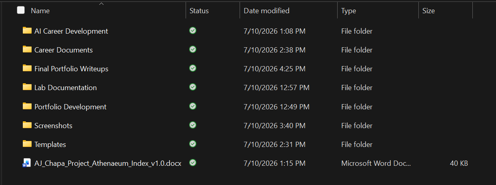
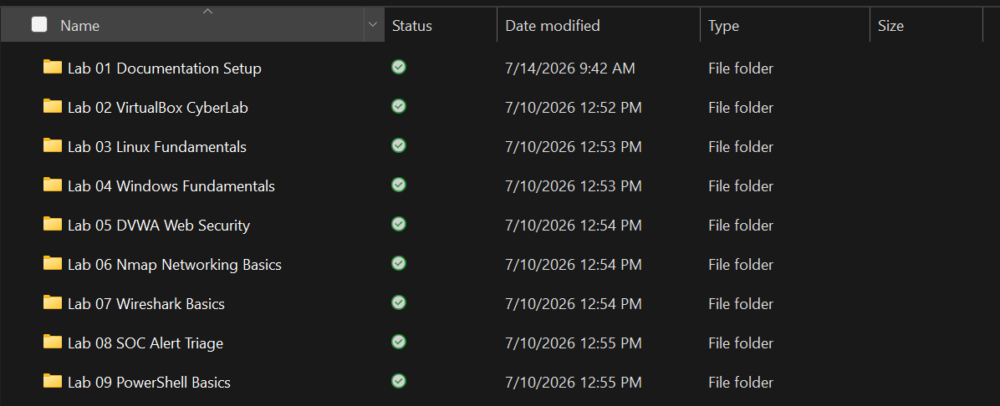
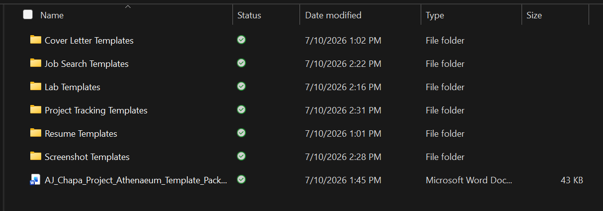
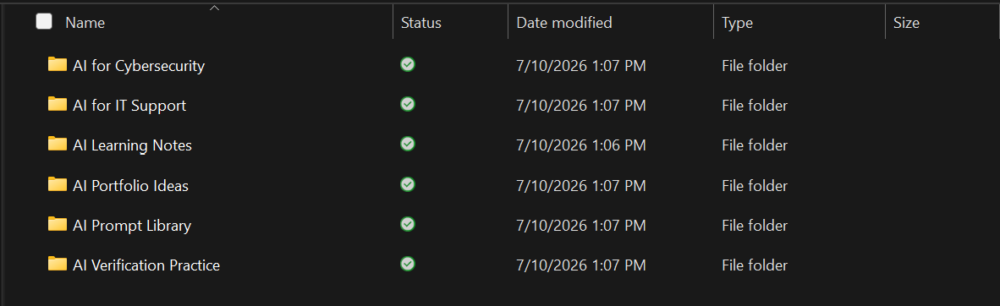

# Lab 01: Documentation Setup

## Overview

This lab established the documentation system used throughout Project Athenaeum. The goal was to create a repeatable structure for organizing cybersecurity labs, screenshots, technical notes, and final portfolio writeups.

## Objective

Create a standardized documentation process that keeps lab evidence organized, makes completed work easy to review, and supports the development of a professional cybersecurity and IT portfolio.

## Skills Demonstrated

- Technical documentation
- File and folder organization
- Screenshot evidence management
- File naming and version control
- Project planning
- Portfolio development
- Attention to detail

## Environment and Tools

- Windows 11
- Microsoft Word
- Windows File Explorer
- GitHub
- Project Athenaeum documentation templates

## Work Completed

During this lab, I:

- Created the primary Project Athenaeum folder structure
- Organized folders for lab documentation, screenshots, templates, portfolio development, career documents, and project tracking
- Developed a standardized screenshot naming system
- Created a lab note template
- Created a screenshot log
- Saved and organized four setup screenshots
- Completed a final portfolio writeup for the lab

## Screenshots and Evidence

### Main Project Athenaeum Folder Structure

The main folder structure organizes lab documentation, screenshots, templates, portfolio materials, career documents, and project tracking resources.

### Planned Lab Documentation Structure

The lab documentation folders provide a structured path for developing and documenting cybersecurity, networking, operating system, and SOC analysis skills.

### Documentation Template Structure

Reusable templates support consistent lab notes, screenshot tracking, project management, job searching, and career documentation.

### AI Career Development Structure

The AI career development folders organize learning activities involving cybersecurity, IT support, prompt development, verification, and portfolio planning.

## Documentation Created

The following working documents were created and retained locally:

- `AJ_Chapa_Lab_01_Documentation_Setup_Notes_v1.0.docx`
- `AJ_Chapa_Lab_01_Screenshot_Log_v1.0.docx`
- Final portfolio writeup
- Four supporting screenshots

## Security and Privacy

Before anything is published, screenshots and documents are reviewed to ensure they do not expose passwords, recovery codes, personal information, employer information, or sensitive system details.

## Importance

Consistent documentation makes technical work easier to repeat, verify, and explain. This process also creates evidence of hands-on experience that can be presented to potential employers while keeping sensitive information protected.

## Lessons Learned

This lab demonstrated that strong technical work requires more than completing a task. The work must also be organized, documented, and communicated clearly. Establishing the documentation process first will make future Project Athenaeum labs more consistent and portfolio ready.

## Status

**Completed and portfolio ready**
