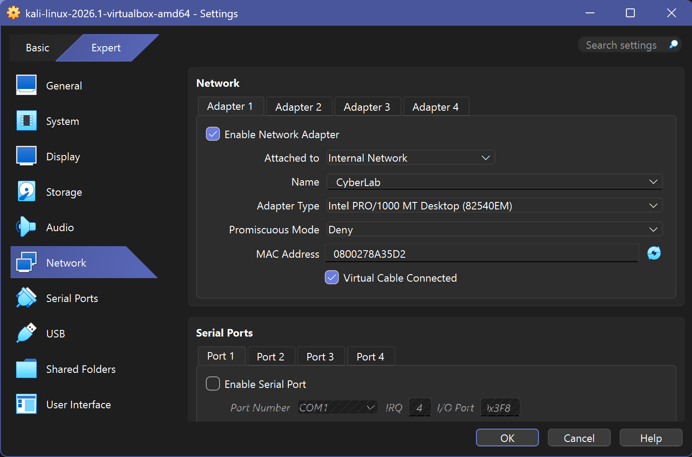
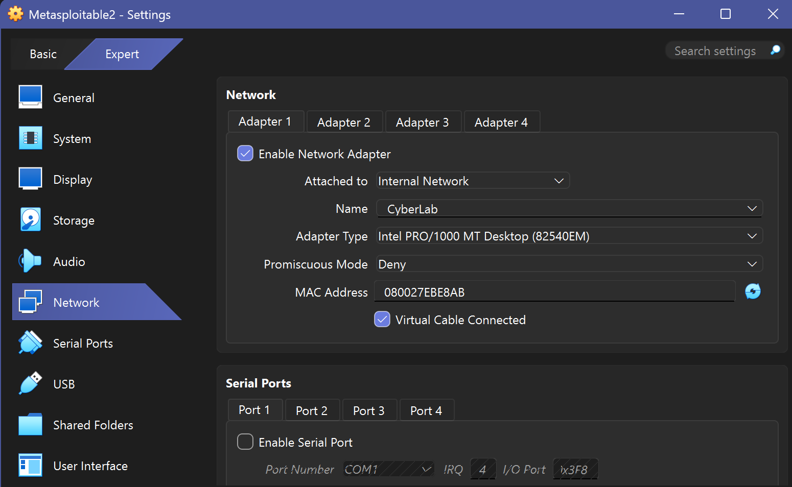
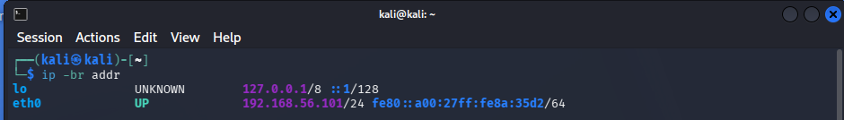
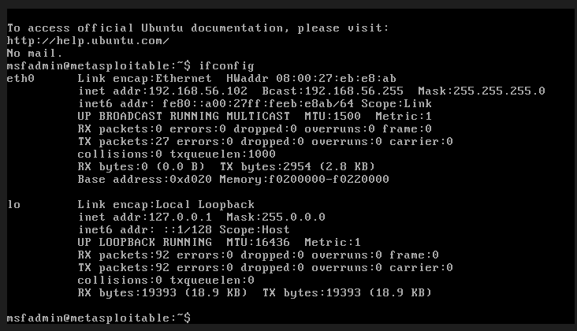
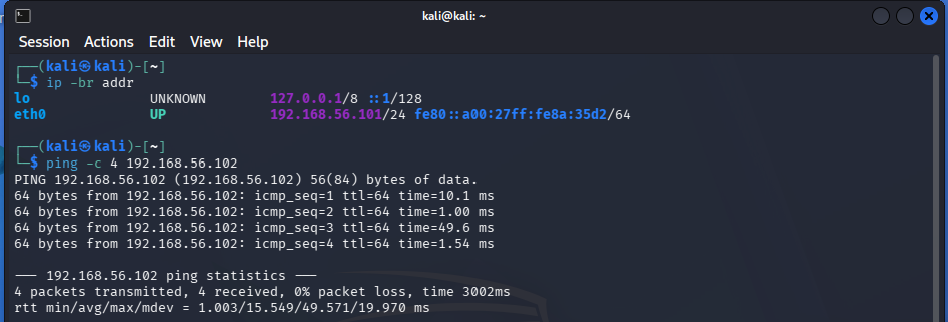
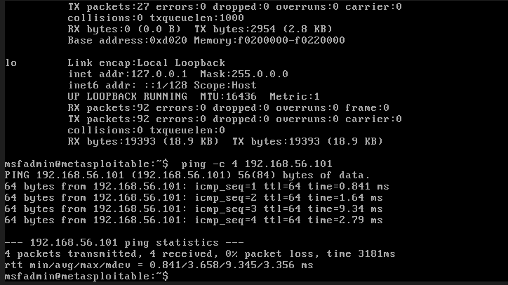

# Lab 02: VirtualBox CyberLab

## Overview

This lab documents the creation of an isolated cybersecurity practice environment using Oracle VirtualBox. The environment includes Kali Linux as the security testing and analysis system and Metasploitable 2 as the intentionally vulnerable target system.

The lab provides a controlled environment for practicing networking, system enumeration, vulnerability identification, web security testing, log review, and other cybersecurity skills without interacting with unauthorized or production systems.

## Objective

Build and document a safe virtual cybersecurity lab that supports repeatable hands-on exercises while maintaining clear network isolation and authorization boundaries.

## Skills Demonstrated

- Virtual machine deployment
- Virtual network configuration
- Linux system administration
- IP address configuration
- Network connectivity testing
- Cybersecurity lab safety
- Technical documentation
- Troubleshooting
- Vulnerability testing in an authorized environment

## Environment and Tools

- Windows 11 host computer
- Oracle VirtualBox
- Kali Linux
- Metasploitable 2
- VirtualBox Internal Network
- Linux command line
- Network troubleshooting utilities

## Virtual Machines

### Kali Linux

Kali Linux serves as the security testing and analyst workstation. It provides tools for network discovery, traffic analysis, vulnerability assessment, web security testing, and security investigation exercises.

Static internal lab address:

```text
192.168.56.101
```

### Metasploitable 2

Metasploitable 2 is an intentionally vulnerable Linux virtual machine used only as an authorized target inside the isolated lab environment.

Static internal lab address:

```text
192.168.56.102
```

## Network Design

The Kali Linux and Metasploitable 2 virtual machines communicate through a VirtualBox Internal Network named:

```text
CyberLab
```

The internal network allows the virtual machines to communicate with one another while preventing the vulnerable target system from being exposed directly to the physical network or the internet.

## Lab Topology

```text
Windows 11 Host
        |
 Oracle VirtualBox
        |
 Internal Network: CyberLab
        |
        +--------------------------+
        |                          |
   Kali Linux                Metasploitable 2
  192.168.56.101              192.168.56.102
 Security Workstation         Vulnerable Target
```

## Work Completed

During this lab, I:

- Installed and configured Oracle VirtualBox
- Imported or created the Kali Linux virtual machine
- Imported the Metasploitable 2 virtual machine
- Configured both systems to use the internal network named `CyberLab`
- Assigned or verified the planned IP addresses
- Confirmed communication between the virtual machines
- Verified that the vulnerable target was not using bridged networking
- Established safety rules for authorized lab activity
- Documented the environment for repeatable future exercises

## Validation Results

The completed configuration was validated through VirtualBox settings review, IP address verification, and bidirectional ping testing.

- Kali Linux `eth0`: `192.168.56.101/24`
- Metasploitable 2 `eth0`: `192.168.56.102/24`
- Both systems use the VirtualBox Internal Network named `CyberLab`
- Adapters 2 through 4 are disabled on both virtual machines
- Neither virtual machine uses NAT or bridged networking
- Ping testing succeeded in both directions
- Connectivity testing completed with 0% packet loss
- Static IP configurations remained active after reboot

## Screenshots and Evidence

### Kali Linux Network Configuration

Kali Linux uses Adapter 1 on the isolated VirtualBox Internal Network named `CyberLab`.



### Metasploitable 2 Network Configuration

Metasploitable 2 uses Adapter 1 on the same isolated `CyberLab` internal network.



### Kali Linux Static IP Address

Kali Linux was configured with the persistent static IPv4 address `192.168.56.101/24`.



### Metasploitable 2 Static IP Address

Metasploitable 2 was configured with the persistent static IPv4 address `192.168.56.102/24`.



### Kali-to-Metasploitable Connectivity Test

Kali successfully communicated with Metasploitable 2 with 0% packet loss.



### Metasploitable-to-Kali Connectivity Test

Metasploitable 2 successfully communicated with Kali with 0% packet loss.



## Security and Safety Boundaries

This lab follows the following safety rules:

- Testing is limited to personally owned or explicitly authorized virtual systems
- Metasploitable 2 is not connected through bridged networking
- No scanning or testing is performed against public Wi-Fi networks
- No testing is performed against City systems, employer systems, or other production environments
- Sensitive credentials and personal information are removed from screenshots
- Vulnerable systems remain isolated when they are not actively being used
- Commands and techniques are documented for educational and defensive purposes

## Importance

A properly isolated virtual lab allows cybersecurity techniques to be practiced safely. The environment creates opportunities to build technical experience while reinforcing authorization, scope control, network segmentation, and responsible security testing.

## Lessons Learned

This lab demonstrates that cybersecurity testing must begin with proper environment design and clearly defined boundaries. Network configuration is not only a technical requirement but also a security control that prevents an intentionally vulnerable system from creating risk outside the lab.

## Planned Exercises

Future exercises using this environment may include:

- Network discovery
- Service enumeration
- Nmap scanning
- Wireshark traffic analysis
- DVWA web security testing
- Vulnerability assessment
- Linux command-line practice
- Log review
- Basic incident investigation

## Status

**Completed and portfolio ready**
