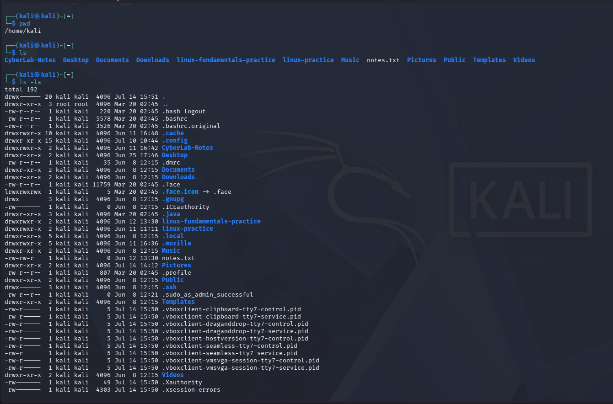
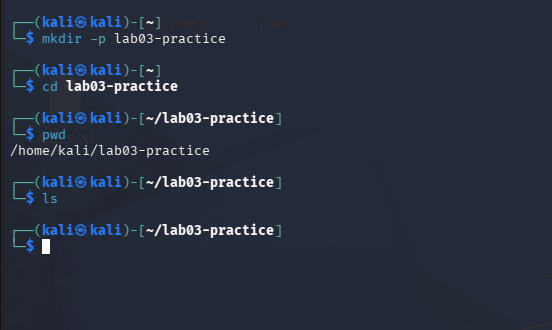
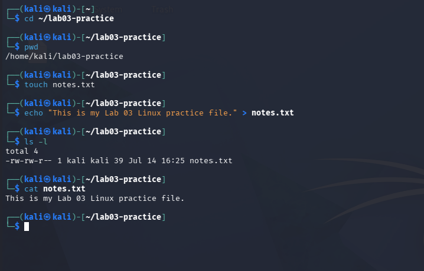
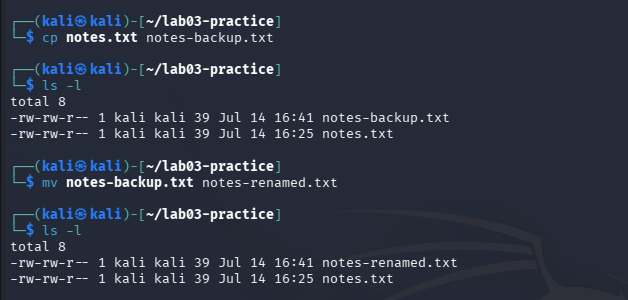
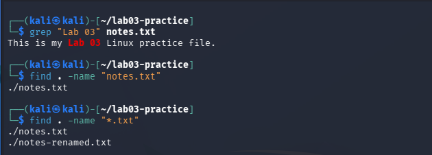
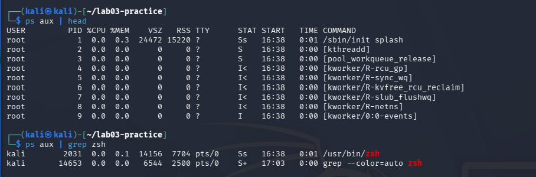
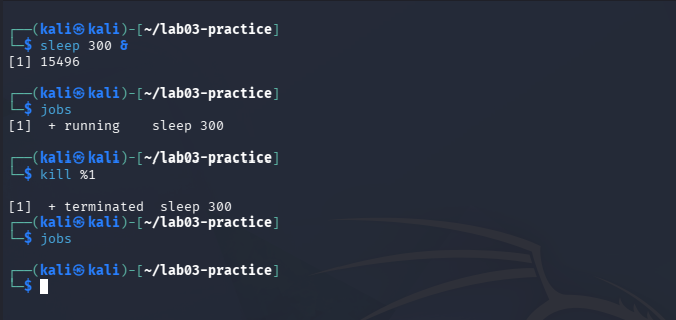
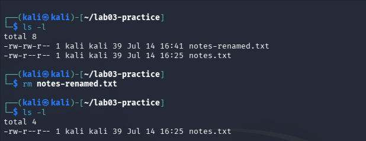
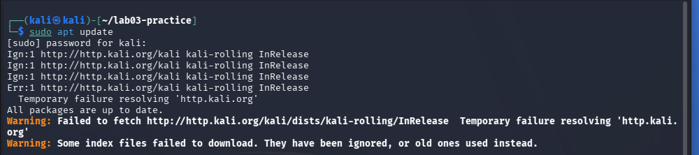

# Lab 03: Linux Fundamentals

## Overview

This lab documents foundational Linux command-line skills completed in Kali Linux. The exercises covered navigation, directory and file management, searching, permissions, process monitoring, process control, file removal, and basic package-management troubleshooting.

The purpose of the lab was to develop confidence using the Linux terminal and create documented evidence of practical system-administration skills relevant to cybersecurity and IT support roles.

## Objective

Practice and document common Linux commands used to navigate the filesystem, manage files and permissions, search for information, monitor processes, control running tasks, and troubleshoot system behavior.

## Skills Demonstrated

- Linux command-line navigation
- Directory and file management
- File viewing and editing
- Copying and moving files
- Searching with `grep` and `find`
- Linux permissions management
- Process monitoring
- Background process control
- File removal
- Package-management troubleshooting
- Technical documentation
- Screenshot evidence collection

## Environment and Tools

- Kali Linux
- Oracle VirtualBox
- Bash shell
- Linux filesystem
- VirtualBox Internal Network
- Project Athenaeum documentation system

## Commands Practiced

### Navigation and Directory Listing

```bash
pwd
ls
ls -la
```

These commands display the current working directory and list files, including hidden files and detailed permission information.

### Directory Creation and Navigation

```bash
mkdir
cd
```

These commands create directories and move between locations in the Linux filesystem.

### File Creation and Viewing

```bash
touch
echo
cat
```

These commands create files, write basic content, and display file contents.

### Copying and Moving Files

```bash
cp
mv
```

These commands copy files and move or rename them.

### Searching for Files and Text

```bash
grep
find
```

These commands search for text inside files and locate files or directories within the filesystem.

### File Permissions

```bash
chmod
ls -l
```

These commands modify file permissions and verify permission changes.

### Process Monitoring

```bash
ps
grep
```

These commands display running processes and filter the results for specific activity.

### Background Process Control

```bash
sleep 300 &
jobs
kill
```

These commands start a background process, review active jobs, and terminate a selected process.

### File Removal

```bash
rm
```

This command permanently removes files from the Linux filesystem.

### Package Management and Network Troubleshooting

```bash
sudo apt update
```

The package-update command was used to demonstrate troubleshooting when Kali was connected only to the isolated `CyberLab` internal network. Because the lab network does not provide internet access, the update could not reach external repositories. This result confirmed that the virtual machine remained isolated as designed.

## Work Completed

During this lab, I:

- Verified the current working directory
- Listed standard and hidden files
- Created and navigated through directories
- Created files and displayed their contents
- Copied, moved, and renamed files
- Searched for text and located files
- Modified and verified Linux file permissions
- Viewed and filtered running processes
- Started and terminated a background process
- Removed a test file
- Investigated a package-update failure caused by intentional network isolation
- Collected ten screenshots documenting the completed exercises

## Screenshots and Evidence

### 1. Current Directory and File Listings

The `pwd`, `ls`, and `ls -la` commands were used to confirm the current directory and display standard, hidden, and detailed file information.



### 2. Directory Creation and Navigation

A new directory was created with `mkdir`, and the `cd` command was used to enter the directory and confirm the working location.



### 3. File Creation and Viewing

A text file was created, content was added, and the file contents were displayed through the command line.



### 4. Copying and Moving Files

The `cp` and `mv` commands were used to copy, move, and rename files within the Linux filesystem.



### 5. Searching With Grep and Find

The `grep` command was used to search for text inside a file, while `find` was used to locate files within the filesystem.



### 6. File Permission Management

The `chmod` command was used to modify file permissions, and `ls -l` was used to verify the resulting permission settings.


### 7. Process Monitoring

The `ps` and `grep` commands were used together to display and filter information about running processes.



### 8. Background Process Control

A background process was started, reviewed, and terminated using process and job-control commands.



### 9. File Removal

The `rm` command was used to remove a test file, and the directory contents were reviewed to confirm its removal.



### 10. Package Management and Network Isolation

The `sudo apt update` command could not reach external repositories because Kali was connected only to the isolated VirtualBox Internal Network. This result supported the earlier verification that the `CyberLab` environment did not provide internet access.



## Security Relevance

Linux command-line skills are important in cybersecurity because analysts frequently work with Linux servers, security appliances, logs, scripts, permissions, processes, and network tools.

Understanding file permissions helps prevent unauthorized access. Process monitoring supports the identification of suspicious activity. Search commands help locate files and indicators, while package-management troubleshooting strengthens system-administration and diagnostic skills.

## Lessons Learned

This lab reinforced that Linux administration requires careful attention to commands, file paths, permissions, and process identifiers. It also demonstrated how system behavior can reflect the underlying network design.

The failed package update was not treated as a lab failure. It provided evidence that Kali was correctly isolated from the internet while connected to the private `CyberLab` network.

## Status

**Completed and portfolio ready**
