# Lab 05: DVWA Web Security

## Overview

This lab documents authorized web application security testing performed against Damn Vulnerable Web Application (DVWA) inside the isolated Project Athenaeum CyberLab.

Kali Linux was used as the security testing workstation, while DVWA was hosted on the intentionally vulnerable Metasploitable 2 virtual machine. The exercises focused on command injection and SQL injection while comparing DVWA's Low and High security settings.

## Objective

Practice identifying and validating common web application vulnerabilities in a controlled environment while documenting how security controls affect attack behavior.

## Skills Demonstrated

- Web application security testing
- Virtual lab networking
- Linux command-line use
- Command injection testing
- SQL injection testing
- Input validation awareness
- Security-control comparison
- Vulnerability verification
- Technical documentation
- Screenshot evidence management
- Responsible and authorized testing

## Environment and Tools

- Windows 11 host computer
- Oracle VirtualBox
- Kali Linux
- Metasploitable 2
- Damn Vulnerable Web Application
- VirtualBox Internal Network named `CyberLab`
- Web browser
- Linux terminal

## Lab Systems

### Kali Linux

Kali Linux served as the security testing workstation.

```text
192.168.56.101
```

### Metasploitable 2 and DVWA

Metasploitable 2 hosted the intentionally vulnerable DVWA target.

```text
192.168.56.102
```

Both systems communicated only through the isolated VirtualBox Internal Network named `CyberLab`.

## Work Completed

During this lab, I:

- Started the isolated Kali Linux and Metasploitable 2 virtual machines
- Verified the Kali Linux network address
- Confirmed connectivity with Metasploitable 2
- Opened the Metasploitable 2 web interface
- Accessed and authenticated to DVWA
- Reviewed the DVWA home page and available exercises
- Set DVWA Security to Low for initial vulnerability testing
- Performed a normal Command Injection function test
- Tested command injection at the Low security level
- Used `whoami` to verify that operating-system command execution occurred
- Compared the same command-injection behavior at the High security level
- Performed a normal SQL Injection function test
- Tested SQL injection at the Low security level
- Compared SQL-injection behavior at the High security level
- Collected and reviewed twelve screenshots
- Completed the Lab 05 screenshot log, notes, and final portfolio writeup

## Command Injection Testing

Command injection occurs when an application improperly handles user input and allows operating-system commands to be executed by the server.

The DVWA Command Injection exercise was first tested using normal input to establish expected functionality. Testing was then performed at the Low security level using controlled input within the authorized lab.

The `whoami` command demonstrated that additional operating-system commands could be executed through vulnerable input handling.

```bash
whoami
```

The exercise was repeated at the High security level to compare how stronger input filtering and validation changed the outcome.

## SQL Injection Testing

SQL injection occurs when untrusted user input is incorporated into a database query without sufficient validation or parameterization.

The DVWA SQL Injection exercise was first tested with standard input. Controlled SQL injection testing was then performed at the Low security level to observe how manipulated input could alter the application's database query behavior.

The same testing approach was compared at the High security level to evaluate the effect of additional security controls.

## Security-Level Comparison

DVWA provides multiple security levels so vulnerability behavior can be compared under different defensive settings.

### Low Security

The Low setting intentionally provides limited protection. It demonstrates how insufficient input validation can expose an application to command injection and SQL injection.

### High Security

The High setting introduces stronger defensive handling. Testing showed that the same input did not behave identically because additional filtering and validation were applied.

The comparison reinforced that security controls can reduce risk, but secure application development should also include server-side validation, parameterized database queries, least privilege, and careful handling of operating-system commands.

## Screenshots and Evidence

### Kali Linux Network Address

Kali Linux was configured as the testing workstation on the isolated `CyberLab` network.

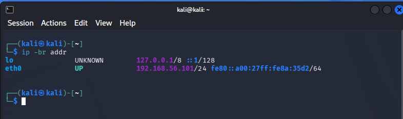

### Connectivity to Metasploitable 2

Successful ping testing confirmed communication between Kali Linux and the authorized Metasploitable 2 target.

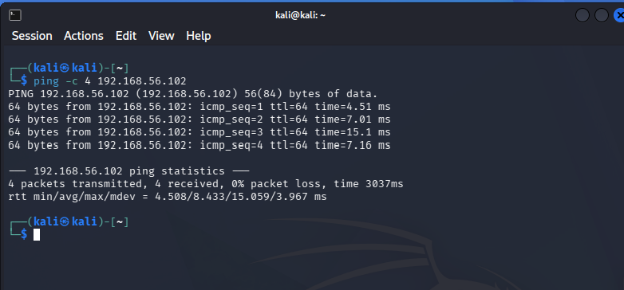

### Metasploitable 2 Web Interface

The Metasploitable 2 web interface provided access to the intentionally vulnerable applications hosted inside the lab.

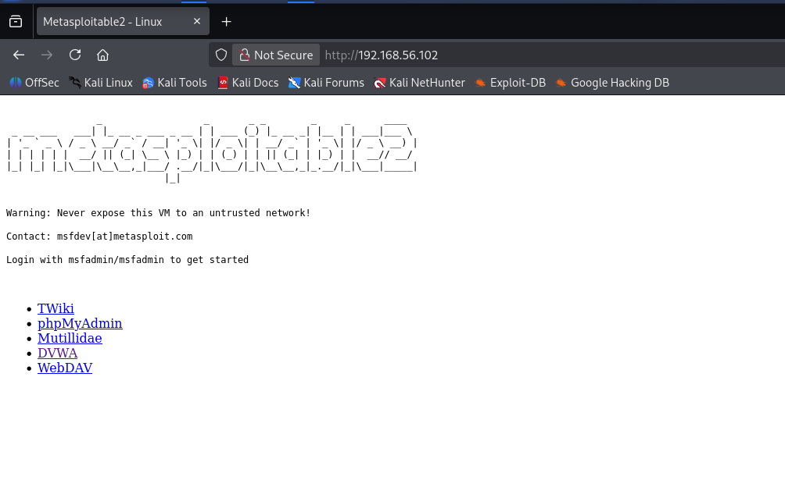

### DVWA Login Page

The DVWA login page was accessed through the isolated lab network.

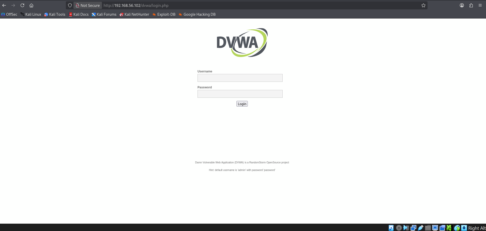

### DVWA Home Page

Successful authentication provided access to the DVWA vulnerability exercises.

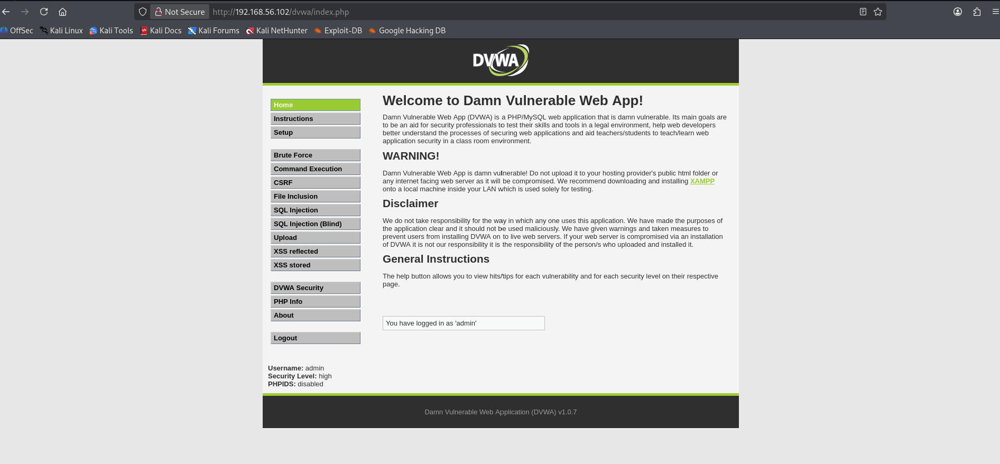

### DVWA Low Security Setting

DVWA Security was set to Low to establish the intentionally vulnerable testing condition.

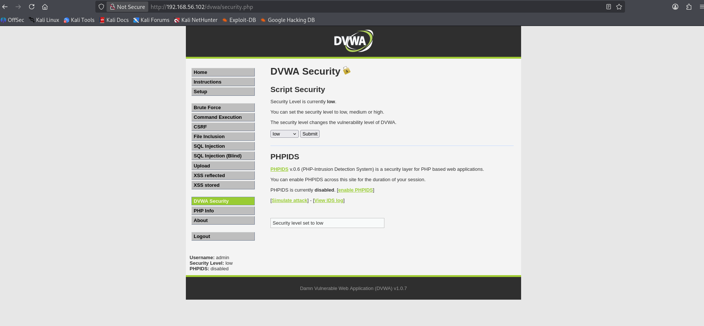

### Command Injection Normal Test

A normal ping request established the expected application behavior before manipulated input was tested.

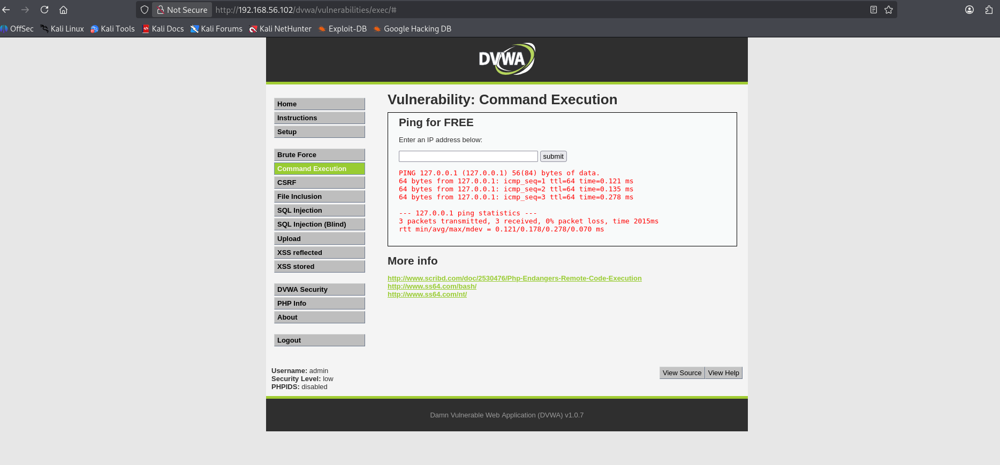

### Command Injection at Low Security

The controlled `whoami` test demonstrated operating-system command execution through insufficient input handling.

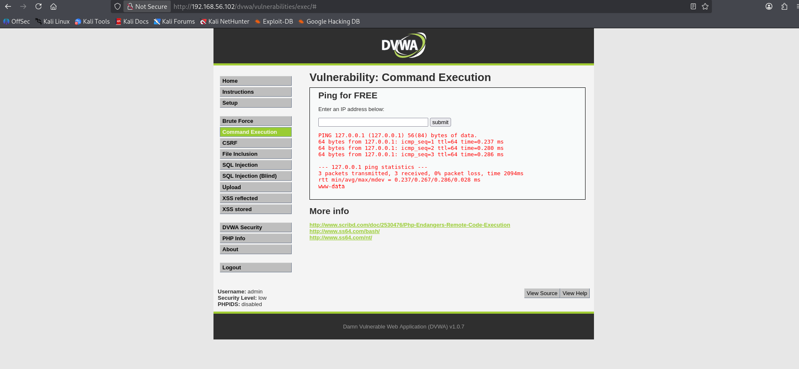

### Command Injection High Security Comparison

The same testing approach was repeated at the High security level to compare the effect of stronger input filtering.

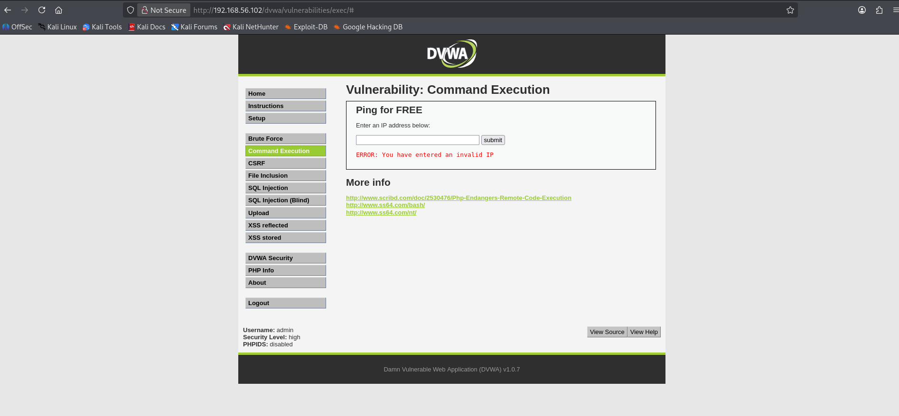

### SQL Injection Normal Test

Standard input was used to establish the expected SQL Injection exercise behavior.

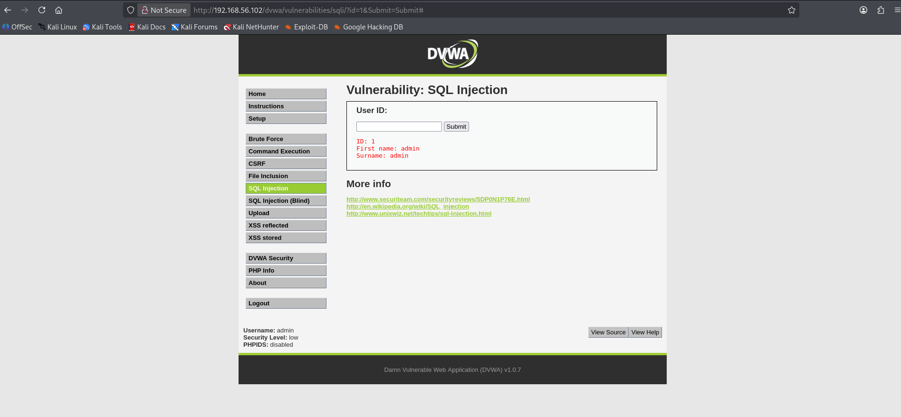

### SQL Injection at Low Security

Controlled SQL injection input demonstrated how insufficient query handling could alter the application’s database response.

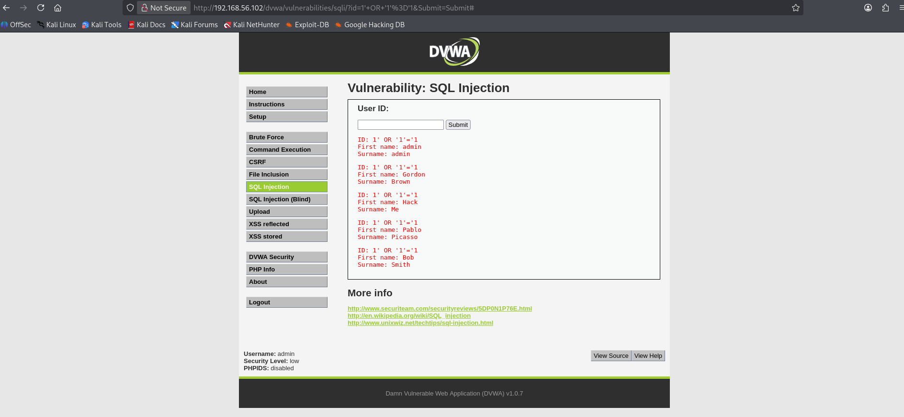

### SQL Injection High Security Comparison

The test was repeated at the High security level to compare the effect of additional defensive controls.

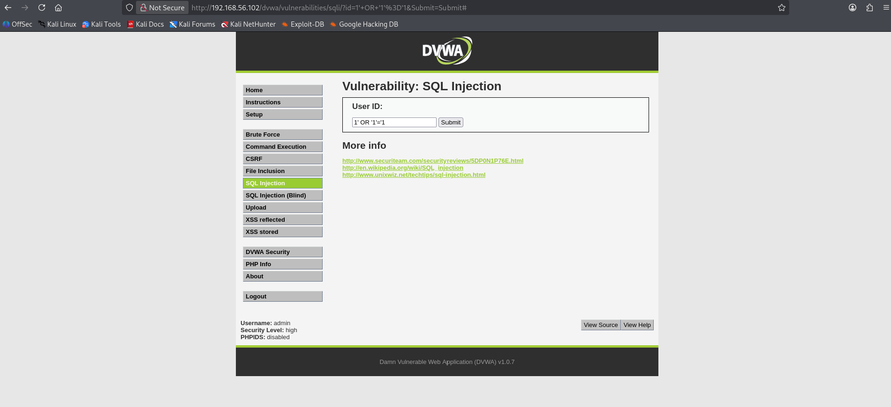

## Security and Safety Boundaries

This lab followed the following rules:

- Testing was limited to personally owned and explicitly authorized virtual machines
- Kali Linux and Metasploitable 2 communicated through the isolated `CyberLab` internal network
- Metasploitable 2 was not connected through bridged networking
- No testing was performed against public websites or internet systems
- No testing was performed against City, employer, school, or other production systems
- Credentials and commands were used only within the authorized training environment
- Screenshots were reviewed for personal or sensitive information before publication
- The exercises were performed for educational and defensive-security development

## Defensive Recommendations

Organizations can reduce command-injection and SQL-injection risk by applying controls such as:

- Strict server-side input validation
- Allowlisting expected input
- Parameterized database queries
- Prepared statements
- Avoiding direct execution of operating-system commands
- Least-privilege service accounts
- Secure error handling
- Web application firewall monitoring
- Application logging and alerting
- Regular code review and security testing
- Timely patching and dependency management

## Importance

Web applications commonly process user input, interact with databases, and communicate with underlying operating systems. Weak input handling can allow an attacker to access information, alter database queries, or execute unauthorized commands.

This lab provided practical experience recognizing these risks, validating vulnerabilities safely, comparing security settings, and documenting evidence in a professional format.

## Lessons Learned

This lab demonstrated that normal application functionality should be understood before vulnerability testing begins. Establishing a baseline made it easier to recognize how manipulated input changed application behavior.

The exercises also showed that input validation and security configuration significantly affect vulnerability exposure. The comparison between Low and High security reinforced the value of layered defenses rather than relying on a single security setting.

Finally, the lab reinforced the importance of authorization, isolation, scope control, and careful evidence handling during security testing.

## Documentation Created

The following Lab 05 documentation was completed and retained locally:

- Lab 05 screenshot log
- Lab 05 technical notes
- Lab 05 final portfolio writeup
- Twelve sanitized supporting screenshots

## Status

**Completed and evidence upload in progress**
