# Lab 06: Nmap Networking Basics

## Overview

This lab documents authorized network discovery and service-enumeration exercises performed with Nmap inside the isolated Project Athenaeum CyberLab.

Kali Linux was used as the scanning workstation, while Metasploitable 2 served as the intentionally vulnerable target. The exercises progressed from basic host scanning to service detection, targeted port scans, operating-system detection, aggressive scanning, and saving scan results for later review.

## Objective

Develop practical familiarity with Nmap while learning how network scans reveal open ports, running services, operating-system information, and potential attack surfaces.

## Skills Demonstrated

- Network discovery
- Host availability testing
- Port scanning
- Service and version detection
- Targeted port enumeration
- Operating-system detection
- Aggressive Nmap scanning
- Scan-result interpretation
- Command-line output management
- Evidence collection
- Technical documentation
- Authorized vulnerability assessment

## Environment and Tools

- Windows 11 host computer
- Oracle VirtualBox
- Kali Linux
- Metasploitable 2
- VirtualBox Internal Network named `CyberLab`
- Nmap
- Linux terminal

## Lab Systems

### Kali Linux

Kali Linux served as the authorized network-scanning workstation.

```text
192.168.56.101
```

### Metasploitable 2

Metasploitable 2 served as the intentionally vulnerable target.

```text
192.168.56.102
```

Both systems communicated only through the isolated VirtualBox Internal Network named `CyberLab`.

## Work Completed

During this lab, I:

- Verified the Kali Linux network address
- Confirmed connectivity with Metasploitable 2
- Verified the installed Nmap version
- Performed a basic Nmap scan against the authorized target
- Used service and version detection
- Scanned common web-service ports
- Scanned common database-service ports
- Scanned common remote-access ports
- Performed operating-system detection
- Performed an aggressive Nmap scan
- Reviewed the complete aggressive-scan results
- Saved Nmap output to a text file
- Opened and reviewed the saved scan-results file
- Documented the results using screenshots, notes, and a screenshot log

## Basic Network Scan

A basic Nmap scan was used to identify open TCP ports on the Metasploitable 2 target.

```bash
nmap 192.168.56.102
```

This scan provided an initial view of the exposed services and established a baseline for more detailed enumeration.

## Service and Version Detection

Service and version detection was used to gather additional information about software listening on open ports.

```bash
nmap -sV 192.168.56.102
```

Identifying service versions can help administrators determine whether outdated, unexpected, or vulnerable software may be present.

## Targeted Port Scanning

Targeted scans were used to focus on categories of commonly used services.

### Web Services

Web-related ports were reviewed to identify available HTTP or HTTPS services.

### Database Services

Database-related ports were reviewed to identify exposed database platforms.

### Remote-Access Services

Remote-access ports were reviewed to identify services such as FTP, SSH, Telnet, and other administrative interfaces.

Targeted scanning can reduce unnecessary output and focus an investigation on services relevant to a particular security question.

## Operating-System Detection

Nmap operating-system detection was used to estimate the target system’s operating-system family and characteristics.

```bash
sudo nmap -O 192.168.56.102
```

Operating-system detection is based on how the target responds to specially crafted network probes and may not always produce an exact identification.

## Aggressive Scan

An aggressive scan combined several Nmap capabilities, including service detection, operating-system detection, script scanning, and traceroute information.

```bash
sudo nmap -A 192.168.56.102
```

This scan produced more detailed information but also generated more network traffic than the basic scans.

## Saving Scan Results

Nmap output was saved to a text file for documentation and later analysis.

```bash
nmap -sV -oN lab06_nmap_results.txt 192.168.56.102
```

The saved file was then reviewed from the Linux terminal.

```bash
cat lab06_nmap_results.txt
```

Saving results supports documentation, comparison, reporting, and follow-up analysis.

## Key Findings

The intentionally vulnerable Metasploitable 2 system exposed numerous services across web, database, file-transfer, remote-access, and administrative ports.

The large number of available services demonstrated how an expanded attack surface increases the number of systems and applications that defenders must inventory, patch, configure, and monitor.

The results were generated only from the authorized Metasploitable 2 target inside the isolated CyberLab.

## Security and Safety Boundaries

This lab followed the following rules:

- Scanning was limited to personally owned and explicitly authorized virtual machines
- Kali Linux and Metasploitable 2 communicated through the isolated `CyberLab` internal network
- Metasploitable 2 was not connected through bridged networking
- No public IP addresses or internet systems were scanned
- No testing was performed against City, employer, school, or other production systems
- Scan scope was defined before commands were executed
- Results were reviewed for sensitive information before publication
- The exercises were performed for educational and defensive-security development

## Defensive Importance

Network scanning helps organizations:

- Discover active systems
- Identify exposed ports
- Inventory running services
- Detect unexpected applications
- Support vulnerability assessments
- Validate firewall rules
- Reduce unnecessary attack surface
- Prioritize patching and remediation
- Establish baselines for future monitoring

Nmap results should be combined with asset ownership, vulnerability information, configuration reviews, and organizational risk priorities before remediation decisions are made.

## Lessons Learned

This lab demonstrated that Nmap can progress from basic discovery to detailed service and operating-system enumeration.

Basic scans provide a quick overview, while service detection and aggressive scanning produce richer information for analysis. Targeted scans are useful when an investigator needs to focus on a particular technology or service category.

The lab also reinforced that scanning must remain within an authorized scope. Even basic scanning can reveal detailed information about a system and should not be performed against networks or devices without permission.

## Screenshots and Evidence

### Kali Linux Network Address

Kali Linux was configured as the authorized Nmap scanning workstation on the isolated `CyberLab` network.

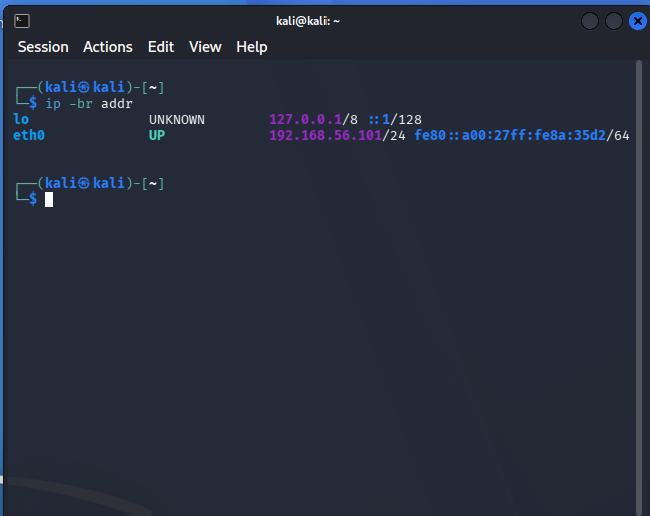

### Connectivity to Metasploitable 2

Successful ping testing confirmed communication with the authorized Metasploitable 2 target.

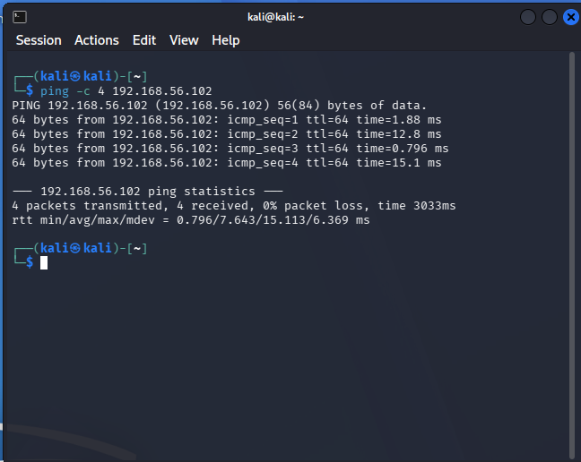

### Nmap Version

The installed Nmap version was verified before beginning the scanning exercises.

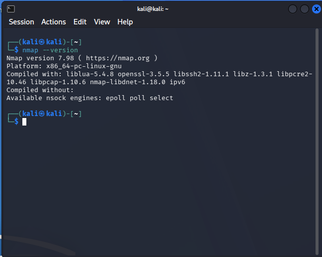

### Basic Nmap Scan

A basic scan identified open TCP ports on Metasploitable 2 and established an initial view of its exposed services.

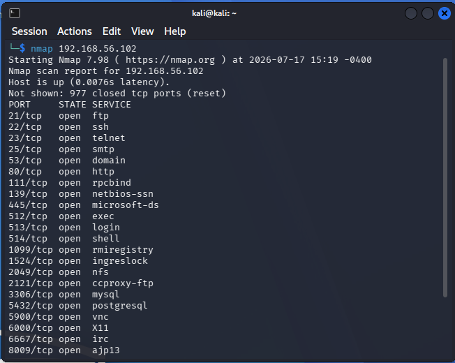

### Service and Version Detection

The `-sV` option gathered additional information about the software and versions associated with open ports.

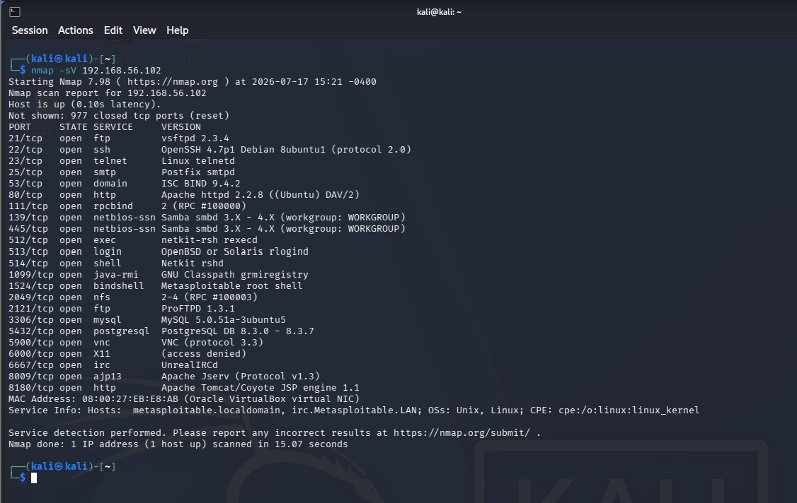

### Web-Port Scan

A targeted scan examined common web-service ports on the authorized target.

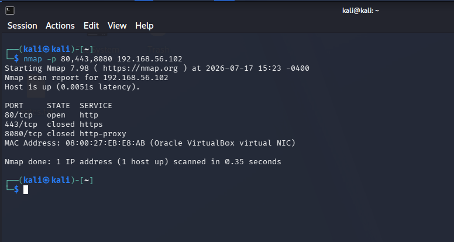

### Database-Port Scan

A targeted scan examined ports commonly associated with database services.

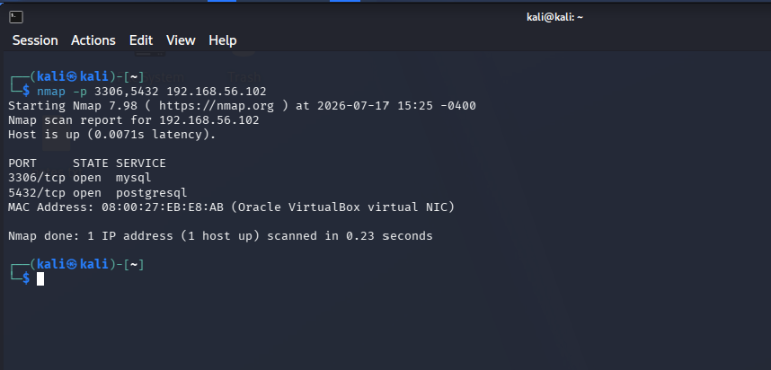

### Remote-Access Port Scan

Remote-access and administrative service ports were examined to identify exposed services.

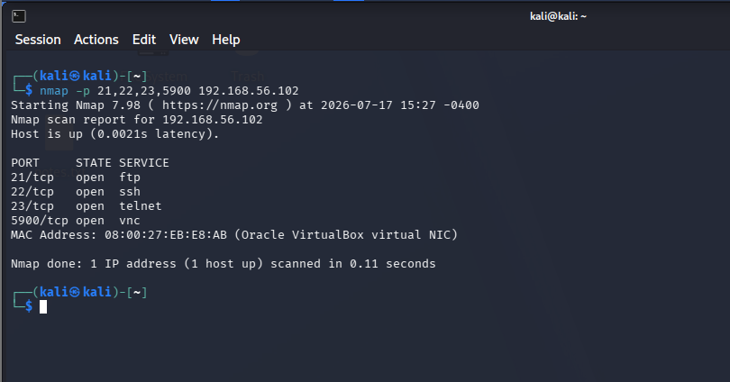

### Operating-System Detection

Nmap operating-system detection was used to estimate the target system’s operating-system family and characteristics.

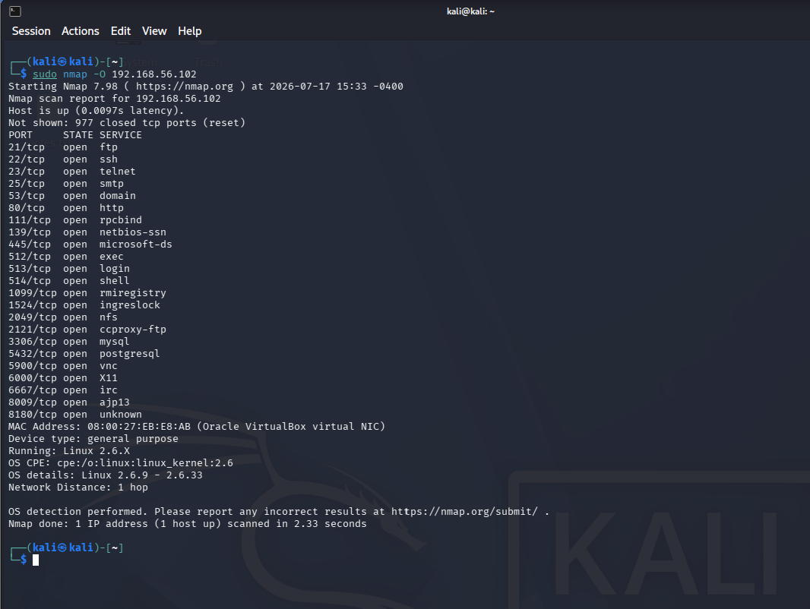

### Aggressive Scan — Upper Section

The upper section of the aggressive scan displayed detailed port, service, and script-scanning results.

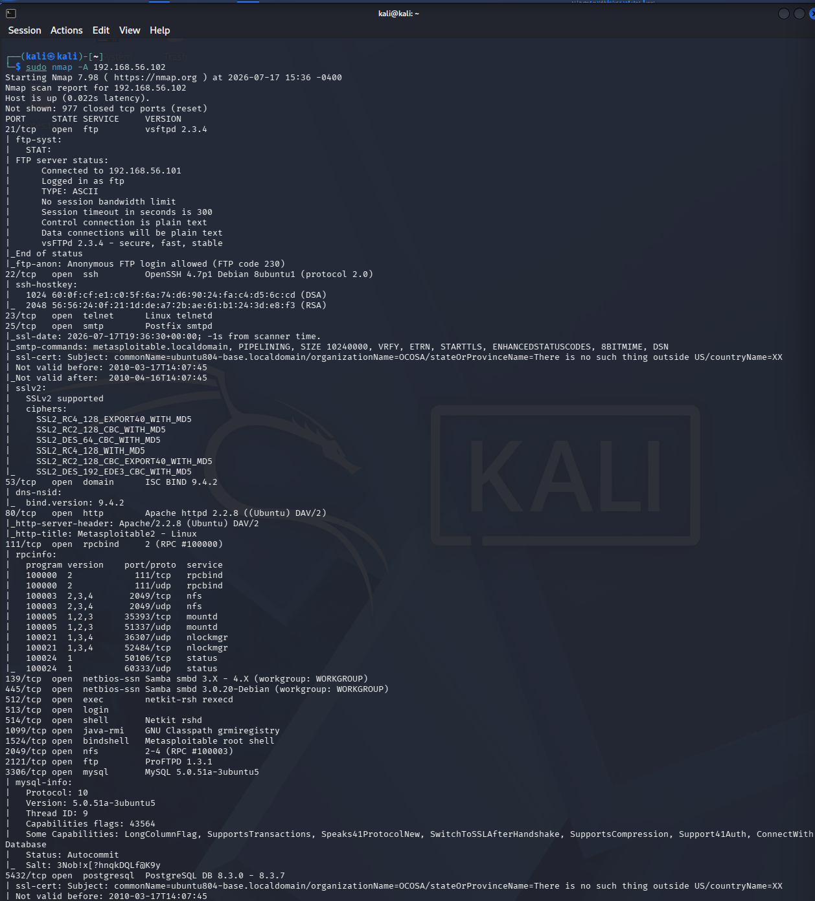

### Aggressive Scan — Lower Section

The lower section documented additional script results, operating-system findings, network distance, and scan-completion information.

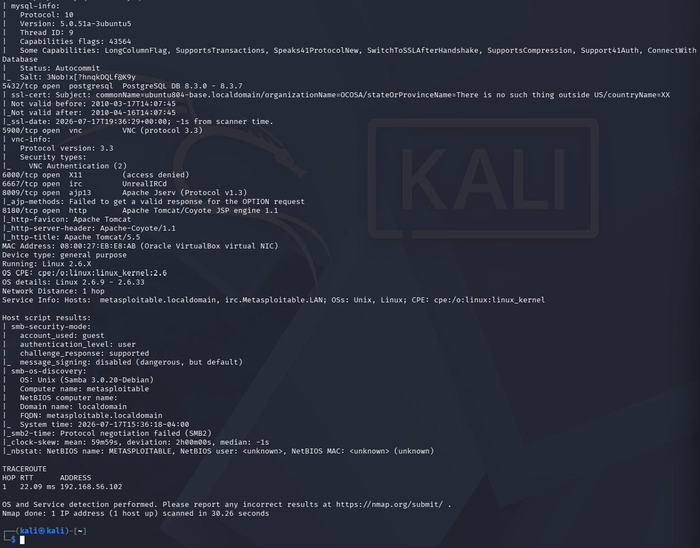

### Saving Scan Results

Nmap output was saved to a text file to support documentation and later review.

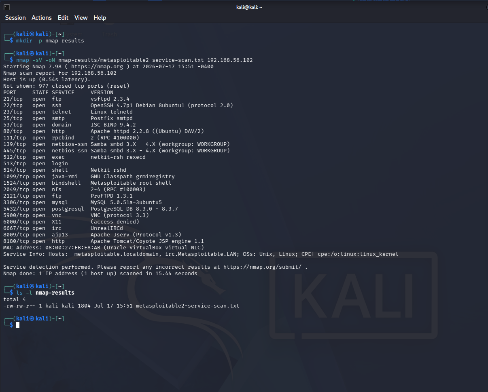

### Reviewing Saved Results

The saved Nmap-results file was opened in the Linux terminal to confirm that the scan information had been retained successfully.

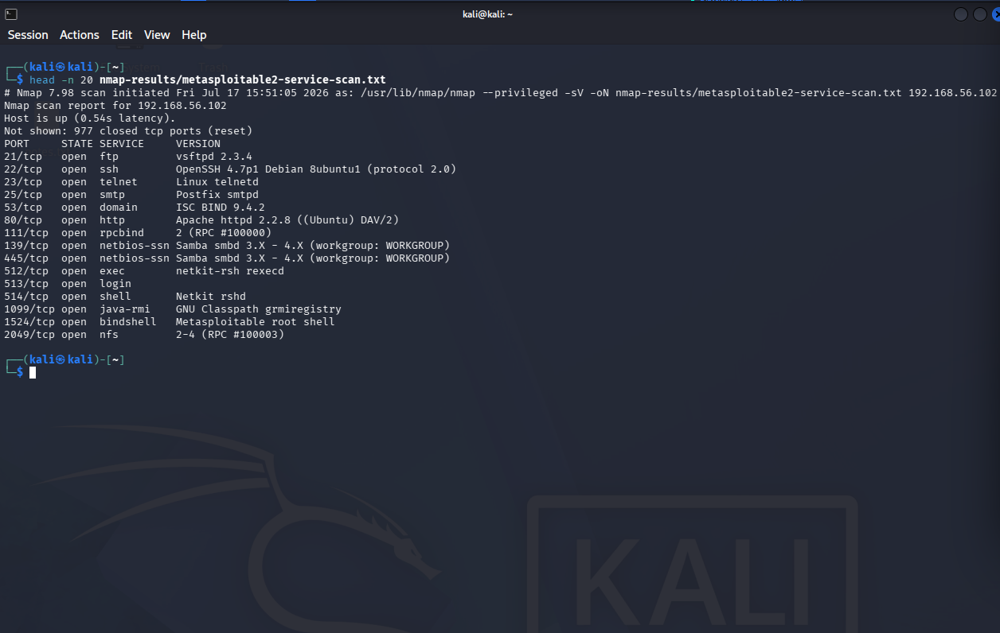

## Documentation Created

The following documentation was retained locally:

- Lab 06 screenshot log
- Lab 06 technical notes
- Lab 06 portfolio documentation
- Thirteen supporting screenshots

## Status

**Completed and portfolio ready**
