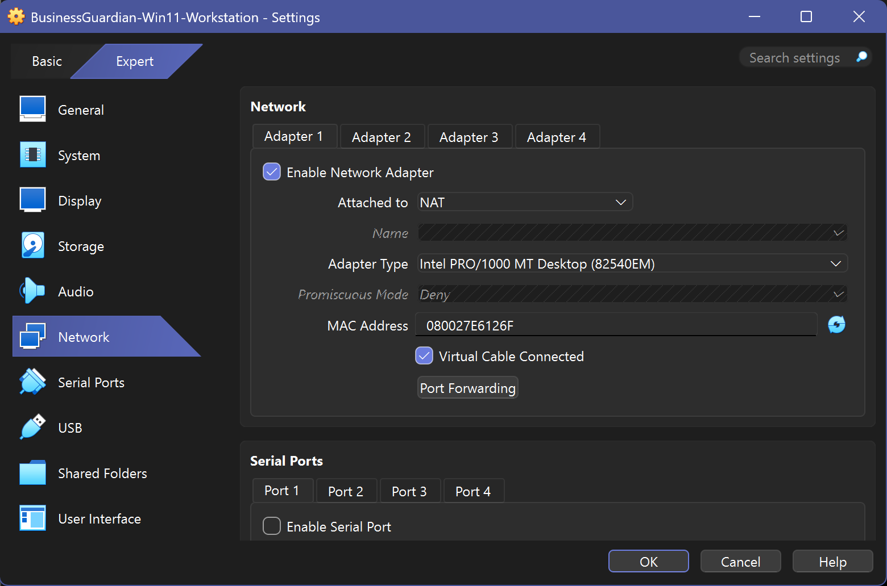
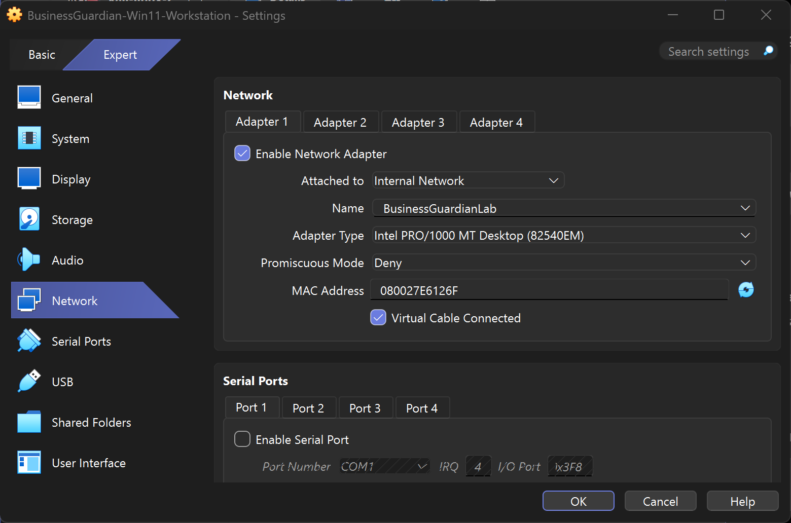
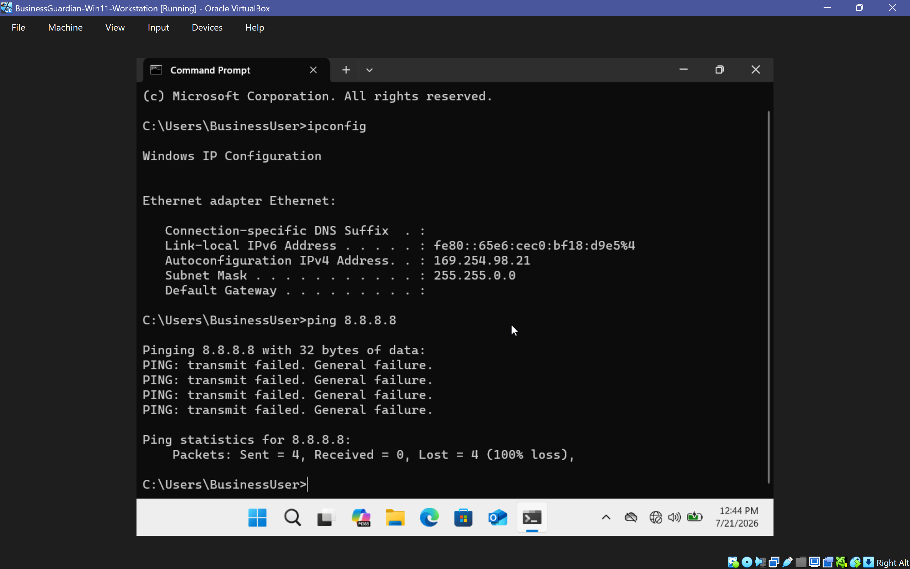
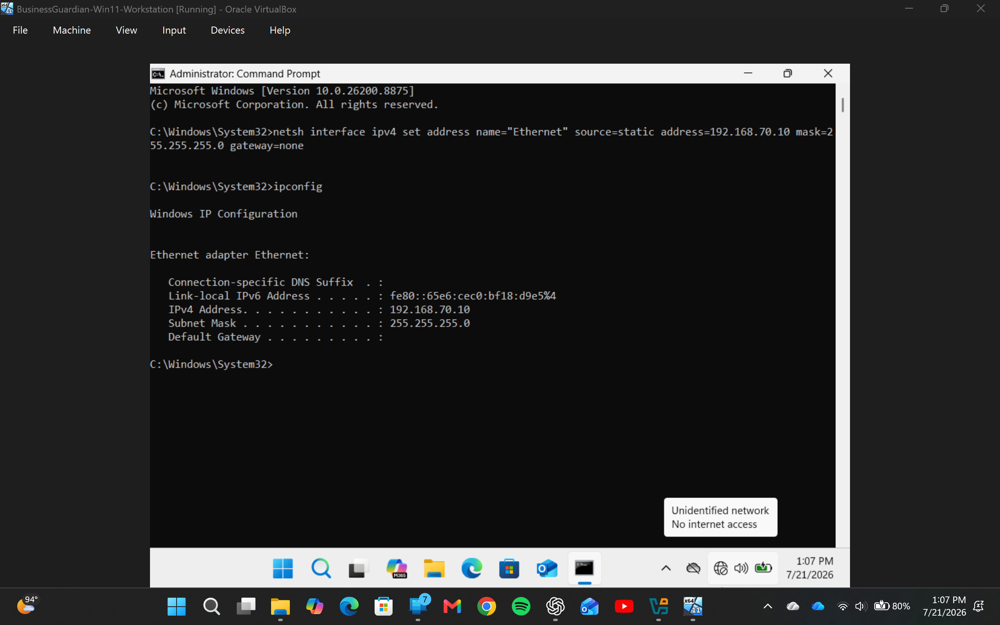
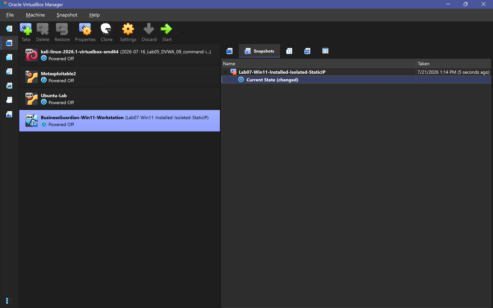

# Lab 07 — BusinessGuardianLab Network Setup

## Before You Can Monitor a Business, You Need a Safe Place to Build One

Labs 01–06 established the Project Athenaeum foundation through documentation, operating-system administration, networking, and authorized security testing.

Lab 07 starts a new phase.

Instead of using a general cybersecurity practice environment, I wanted a dedicated lab that could eventually represent a small-business workstation and support endpoint monitoring, troubleshooting, security automation, and later Business Guardian development.

That raised the first design question:

**How do I create a Windows business workstation that I can safely experiment with without exposing the surrounding network?**

The answer became `BusinessGuardianLab`.

This lab creates:

```text
Windows 11 Workstation
        ↓
Isolated VirtualBox Network
        ↓
Persistent Internal Address
        ↓
Known-Good Recovery Snapshot
```

Everything that follows in the Business Guardian sequence builds from this foundation.

---

# What Lab 07 Builds

The lab establishes a dedicated Windows 11 environment for future small-business security scenarios.

The completed baseline includes:

- Windows 11 Pro virtual workstation
- Local lab user
- VirtualBox Internal Network
- No Bridged Adapter
- No public internet connectivity after setup
- Persistent static IPv4 address
- Validated isolation
- Clean recovery snapshot

The goal was not yet to monitor or analyze security events.

The goal was to create a safe, repeatable environment where that work could happen later.

---

# The Workstation

The virtual machine is named:

```text
BusinessGuardian-Win11-Workstation
```

The local lab account is:

```text
BusinessUser
```

The workstation is designed to represent a simulated small-business endpoint for later exercises involving:

- IT support
- Windows administration
- Endpoint monitoring
- Troubleshooting
- Logging
- Security testing
- Backup and recovery
- Incident-response exercises

No real customer or business data is used.

---

# Starting With Temporary Internet Access

Windows installation initially required a straightforward setup path.

The workstation therefore started with VirtualBox NAT networking.

Conceptually:

```text
Windows Workstation
       ↓
VirtualBox NAT
       ↓
Temporary Internet Access
```

That allowed the operating system installation and initial configuration to be completed.

<p align="center">
  
</p>

<p align="center">
  <em>NAT was used during initial Windows setup before the workstation was moved into the isolated business lab.</em>
</p>

---

# Moving the Workstation Into Isolation

Once Windows setup was complete, the virtual machine was shut down and the networking model changed.

Adapter 1 was moved from NAT to the VirtualBox Internal Network:

```text
BusinessGuardianLab
```

Adapters 2 through 4 remained disabled.

No Bridged Adapter was enabled.

The architecture changed from:

```text
Windows Workstation
       ↓
      NAT
       ↓
   Internet
```

to:

```text
Windows Workstation
       ↓
BusinessGuardianLab
       ↓
Isolated Internal Network
```

<p align="center">
  
</p>

<p align="center">
  <em>The workstation was moved from NAT to the isolated BusinessGuardianLab Internal Network.</em>
</p>

---

# A Failed Ping Was the Result I Wanted

After isolation, the workstation was tested against a public IP address:

```powershell
ping 8.8.8.8
```

The test failed.

Normally, a failed connectivity test suggests a problem.

Here, it proved the security boundary was working.

<p align="center">
  
</p>

<p align="center">
  <em>The failed public-internet test confirmed that the workstation was isolated as intended.</em>
</p>

This was an early but useful lesson:

> **A failed test can still be a PASS when failure is the expected security behavior.**

---

# Why Windows Assigned an APIPA Address

After the workstation was moved to the isolated network, `ipconfig` showed an address in the Automatic Private IP Addressing range.

Typical APIPA range:

```text
169.254.0.0/16
```

That was not an unexpected Windows failure.

It revealed something about the network.

`BusinessGuardianLab` did not yet contain a DHCP server.

The workstation was asking for an automatic address, but nothing on the network was available to provide one.

Conceptually:

```text
Windows Requests DHCP Address
           ↓
No DHCP Server Exists
           ↓
Windows Assigns APIPA Address
```

This provided a useful troubleshooting signal and confirmed that the isolated network was behaving as expected.

---

# Giving the Workstation a Predictable Address

Future monitoring systems would need to know where this workstation lives.

A changing or self-assigned APIPA address would make that difficult.

The workstation was therefore configured with:

```text
IP address: 192.168.70.10
Subnet prefix: /24
Network: 192.168.70.0/24
```

No default gateway or public DNS server was required for this isolated stage.

<p align="center">
  
</p>

<p align="center">
  <em>The workstation received a persistent internal address that later monitoring systems could reliably use.</em>
</p>

The final workstation baseline became:

```text
BusinessGuardian-Win11-Workstation
192.168.70.10/24
```

---

# Why Static Addressing Matters Here

A predictable address becomes increasingly useful as the lab grows.

Future components can reliably reference:

```text
192.168.70.10
```

instead of rediscovering the workstation every time the environment starts.

That supports later:

- Monitoring servers
- Endpoint agents
- Administrative tools
- Python scripts
- Dashboards
- Troubleshooting
- Security testing

This small networking decision becomes part of the foundation used throughout the later Business Guardian labs.

---

# Preserving the Clean Baseline

Once Windows installation, network isolation, and static addressing were complete, the workstation was preserved with a VirtualBox snapshot:

```text
Lab07-Win11-Installed-Isolated-StaticIP
```

<p align="center">
  
</p>

<p align="center">
  <em>The clean snapshot preserved a known-good recovery point before monitoring software or additional business applications were introduced.</em>
</p>

This creates an important development rule that continues through Project Athenaeum:

> **Preserve a known-good state before adding the next major layer.**

---

# Final Network Design

The completed Lab 07 environment is intentionally simple:

```text
Windows 11 Host
       |
Oracle VirtualBox
       |
BusinessGuardianLab
192.168.70.0/24
       |
BusinessGuardian-Win11-Workstation
192.168.70.10/24

Public Internet: Unavailable
Bridged Networking: Disabled
```

At this stage there is:

- No monitoring server
- No Wazuh agent
- No alert processing
- No security automation

Those capabilities belong to later labs.

Lab 07 only establishes the environment they will depend on.

---

# Final Validation

Lab 07 successfully demonstrated:

```text
Create Windows VM
       ↓
Install Windows 11
       ↓
Complete Initial Setup
       ↓
Remove NAT
       ↓
Join BusinessGuardianLab
       ↓
Confirm Internet Isolation
       ↓
Identify APIPA Condition
       ↓
Assign Static IPv4 Address
       ↓
Verify Configuration
       ↓
Create Recovery Snapshot
```

## Validation Status

| Validation Area | Result |
| --- | --- |
| Windows 11 VM deployment | **PASS** |
| Local lab account | **PASS** |
| Internal network configuration | **PASS** |
| Bridged networking disabled | **PASS** |
| Public internet isolation | **PASS** |
| APIPA condition identified | **PASS** |
| Static IPv4 configuration | **PASS** |
| Persistent address | **192.168.70.10/24** |
| Recovery snapshot | **COMPLETE** |
| BusinessGuardianLab baseline | **ESTABLISHED** |

---

# Security and Safety Boundaries

Lab 07 uses only personally owned and authorized virtual systems.

The environment follows these controls:

- The workstation operates on the isolated `BusinessGuardianLab` network
- No Bridged Adapter is enabled
- Public systems are not scanned or tested
- Employer systems are not involved
- City systems are not involved
- School systems are not involved
- Customer systems are not involved
- No real customer or financial information is used
- Future business activity is synthetic
- Screenshots are reviewed before publication
- Passwords and personal information are excluded from GitHub
- Recovery snapshots are created before major changes

---

# What Lab 07 Proves

Lab 07 demonstrates that a useful security lab begins with more than simply creating a virtual machine.

The workstation needed:

- A defined purpose
- A network boundary
- Predictable addressing
- Isolation validation
- Troubleshooting
- A recovery strategy

The APIPA condition also turned into a useful networking lesson.

Instead of treating the unexpected address as a random problem, it revealed exactly what was missing:

```text
No DHCP server
```

And the failed internet ping proved that the isolation control was doing its job.

Most importantly:

> **Before Business Guardian could monitor anything, it needed a controlled business environment worth monitoring.**

Lab 07 creates that environment.

---

# Skills Demonstrated

- Oracle VirtualBox administration
- Windows 11 deployment
- Virtual network configuration
- Network isolation
- NAT vs. Internal Network design
- Static IPv4 addressing
- APIPA troubleshooting
- Windows network diagnostics
- Connectivity testing
- Security-boundary validation
- Snapshot management
- Recovery planning
- Technical documentation
- Screenshot evidence management

---

# Where the Project Goes From Here

Lab 07 answers:

**Can I create a controlled Windows environment that safely represents a small-business endpoint?**

The answer is yes.

The project now has:

```text
Isolated Business Workstation
192.168.70.10
```

But an isolated endpoint alone cannot provide centralized security visibility.

That creates the next question:

**How do I monitor this workstation without giving the lab unnecessary network exposure?**

[Lab 08 — Wazuh Monitoring Server Setup](../lab-08-wazuh-monitoring-server-setup/README.md) answers that question by adding a centralized Wazuh server with separate administrative and isolated monitoring interfaces.

The progression becomes:

```text
Business Workstation
       ↓
Isolated Network
       ↓
Central Monitoring Server
       ↓
Endpoint Agent
       ↓
Security Telemetry
```

Lab 07 is where the Business Guardian technical journey begins.

**Everything that follows depends on this network.**
