# Lab 08 — Wazuh Monitoring Server Setup

## How Do You Build Centralized Monitoring Without Giving the Lab Unnecessary Exposure?

Lab 07 created the isolated `BusinessGuardianLab` network and its Windows 11 workstation.

But an isolated workstation by itself cannot provide centralized security visibility.

The next question was:

**How do I add a monitoring server that can receive security data from the lab while still having controlled access for installation and administration?**

Lab 08 builds that server using Wazuh.

The key design decision was to give the monitoring server two separate network paths:

```text
Controlled Administration / Updates
            ↓
           NAT
            ↓
       Wazuh Server
            ↓
   Isolated Internal Network
            ↓
Business Guardian Workstation
```

One interface supports controlled outbound access.

The other provides a stable, isolated path to future monitored endpoints.

This is where `BusinessGuardianLab` begins turning from an isolated Windows environment into a centralized security-monitoring lab.

---

# What Lab 08 Builds

The completed environment includes:

- Linux-based Wazuh monitoring server
- Wazuh manager
- Wazuh indexer
- Wazuh dashboard
- Dual virtual-network interfaces
- Persistent internal IPv4 addressing
- Isolated endpoint-monitoring network
- Local dashboard access from the host
- Recovery snapshots
- Credential-safe public documentation

The server becomes the central point where later Windows endpoint telemetry and security events can be collected and reviewed.

---

# The Network Problem

The Wazuh server needs to perform two different jobs.

It needs controlled connectivity for:

- Installation
- Package retrieval
- Updates
- Administrative setup

But it also needs a trusted path to the isolated Business Guardian environment.

Putting everything on one unrestricted network would weaken the lab design.

So Lab 08 separates those functions.

---

# One Server, Two Networks

## Adapter 1 — NAT

The first virtual adapter provides controlled outbound connectivity.

Linux interface:

```text
enp0s3
```

Address:

```text
10.0.2.15/24
```

Its purpose is administrative:

```text
Installation
Updates
Package Retrieval
Controlled Setup
```

---

## Adapter 2 — BusinessGuardianLab

The second adapter connects directly to the isolated internal network.

Linux interface:

```text
enp0s8
```

Static address:

```text
192.168.70.20/24
```

VirtualBox network:

```text
BusinessGuardianLab
```

This is the interface future endpoints use to communicate with Wazuh.

No Bridged Adapter was used.

---

# Final Network Architecture

```text
Windows 11 Host
        |
 Oracle VirtualBox
        |
        +----------------------------------+
        |                                  |
      NAT                          Internal Network
10.0.2.0/24                       BusinessGuardianLab
        |                          192.168.70.0/24
        |                                  |
   Wazuh Server                +-------------------------+
   enp0s3                      |                         |
   10.0.2.15              Wazuh Server          Windows Workstation
                          enp0s8                192.168.70.10
                          192.168.70.20
```

The important separation is:

```text
Administrative Connectivity
           ≠
Endpoint Monitoring Connectivity
```

---

# Building the Linux Server

A dedicated Linux server virtual machine was created for Wazuh.

The setup included:

- Virtual-machine hardware configuration
- Ubuntu Server installation
- Initial operating-system configuration
- OpenSSH support for authorized administration
- System updates
- Network-interface identification
- Clean pre-Wazuh recovery snapshot

<p align="center">
  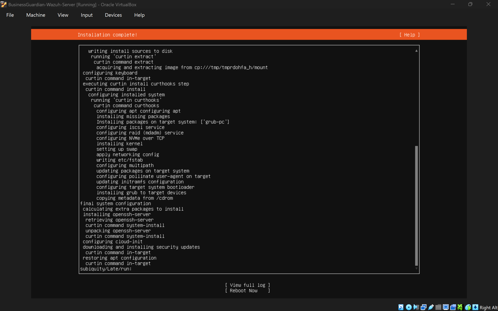
</p>

<p align="center">
  <em>The Linux server installation established the base system that would host Wazuh.</em>
</p>

---

# Preserving a Clean Starting Point

Before Wazuh was installed, a recovery snapshot was created.

<p align="center">
  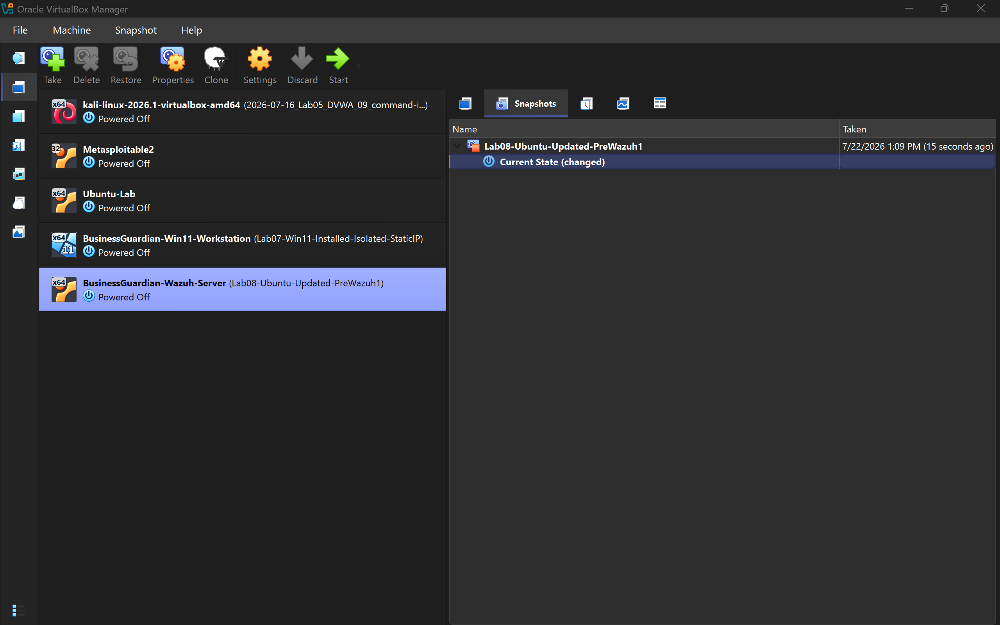
</p>

<p align="center">
  <em>A clean pre-Wazuh snapshot provided a known recovery point before the monitoring platform was added.</em>
</p>

This follows a rule that becomes increasingly important throughout Project Athenaeum:

> **Preserve a known-good state before making a major change.**

---

# Installing Wazuh

The Wazuh components were installed on the Linux server.

The deployment provided three major pieces of the monitoring stack:

```text
Wazuh Manager
      +
Wazuh Indexer
      +
Wazuh Dashboard
```

Each serves a different role.

## Wazuh Manager

The manager handles the central security-analysis and endpoint-management functions.

<p align="center">
  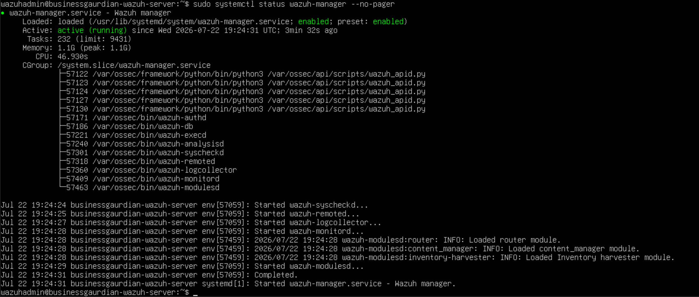
</p>

<p align="center">
  <em>The Wazuh manager service was verified after installation.</em>
</p>

---

## Wazuh Indexer

The indexer provides storage and indexing for security information.

<p align="center">
  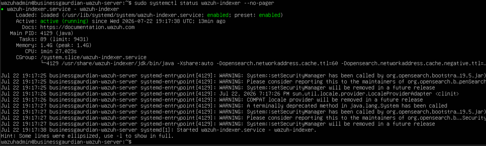
</p>

<p align="center">
  <em>The indexer service was confirmed operational before dashboard validation.</em>
</p>

---

## Wazuh Dashboard

The dashboard provides the browser-based interface used later to review endpoints, alerts, and security information.

<p align="center">
  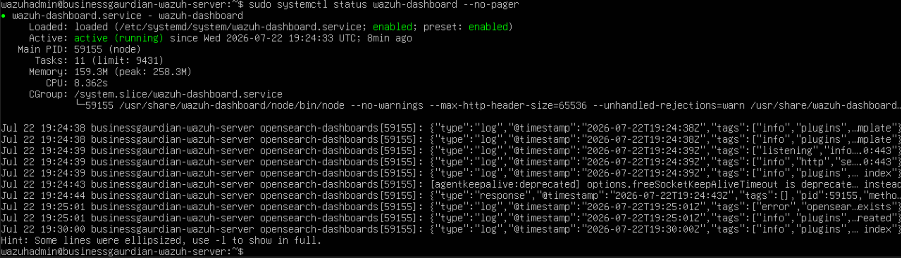
</p>

<p align="center">
  <em>The dashboard service completed the core Wazuh monitoring stack.</em>
</p>

---

# Reaching the Dashboard Without Exposing the Lab

The Wazuh dashboard needed to be accessible from the Windows host computer.

Instead of exposing the virtual machine directly to the surrounding network, a VirtualBox NAT port-forwarding rule was used.

The host browser reaches Wazuh through:

```text
https://127.0.0.1:8443
```

Conceptually:

```text
Host Browser
     ↓
127.0.0.1:8443
     ↓
VirtualBox Port Forwarding
     ↓
Wazuh Dashboard
```

<p align="center">
  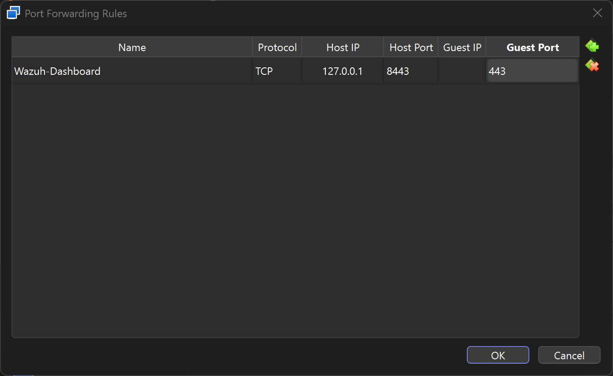
</p>

<p align="center">
  <em>Local port forwarding provided host access to the dashboard without using a Bridged Adapter.</em>
</p>

---

# First Dashboard Access

The Wazuh login page successfully loaded from the host browser.

<p align="center">
  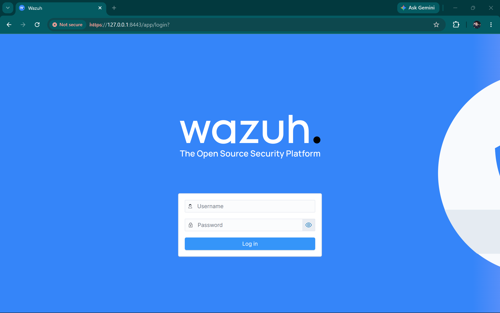
</p>

<p align="center">
  <em>The dashboard became reachable from the host through the local forwarding path.</em>
</p>

The lab browser displayed a certificate warning because the environment used a locally generated certificate.

That was expected for the isolated lab.

Successful access confirmed that:

- The dashboard service was running
- Port forwarding was functioning
- The host could reach the virtual server
- The Wazuh installation had progressed successfully

---

# Adding the Isolated Monitoring Interface

With Wazuh installed, the server still needed a permanent connection to `BusinessGuardianLab`.

A second VirtualBox adapter was added and connected to the internal network.

<p align="center">
  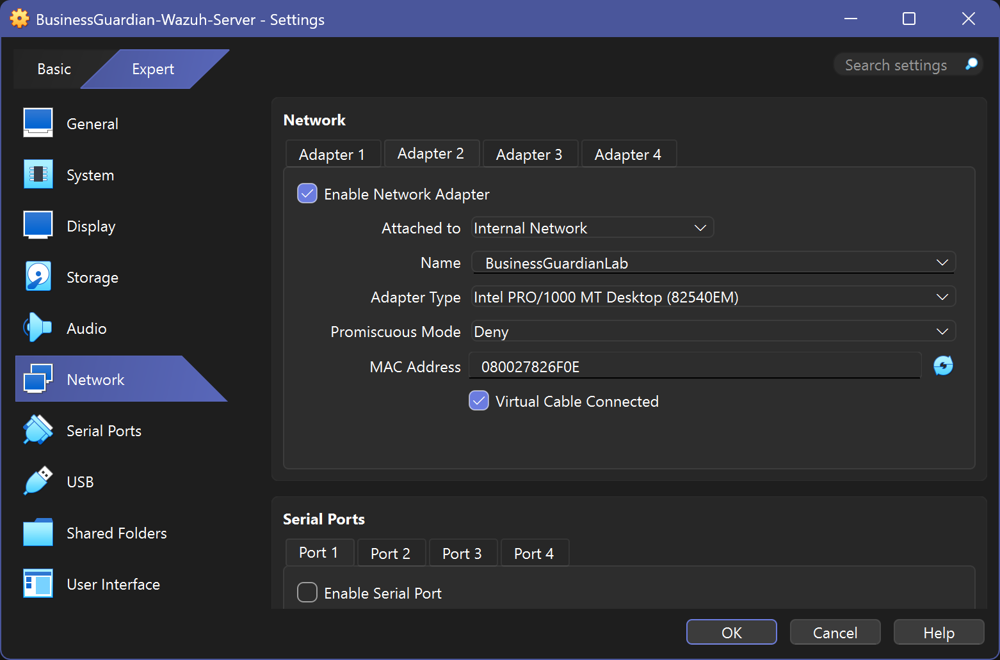
</p>

Linux then detected both interfaces:

```text
enp0s3 → NAT
enp0s8 → BusinessGuardianLab
```

<p align="center">
  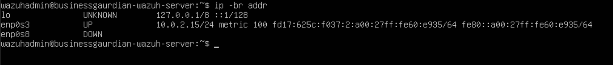
</p>

<p align="center">
  <em>Linux detected separate interfaces for administrative connectivity and isolated endpoint monitoring.</em>
</p>

---

# Giving the Monitoring Server a Permanent Address

The internal interface was assigned:

```text
Interface: enp0s8
Address: 192.168.70.20/24
Network: 192.168.70.0/24
```

A predictable address is essential because monitored endpoints need a consistent destination.

The lab now had:

```text
Windows workstation: 192.168.70.10
Wazuh server:        192.168.70.20
```

<p align="center">
  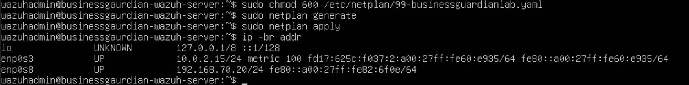
</p>

<p align="center">
  <em>The monitoring server received a persistent address on the isolated Business Guardian subnet.</em>
</p>

---

# Can the Windows Workstation Reach the Server?

The next test was simple but essential.

The Windows workstation needed to communicate with:

```text
192.168.70.20
```

The connectivity test succeeded.

<p align="center">
  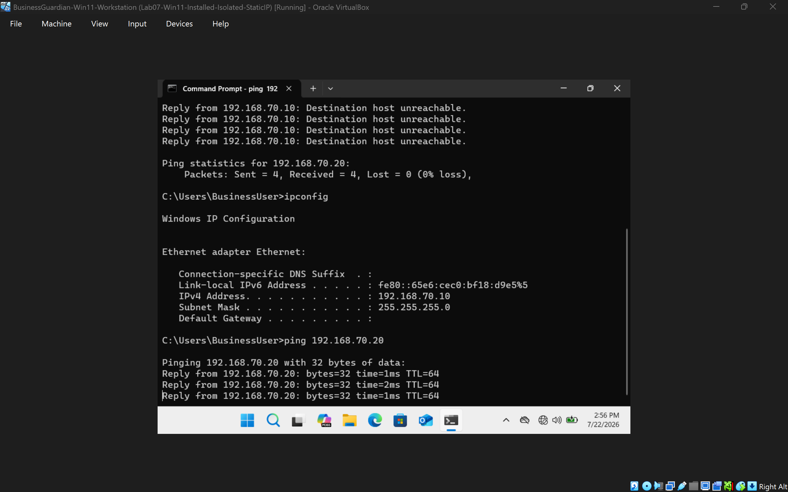
</p>

<p align="center">
  <em>The isolated Windows workstation successfully reached the Wazuh server across BusinessGuardianLab.</em>
</p>

That validated the network path needed for the next phase:

```text
Windows Endpoint
      ↓
BusinessGuardianLab
      ↓
Wazuh Monitoring Server
```

---

# Troubleshooting One Layer at a Time

Deploying the monitoring platform required more than installing software.

Several layers had to work together:

```text
VirtualBox
    ↓
Linux Interfaces
    ↓
IP Configuration
    ↓
Wazuh Services
    ↓
Port Forwarding
    ↓
Browser Access
    ↓
Internal Endpoint Connectivity
```

Troubleshooting included:

- Identifying the correct Linux interfaces
- Distinguishing NAT from the internal adapter
- Assigning a persistent address to `enp0s8`
- Confirming the internal network name
- Confirming the virtual cable was connected
- Reaching the dashboard from the host
- Matching host and guest port-forwarding settings
- Interpreting the local certificate warning
- Protecting generated credentials from public screenshots

This reinforced a practical troubleshooting lesson:

> **When several technologies are stacked together, validate each layer separately.**

---

# Protecting Credentials While Still Showing the Work

Wazuh generated administrative credentials during installation.

Those credentials are necessary for the environment.

They are not necessary for a public portfolio.

One screenshot containing potentially sensitive generated credentials was retained privately and excluded from GitHub.

Public evidence does not expose:

- Wazuh administrator passwords
- Generated installation credentials
- Recovery information
- API keys
- Tokens
- Private certificates or keys
- Personal account information
- Unnecessary host-system details

That allows the portfolio to prove the deployment without exposing the environment.

---

# Preserving the Completed Server

After installation, networking, dashboard access, service validation, and Windows connectivity were confirmed, a post-Wazuh recovery snapshot was created.

<p align="center">
  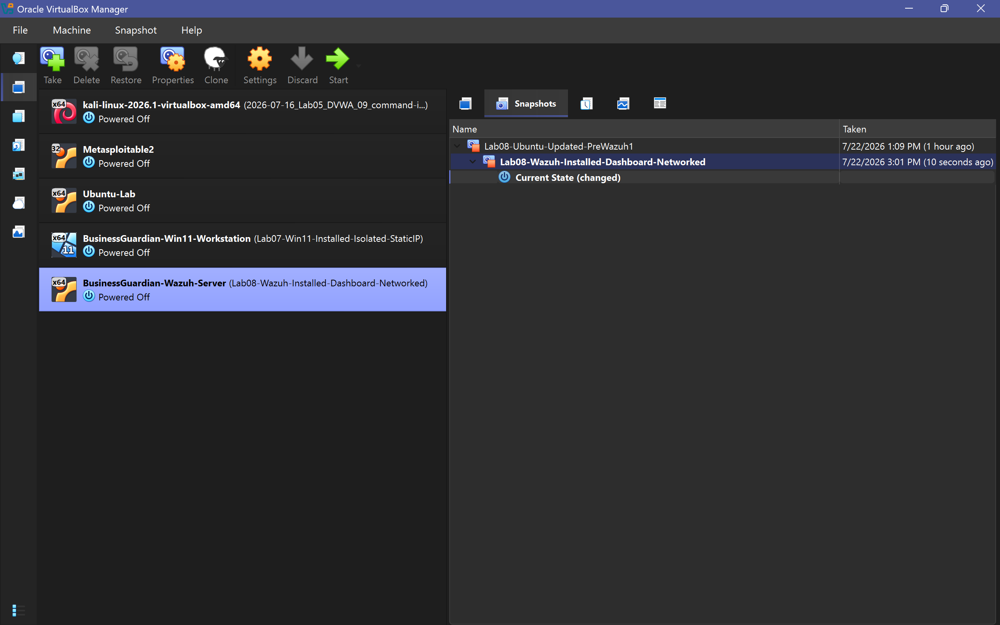
</p>

<p align="center">
  <em>The completed monitoring-server configuration was preserved before endpoint-agent deployment began.</em>
</p>

---

# Final Validation

Lab 08 successfully demonstrated:

```text
Linux Server Created
       ↓
Wazuh Installed
       ↓
Manager / Indexer / Dashboard Verified
       ↓
Local Dashboard Access Configured
       ↓
Internal Adapter Added
       ↓
Static Monitoring Address Assigned
       ↓
Windows-to-Wazuh Connectivity Confirmed
       ↓
Known-Good Snapshot Created
```

## Validation Status

| Validation Area | Result |
| --- | --- |
| Linux server deployment | **PASS** |
| NAT interface | **PASS** |
| Internal interface | **PASS** |
| Static internal address | **PASS** |
| Wazuh manager service | **PASS** |
| Wazuh indexer service | **PASS** |
| Wazuh dashboard service | **PASS** |
| Host dashboard access | **PASS** |
| NAT port forwarding | **PASS** |
| Windows-to-server communication | **PASS** |
| Bridged networking avoided | **PASS** |
| Credential-safe publication | **PASS** |
| Recovery snapshot | **COMPLETE** |

---

# Security and Safety Boundaries

All Lab 08 work was performed on personally owned and authorized systems.

The environment follows these controls:

- Endpoint communication uses the isolated `BusinessGuardianLab` network
- No Bridged Adapter is enabled
- NAT is limited to controlled installation and administration
- Dashboard access is forwarded only to the local host
- No customer systems are involved
- No employer or City systems are involved
- No production systems are involved
- No real financial data is used
- Generated credentials are excluded from public evidence
- Recovery snapshots are created before major changes
- Monitoring remains limited to authorized Project Athenaeum systems

---

# What Lab 08 Proves

Lab 08 demonstrates that deploying a monitoring platform is not just an application-installation task.

The server needed:

- A stable Linux base
- Correct virtual networking
- Separate connectivity roles
- Persistent addressing
- Working Wazuh services
- Controlled dashboard access
- Endpoint reachability
- Credential-safe documentation
- Recovery planning

Most importantly:

> **The monitoring server now has a trusted path to the isolated business environment without requiring that environment to be exposed directly to the surrounding network.**

That gives later labs somewhere to send endpoint telemetry.

---

# Skills Demonstrated

- Linux server administration
- Virtual machine deployment
- Wazuh installation
- SIEM fundamentals
- Endpoint-monitoring architecture
- Dual-interface networking
- Static IPv4 configuration
- Linux interface identification
- VirtualBox Internal Networks
- NAT port forwarding
- Service validation
- Browser-based dashboard access
- Network troubleshooting
- Credential protection
- Snapshot management
- Technical documentation

---

# Where the Project Goes From Here

Lab 07 answered:

**Can I create an isolated Windows environment that represents a small-business endpoint?**

Lab 08 answered:

**Can I give that environment a centralized monitoring server while keeping its endpoint network isolated?**

The answer was yes.

The architecture now has:

```text
Windows Workstation
192.168.70.10
       ↓
BusinessGuardianLab
       ↓
Wazuh Monitoring Server
192.168.70.20
```

But the server is still only waiting for security data.

The next question is:

**Can the Windows workstation actually enroll with Wazuh and report telemetry?**

[Lab 09 — Wazuh Windows Agent Deployment](../lab-09-wazuh-windows-agent-deployment/README.md) installs the endpoint agent, troubleshoots its configuration, validates communication, and confirms that monitoring continues after temporary internet access is removed.

The progression becomes:

```text
Isolated Business Network
        ↓
Central Monitoring Server
        ↓
Windows Endpoint Agent
        ↓
Active Endpoint Telemetry
```

Lab 08 is where BusinessGuardianLab gets its central security system.

**The network is no longer just isolated. It is ready to be monitored.**
