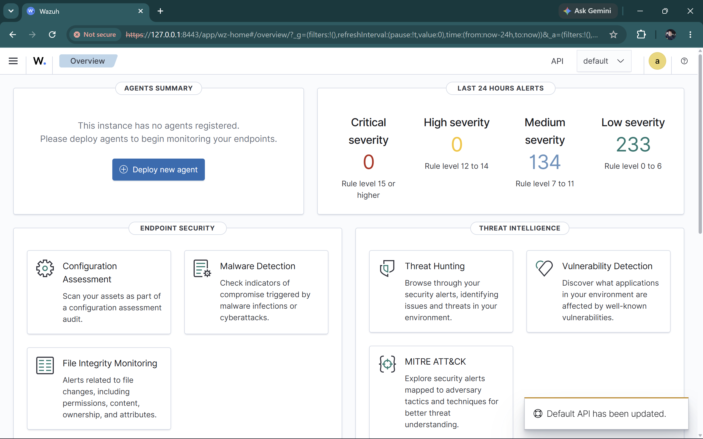
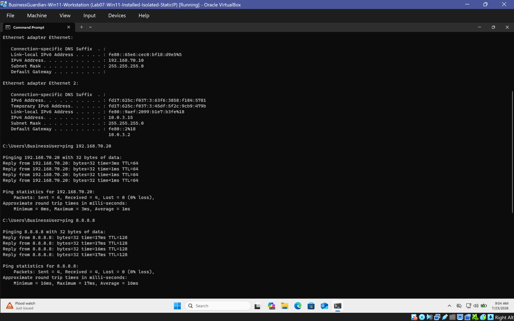
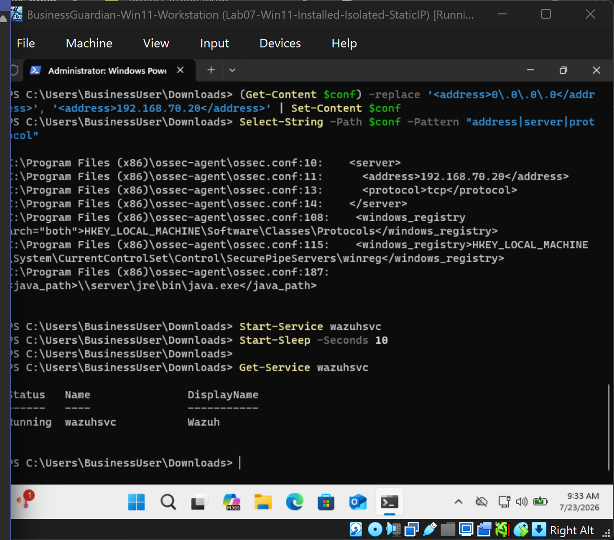
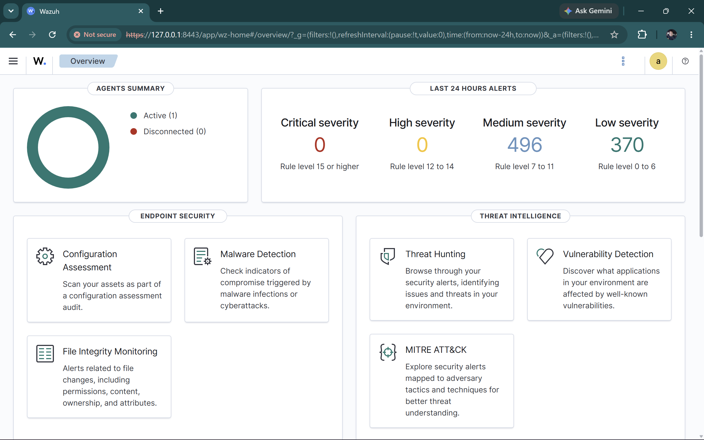
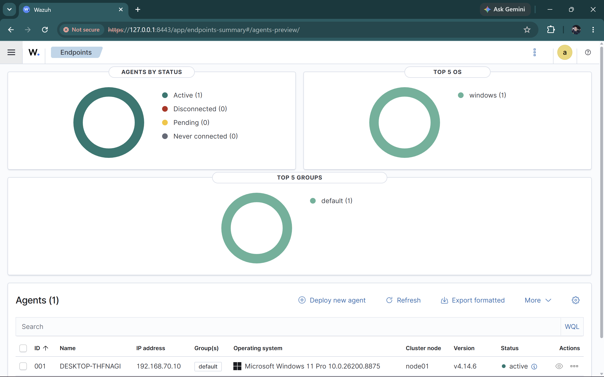
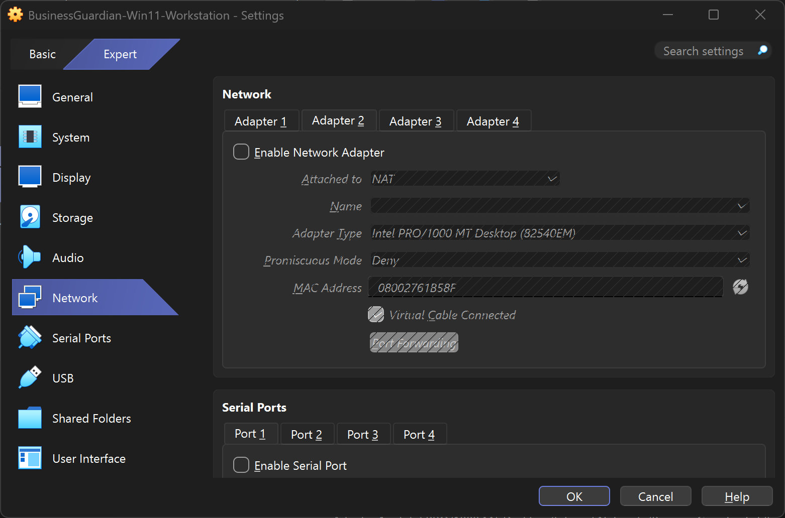
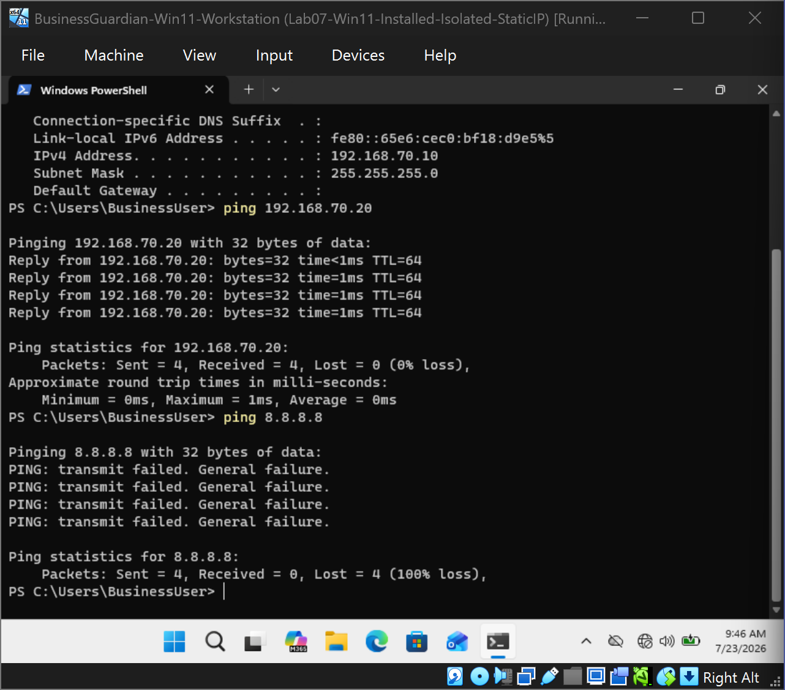
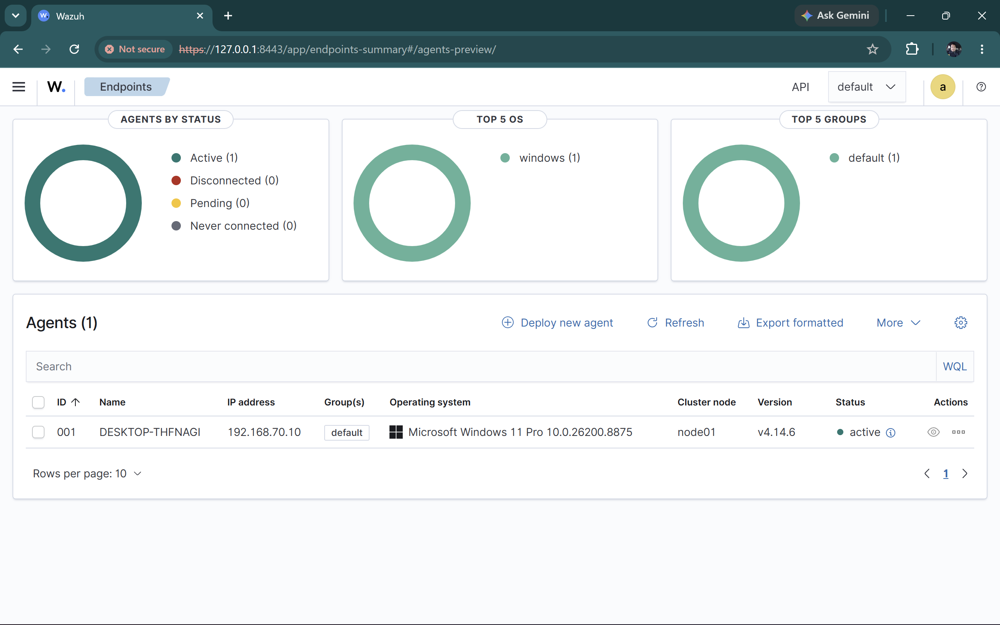
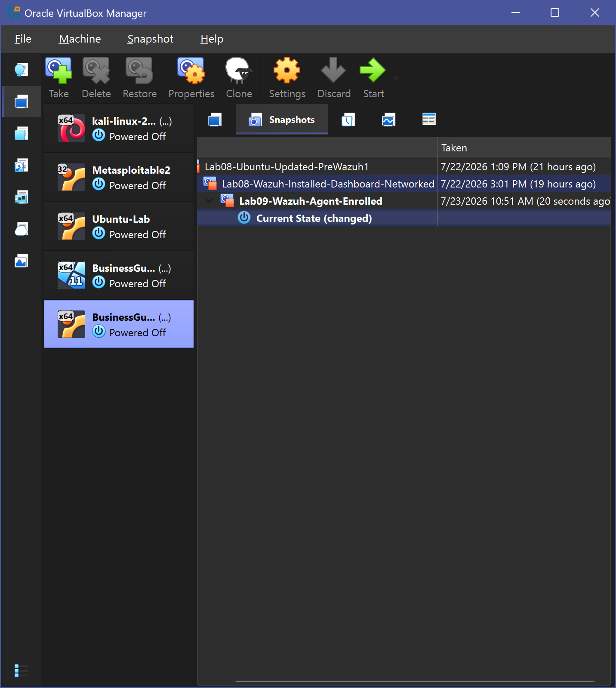
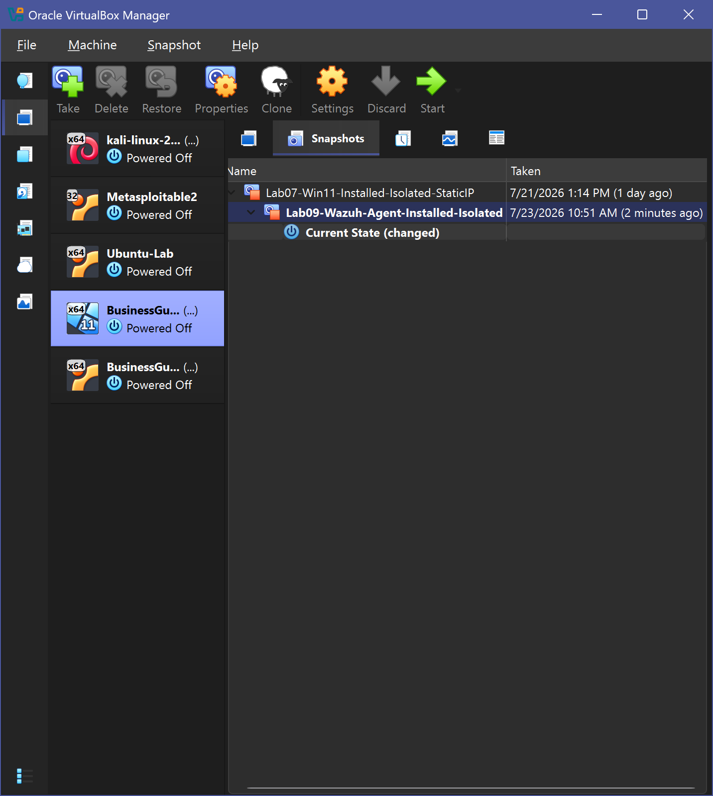

# Lab 09 — Wazuh Windows Agent Deployment

## Installing the Agent Was the Easy Part

Lab 08 established the centralized Wazuh monitoring server.

The next step was to connect a Windows endpoint to it.

At first, the deployment looked successful. The Wazuh Windows agent installed, the files were present, and the service existed.

But the workstation still was not reporting correctly.

That turned Lab 09 into more than an installation exercise.

The real question became:

**Why can software be installed correctly and still fail to communicate?**

The answer was hidden in the agent configuration.

After troubleshooting the network, service, and configuration layers separately, an incorrect manager address was identified, corrected, and validated.

The final result was an active Windows 11 endpoint reporting to Wazuh while remaining isolated from the public internet.

```text
Windows Workstation
        ↓
Wazuh Agent
        ↓
Internal Lab Network
        ↓
Wazuh Manager
        ↓
Wazuh Dashboard
```

This established centralized endpoint monitoring for the Business Guardian lab.

---

# Lab Environment

## Windows Workstation

```text
BusinessGuardian-Win11-Workstation
192.168.70.10/24
```

## Wazuh Monitoring Server

```text
192.168.70.20/24
```

## Internal Network

```text
BusinessGuardianLab
192.168.70.0/24
```

The architecture is:

```text
Windows 11 Host
      |
Oracle VirtualBox
      |
BusinessGuardianLab
192.168.70.0/24
      |
      +-----------------------------+
      |                             |
Windows Workstation              Wazuh Server
192.168.70.10                    192.168.70.20
Wazuh Agent                      Wazuh Manager
```

Temporary NAT connectivity was used only when required for the authorized installation.

No Bridged Adapter was used.

---

# Before Deployment

The Wazuh dashboard was reviewed before enrolling the endpoint.

This established the starting condition:

```text
No active Windows endpoint enrolled
```

That gave the deployment a clear before-and-after state.

<p align="center">
  
</p>

<p align="center">
  <em>The dashboard provided a clean starting point before the Windows workstation was enrolled.</em>
</p>

---

# Temporary Installation Connectivity

The Windows workstation normally operates inside the isolated `BusinessGuardianLab` network.

Temporary NAT connectivity was enabled only to support the authorized Wazuh agent download and installation.

Before continuing, connectivity was checked in two directions:

```text
Windows Workstation → Internet
Windows Workstation → Wazuh Server
```

<p align="center">
  
</p>

<p align="center">
  <em>Temporary installation connectivity was validated before the agent deployment began.</em>
</p>

---

# Installing the Wazuh Agent

The Wazuh deployment interface was used to prepare the Windows installation.

The intended manager address was:

```text
192.168.70.20
```

The official Windows agent was downloaded and installed on the authorized workstation.

At this point, the installation itself appeared successful.

But the endpoint did not report correctly.

That was the first sign that:

> **Installed does not automatically mean configured correctly.**

---

# Troubleshooting the Failed Connection

The problem was approached one layer at a time.

The troubleshooting sequence was:

```text
1. Confirm the Wazuh server is running
2. Check the Windows network configuration
3. Test connectivity to 192.168.70.20
4. Confirm the Wazuh agent is installed
5. Check the Windows agent service
6. Inspect the agent configuration
7. Identify the incorrect manager address
8. Correct the configuration
9. Restart the service
10. Validate the endpoint in Wazuh
```

The key discovery was inside the agent configuration.

The manager address had been set to:

```text
0.0.0.0
```

That does not identify the actual Wazuh monitoring server.

It was corrected to:

```text
192.168.70.20
```

The configuration was saved with administrator privileges and the Wazuh agent service was restarted.

After that correction, communication succeeded.

---

# Why This Troubleshooting Matters

The agent files existed.

The service existed.

The network was reachable.

But one incorrect configuration value prevented the complete workflow from functioning.

That is a useful troubleshooting lesson:

```text
Installation
    ≠
Service Running
    ≠
Correct Configuration
    ≠
Successful Communication
```

Each layer has to be checked independently.

---

# Validating the Windows Service

After correcting the manager configuration, Windows Services confirmed that the Wazuh agent service was running.

<p align="center">
  
</p>

<p align="center">
  <em>The agent service was confirmed running after the configuration problem was corrected.</em>
</p>

A running Wazuh agent supports functions such as:

- Endpoint information collection
- Windows event monitoring
- Manager communication
- Security telemetry forwarding
- Configuration updates
- Centralized alerting
- Later investigation workflows

---

# The Endpoint Appears in Wazuh

After the configuration correction and service restart, the Windows workstation appeared in the Wazuh dashboard.

<p align="center">
  
</p>

<p align="center">
  <em>The Windows workstation successfully registered with the Wazuh manager.</em>
</p>

The dashboard reported:

```text
Active agents: 1
```

The endpoint was identified as the Windows 11 workstation using:

```text
192.168.70.10
```

---

# Active Agent Validation

The agent-details view provided additional confirmation that the deployment was functioning correctly.

<p align="center">
  
</p>

<p align="center">
  <em>The monitored Windows workstation was active and reporting from its isolated internal address.</em>
</p>

At this stage, the following had all been confirmed:

- Agent installed
- Agent service running
- Correct manager configured
- Internal communication working
- Endpoint accepted by Wazuh
- Dashboard receiving agent information

---

# Restoring Network Isolation

The temporary internet connection was not intended to remain part of the final lab design.

After installation and validation, NAT was disabled.

<p align="center">
  
</p>

The workstation was returned to:

```text
BusinessGuardianLab
```

The final network goal was:

```text
Can reach Wazuh server
        +
Cannot reach public internet
```

---

# Proving Isolation Did Not Break Monitoring

Connectivity to the Wazuh server was tested:

```powershell
ping 192.168.70.20
```

That communication remained available.

A public internet connectivity test was also performed:

```powershell
ping 8.8.8.8
```

That failed as expected.

<p align="center">
  
</p>

<p align="center">
  <em>The workstation retained communication with the Wazuh server while public internet access remained unavailable.</em>
</p>

---

# Monitoring Still Works After Isolation

Removing NAT would not be useful if doing so caused the agent to disconnect.

The Wazuh dashboard was checked again after isolation was restored.

The endpoint remained active.

<p align="center">
  
</p>

<p align="center">
  <em>The Wazuh agent remained active after temporary internet connectivity was removed.</em>
</p>

That confirmed the intended final architecture:

```text
Windows Endpoint
      ↓
Isolated Internal Network
      ↓
Wazuh Monitoring Server

No public internet required for normal monitoring
```

---

# Preserving the Known-Good State

Once deployment, communication, and isolation were validated, recovery snapshots were created.

## Wazuh Server Snapshot

<p align="center">
  
</p>

## Windows Workstation Snapshot

<p align="center">
  
</p>

These snapshots preserve the environment after confirming:

- Wazuh agent installed
- Manager address corrected
- Agent service running
- Endpoint active
- NAT disabled
- Internal communication available
- Public internet unavailable

That created a known-good baseline before alert-generation work began.

---

# Final Validation

Lab 09 successfully demonstrated:

```text
Install Agent
     ↓
Troubleshoot Configuration
     ↓
Correct Manager Address
     ↓
Restart Service
     ↓
Endpoint Registers
     ↓
Dashboard Shows Active Agent
     ↓
Remove Temporary NAT
     ↓
Internal Monitoring Continues
     ↓
Public Internet Remains Unavailable
```

## Validation Status

| Validation Area | Result |
| --- | --- |
| Windows agent installation | **PASS** |
| Agent service validation | **PASS** |
| Manager configuration | **PASS after correction** |
| Agent-to-manager communication | **PASS** |
| Dashboard registration | **PASS** |
| Active endpoint status | **PASS** |
| Internal server connectivity | **PASS** |
| Temporary NAT removal | **PASS** |
| Public internet isolation | **PASS** |
| Agent active after isolation | **PASS** |
| Recovery snapshots | **COMPLETE** |

---

# Security and Safety Boundaries

All work was performed on personally owned and authorized systems.

The lab followed these controls:

- Windows and Wazuh systems remained on `BusinessGuardianLab`
- NAT was temporary and limited to installation needs
- No Bridged Adapter was used
- No production environment was involved
- No employer or City systems were tested
- No customer systems were tested
- No real financial data was used
- Credentials were excluded from public evidence
- Sensitive configuration details were sanitized
- Screenshots were reviewed before publication
- Recovery snapshots were created before later testing

---

# What Lab 09 Proves

Lab 09 demonstrates more than successful Wazuh installation.

It shows how to troubleshoot an endpoint-monitoring integration when the software appears installed but the complete system still does not work.

The lab required checking:

- Networking
- Service state
- Configuration
- Manager addressing
- Endpoint registration
- Dashboard status
- Network isolation

Most importantly:

> **Successful installation did not end the troubleshooting process. Successful communication did.**

The final result moved the Business Guardian environment from infrastructure into actual endpoint monitoring.

---

# Skills Demonstrated

- Windows endpoint administration
- Wazuh agent deployment
- SIEM endpoint integration
- Windows service management
- XML configuration review
- Configuration troubleshooting
- Static IPv4 networking
- Connectivity testing
- VirtualBox network isolation
- Dashboard validation
- Layered troubleshooting
- Snapshot management
- Security evidence handling
- Technical documentation

---

# Where the Project Goes From Here

Lab 08 answered:

**Can I build a centralized Wazuh monitoring server inside the isolated Business Guardian environment?**

Lab 09 answered:

**Can I connect a Windows endpoint to it and keep that endpoint monitored after internet access is removed?**

The answer was yes.

Now the environment has:

```text
Windows Endpoint
      ↓
Active Wazuh Agent
      ↓
Wazuh Monitoring Server
```

But an active agent alone does not prove that security events are actually making it through the full detection pipeline.

That becomes the next question:

**Can I create a controlled Windows event and follow it all the way into a Wazuh alert?**

[Lab 10 — Wazuh Alert Review and Security Data Collection](../lab-10-wazuh-alert-review-ai-data-collection/README.md) answers that question.

The progression becomes:

```text
Monitoring Server
      ↓
Endpoint Agent
      ↓
Active Telemetry
      ↓
Controlled Event
      ↓
Wazuh Detection
      ↓
Security Evidence
```

Lab 09 is where BusinessGuardianLab becomes more than an isolated network.

**It becomes a monitored endpoint environment.**
