# Lab 10: Wazuh Alert Review and AI Data Collection

## Overview

This lab documents the first complete alert-review workflow in the Project Athenaeum Business Guardian environment.

A safe test event was created on the isolated Windows 11 workstation. The active Wazuh agent forwarded the event to the Wazuh monitoring server, where the resulting alert was located and reviewed through the dashboard.

The alert’s detailed fields and JSON structure were then examined and converted into a smaller, sanitized data sample that could later be used by an AI-assisted alert-explanation tool.

## Objective

Generate a controlled Windows event, confirm that Wazuh detects it, review the resulting alert and JSON fields, and prepare a sanitized AI-ready data sample.

## Skills Demonstrated

- Windows event generation
- Wazuh endpoint monitoring
- SIEM alert review
- Alert validation
- Windows telemetry analysis
- JSON data review
- Security-event field identification
- Evidence collection
- Data sanitization
- AI-ready dataset preparation
- SOC-style documentation
- Technical troubleshooting
- Snapshot and recovery management

## Environment and Tools

- Windows 11 host computer
- Oracle VirtualBox
- `BusinessGuardian-Win11-Workstation`
- Wazuh Monitoring Server
- Wazuh Windows agent
- Wazuh dashboard
- Windows Event Viewer
- Windows command-line tools
- JSON alert details
- VirtualBox Internal Network named `BusinessGuardianLab`

## Lab Systems

### Windows Workstation

```text
BusinessGuardian-Win11-Workstation
192.168.70.10/24
```

### Wazuh Monitoring Server

```text
192.168.70.20/24
```

### Internal Network

```text
BusinessGuardianLab
192.168.70.0/24
```

The workstation and monitoring server communicated through the isolated internal network without requiring public internet access.

## Lab Workflow

```text
Windows test event created
          |
          v
Windows event recorded
          |
          v
Wazuh agent collected the event
          |
          v
Wazuh server generated an alert
          |
          v
Alert details reviewed
          |
          v
JSON fields examined
          |
          v
Sanitized AI data sample created
```

## Work Completed

During this lab, I:

- Started the Wazuh monitoring server
- Started the isolated Windows 11 workstation
- Confirmed that the Wazuh agent remained active
- Verified communication between the workstation and server
- Reviewed the Wazuh dashboard before creating the test event
- Created a safe and controlled Windows event
- Confirmed that the event was recorded on the workstation
- Located the corresponding event in Wazuh
- Opened and reviewed the Wazuh alert
- Examined the alert description, severity, timestamp, agent, and source information
- Opened the full alert details
- Reviewed the event’s JSON structure
- Identified fields useful for later automation and AI analysis
- Removed unnecessary or sensitive information
- Created a smaller AI-ready alert-data sample
- Documented the event-to-alert workflow
- Created recovery snapshots after successful validation
- Completed the screenshot log, technical notes, and final portfolio writeup

## Screenshots and Evidence

### Lab Documentation Setup

The Lab 10 documentation structure was prepared to organize alert evidence, technical notes, the screenshot log, AI data samples, and the final portfolio writeup.

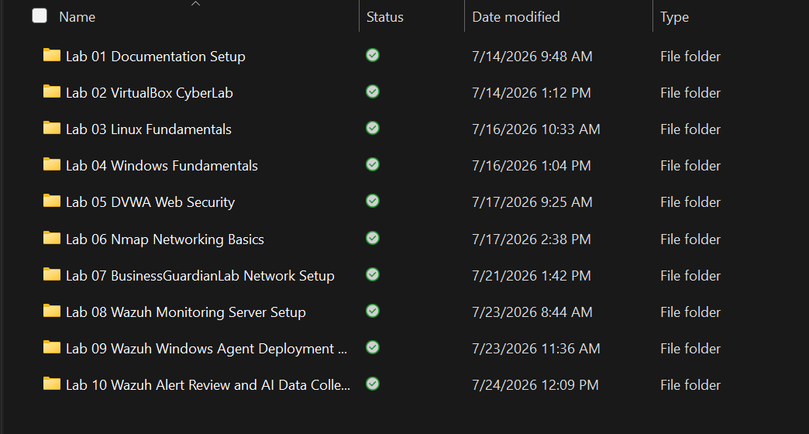

### Active Agent Starting State

The Wazuh dashboard confirmed that the Windows workstation agent was active before controlled events were generated.

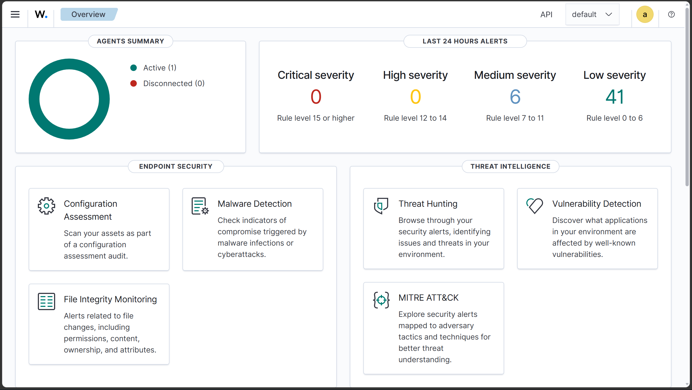

### Controlled Windows Events Created

Safe Windows events were created on the authorized Business Guardian workstation to test the endpoint-monitoring pipeline.

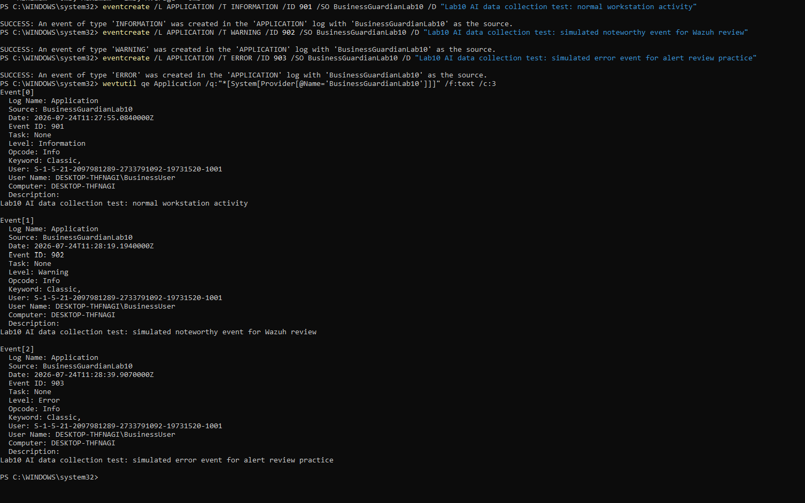

### Simulated Windows Error Alert Visible

The resulting simulated Windows error alert appeared in the Wazuh dashboard, confirming successful collection and detection.

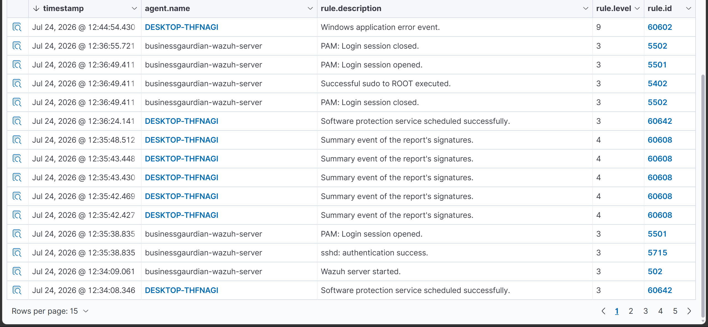

### Alert Details — Overview

The upper section of the alert-details view displayed the alert timestamp, monitored agent, severity, description, and supporting event information.

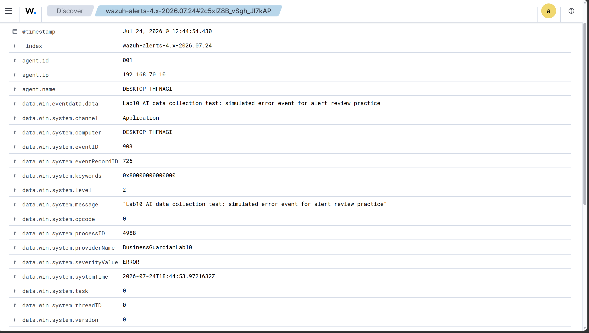

### Alert Details — Rule Fields

The rule fields were reviewed to identify the Wazuh rule, severity level, description, and information relevant to analyst triage.

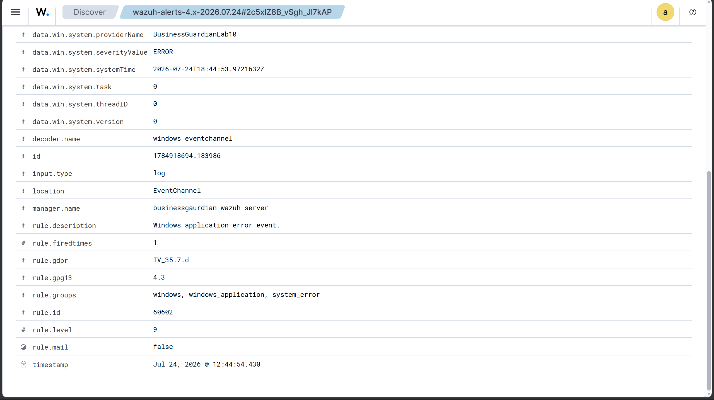

### JSON Review — Event Fields

The alert’s structured JSON event fields were examined to identify endpoint, timestamp, source, and Windows event information.

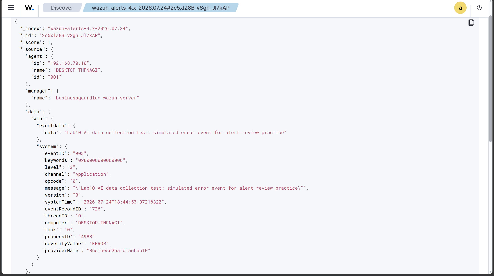

### JSON Review — Rule Fields

The JSON rule fields were reviewed to identify structured detection information suitable for searching, automation, and later AI analysis.

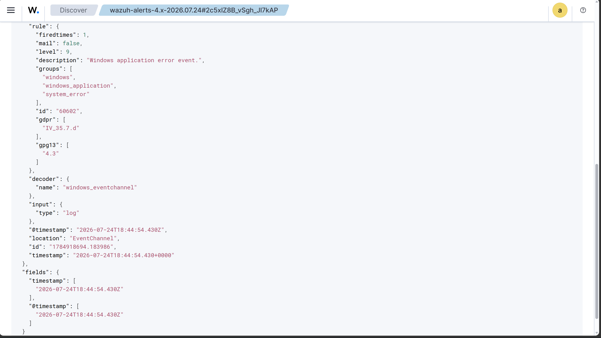

### AI Data Sample Created

A smaller sanitized alert-data file was created using selected fields from the Wazuh event.

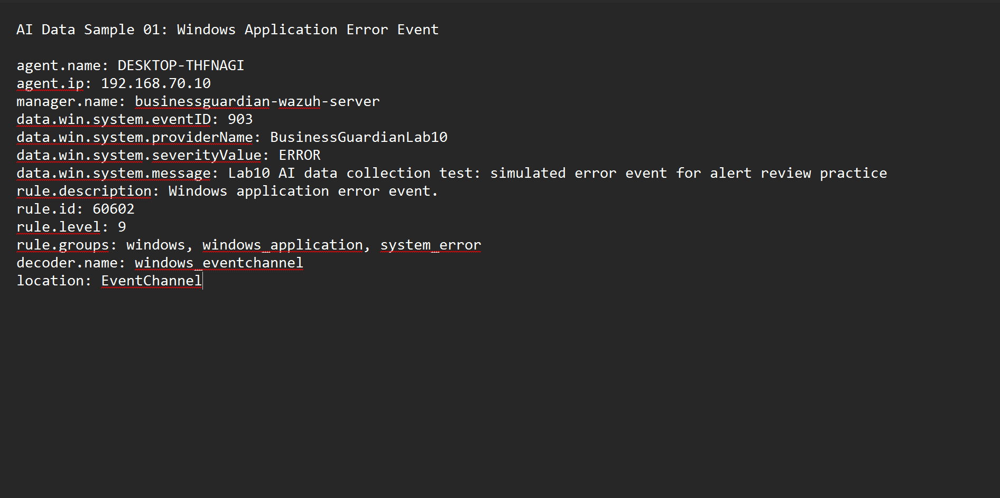

### Wazuh Server Recovery Snapshot

A recovery snapshot preserved the Wazuh server after successful alert collection, review, and data preparation.

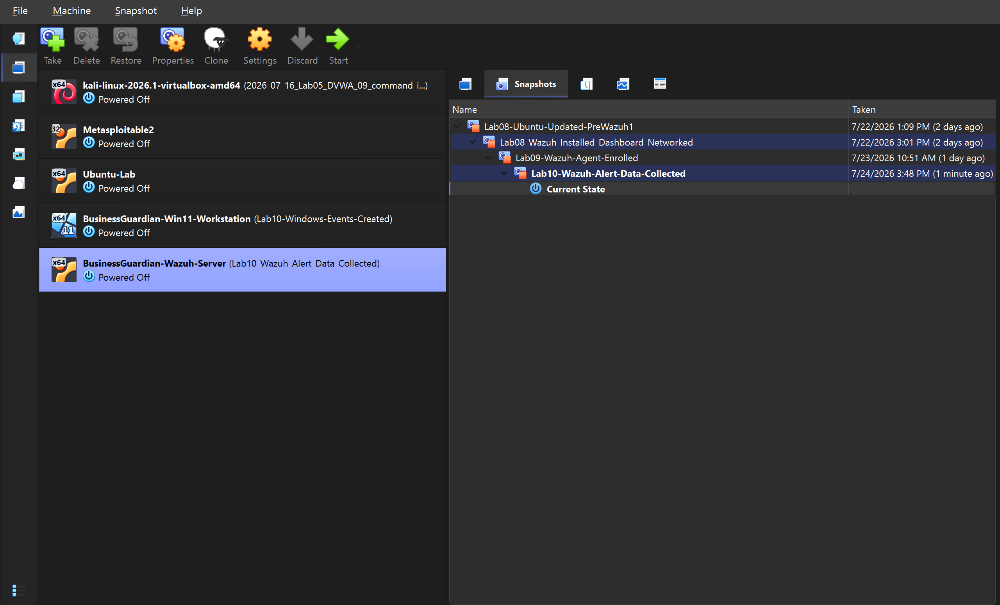

### Windows Workstation Recovery Snapshot

A recovery snapshot preserved the Windows workstation after the controlled events were created and successfully collected.

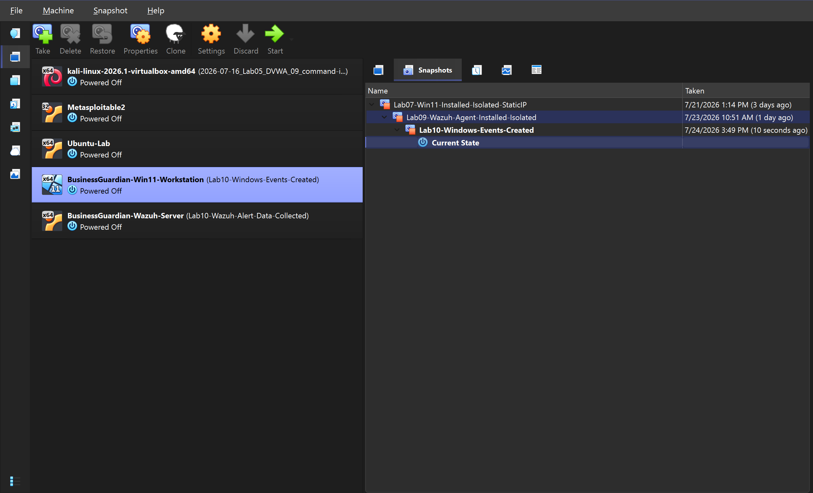

## Controlled Windows Event

A safe Windows test event was generated on the authorized Business Guardian workstation.

The purpose of the event was not to simulate a destructive attack. It was created to validate that:

- Windows recorded the activity
- The Wazuh agent collected the event
- The Wazuh manager processed it
- An alert appeared in the dashboard
- The alert contained useful investigation fields

This established a repeatable method for future alert-generation exercises.

## Wazuh Alert Detection

After the Windows event was created, the Wazuh dashboard was reviewed for new activity from:

```text
BusinessGuardian-Win11-Workstation
```

The related alert confirmed that the complete monitoring path was working:

```text
Windows endpoint
→ Wazuh agent
→ Wazuh manager
→ Alert rule
→ Wazuh dashboard
```

This was the first validated end-to-end alert workflow in the Business Guardian environment.

## Alert Review

The Wazuh alert was reviewed to identify information an analyst would use during triage.

Important alert information included:

- Alert timestamp
- Agent name
- Agent address
- Rule identification
- Rule description
- Alert severity or level
- Windows event information
- Event source or channel
- Host information
- Supporting event data

These fields provide the context needed to understand what happened, which system produced the event, and whether further investigation is required.

## JSON Review

The full JSON alert view was examined to understand how Wazuh stores and organizes event information.

JSON is useful because it provides structured data that can be:

- Searched
- Filtered
- Parsed with Python
- Compared with other alerts
- Added to incident reports
- Sent to dashboards
- Processed by AI-assisted tools

Reviewing the JSON structure helped identify which fields were useful and which fields could be removed from a simplified data sample.

## AI-Ready Data Sample

A smaller, sanitized alert-data sample was created from the Wazuh event.

The sample retained useful investigation fields while excluding unnecessary, repetitive, or sensitive information.

The resulting structure can later support an AI tool that explains:

- What happened
- Which endpoint generated the event
- Why the alert was created
- How serious the activity may be
- What evidence should be reviewed
- What response steps may be appropriate

The AI sample created during this lab is an early building block rather than a completed automated security product.

## Why This Matters

Security tools often produce alerts containing large amounts of technical data.

An analyst must be able to:

1. Find the relevant alert
2. Understand its context
3. Identify useful fields
4. Separate important evidence from noise
5. Explain the event clearly
6. Decide whether escalation is needed

This lab connected traditional alert review with the larger Project Athenaeum goal of building practical AI-assisted security tools.

## Security and Privacy

This lab followed these rules:

- All activity occurred on personally owned and authorized virtual machines
- The systems remained on the isolated `BusinessGuardianLab` network
- No Bridged Adapter was used
- No public, employer, City, school, or customer systems were tested
- No real customer or financial data was used
- The Windows event was safe and controlled
- Alert data was reviewed before publication
- Passwords, credentials, personal information, and unnecessary system details were excluded
- The AI data sample was sanitized before documentation
- Recovery snapshots were created before future testing

## Lessons Learned

This lab demonstrated that a successful endpoint deployment can be validated by following one event through the entire monitoring pipeline.

Creating the Windows event was only the beginning. The event had to be collected by the agent, processed by Wazuh, matched to an alert rule, displayed in the dashboard, and reviewed in detail.

The JSON view also showed why structured security data is valuable. The same alert information can support manual investigation, Python automation, dashboards, reporting, and future AI-assisted explanations.

The lab reinforced that AI security tools should begin with clean, understandable, and carefully selected data rather than sending entire alerts without review.

## Documentation Created

The following Lab 10 documentation was completed and retained locally:

- Lab 10 screenshot log
- Detailed Lab 10 technical notes
- Lab 10 final portfolio writeup
- Full cropped screenshot evidence set
- Wazuh alert-review evidence
- JSON alert evidence
- Sanitized AI-ready data sample
- Recovery snapshot evidence

Final portfolio writeup:

```text
AJ_Chapa_Lab_10_Wazuh_Alert_Review_AI_Data_Collection_Portfolio_Writeup_v1.0.docx
```

## Future Development

Later Business Guardian work may include:

- Reviewing additional Windows alert types
- Comparing alert severity levels
- Creating a repeatable JSON-export process
- Parsing Wazuh alerts with Python
- Correlating multiple related events
- Building AI-assisted alert explanations
- Producing business-focused incident summaries
- Adding human review and approval controls
- Testing alert accuracy and false-positive handling
- Creating a simplified security dashboard

## Status

**Completed and portfolio ready**
