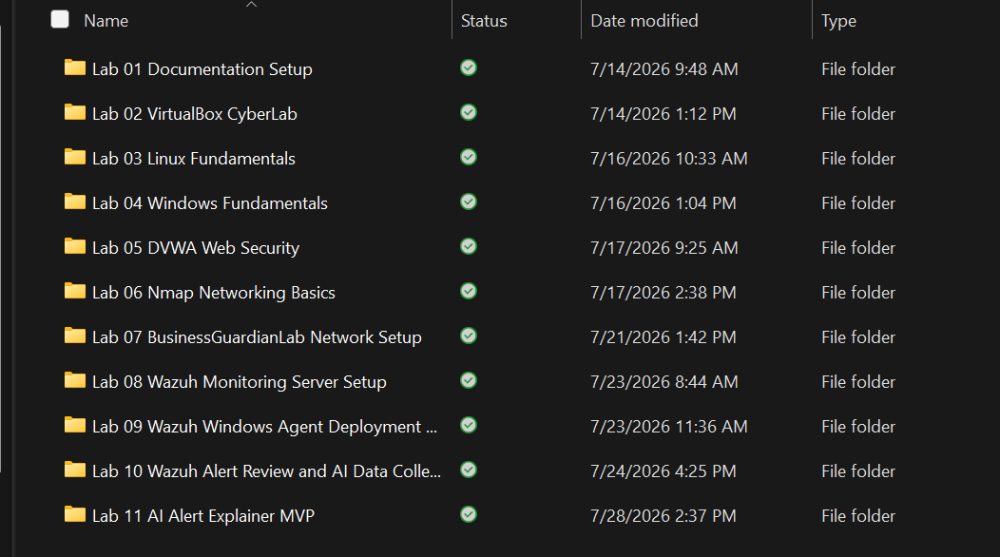
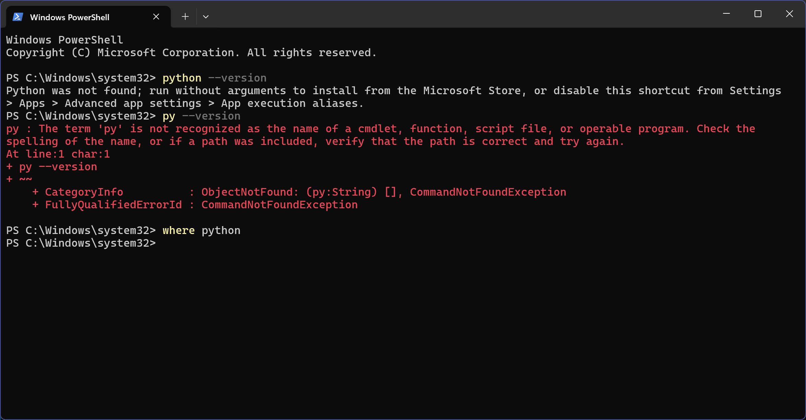
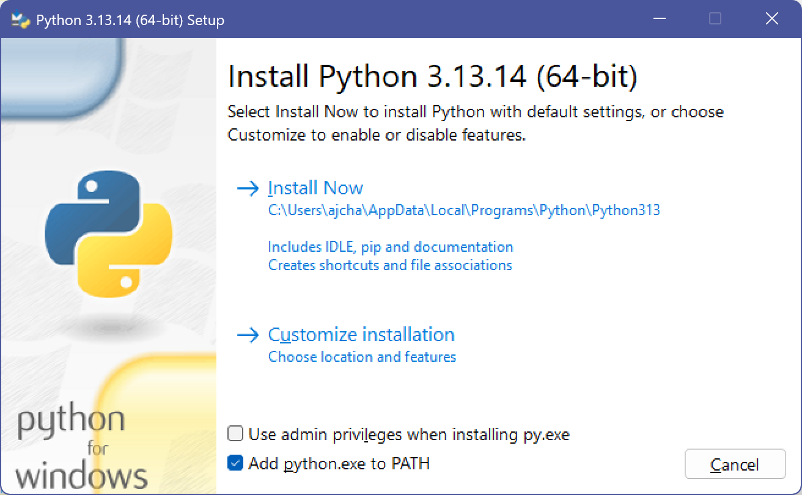
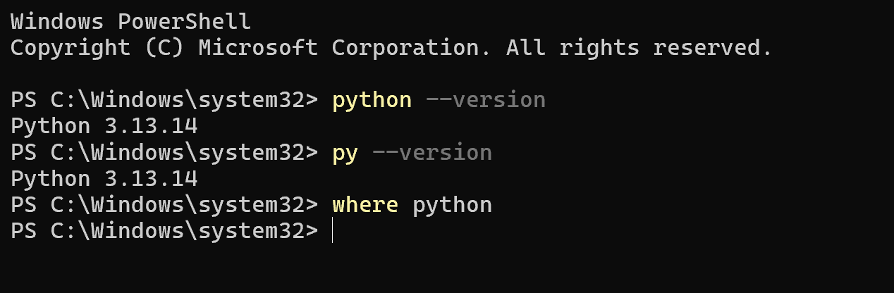
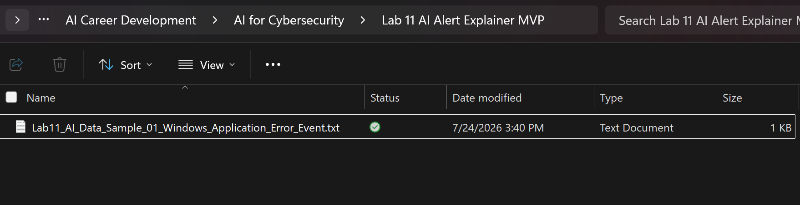
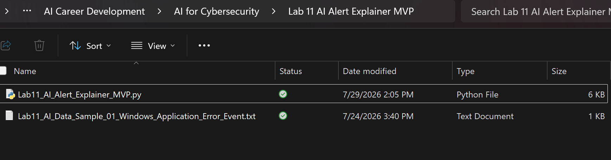
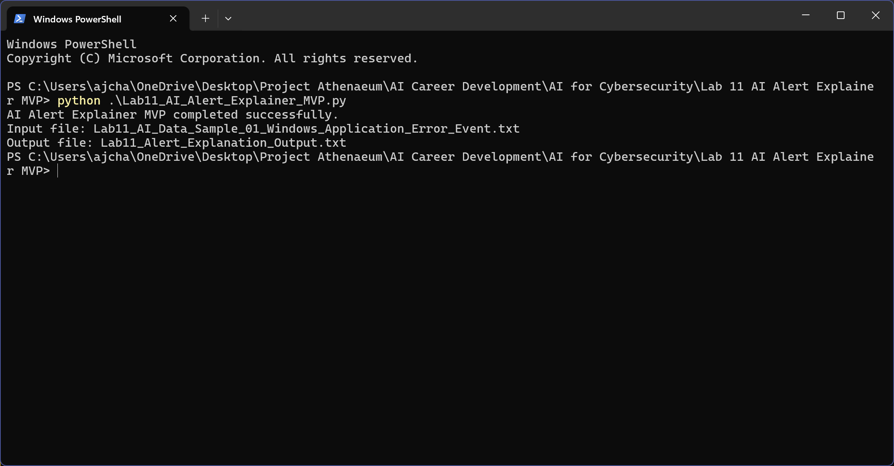
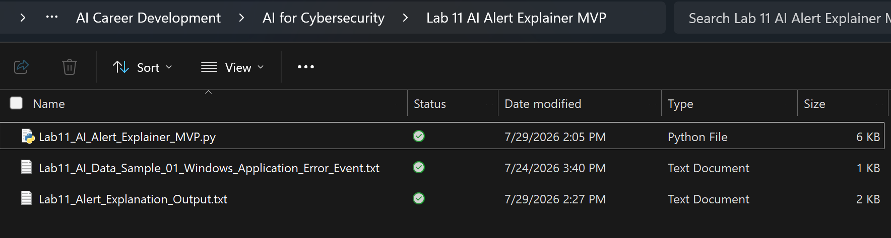
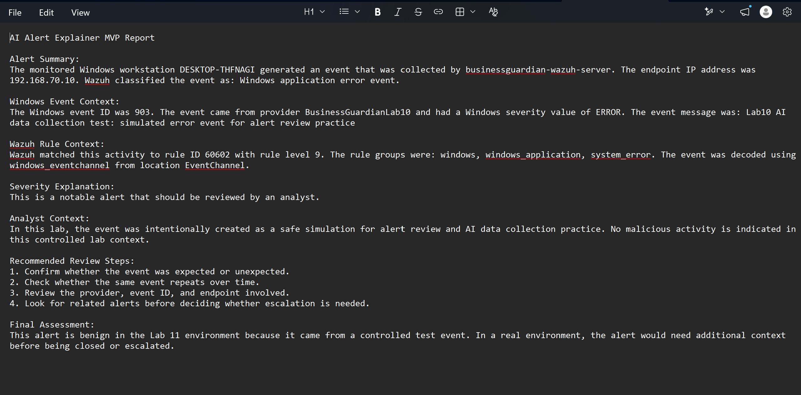

# Lab 11: AI Alert Explainer MVP

## Overview

This lab documents the development of the first functional alert-explanation tool in Project Athenaeum.

The Python-based MVP uses the sanitized Wazuh alert data prepared during Lab 10. It reads selected structured alert fields from a sanitized text sample and converts them into a beginner-friendly security report.

The generated report includes:

- An alert summary
- Windows event context
- Wazuh rule context
- A severity explanation
- Analyst context
- Recommended review steps
- A final assessment

This first version uses Python-based rules and formatted explanations rather than an external artificial intelligence model or API. It establishes the working foundation for later AI-assisted alert analysis.

## Objective

Build and test a beginner-friendly Python tool that reads a sanitized Wazuh alert sample, extracts important security fields, and produces a clear explanation that supports human alert review.

## Skills Demonstrated

- Python fundamentals
- Structured text and key-value parsing
- Security-data processing
- Wazuh alert interpretation
- Windows event analysis
- Alert-field extraction
- Conditional logic
- Python functions
- File input and output
- Error handling
- Severity interpretation
- Plain-language technical communication
- Analyst workflow development
- Human-in-the-loop decision support
- Testing and troubleshooting
- Technical documentation
- Privacy-conscious data handling

## Environment and Tools

- Windows 11 host computer
- Python
- Windows Terminal
- Windows File Explorer
- Local text editor
- Sanitized Wazuh alert sample from Lab 10
- Project Athenaeum documentation system
- GitHub

No additional virtual machines were required because the Wazuh alert had already been generated, reviewed, and sanitized during Lab 10.

## Project Relationship

Lab 11 builds directly on the alert-review and data-collection work completed during Lab 10.

```text
Lab 10
Controlled Windows event generated
          |
          v
Wazuh alert detected and reviewed
          |
          v
Important alert fields sanitized
          |
          v
Lab 11
Python reads the alert sample
          |
          v
Expected fields are extracted
          |
          v
Severity and context are interpreted
          |
          v
Plain-language report is generated
          |
          v
Human analyst reviews the result
```

## Project Files

The functional MVP files are published with this lab:

- [Python alert-explainer script](Lab11_AI_Alert_Explainer_MVP.py)
- [Sanitized Wazuh alert-data sample](Lab11_AI_Data_Sample_01_Windows_Application_Error_Event.txt)
- [Generated alert-explanation output](Lab11_Alert_Explanation_Output.txt)

The script, input sample, and generated output are stored together so the GitHub project matches the tested local configuration.

## Project Structure

```text
lab-11-ai-alert-explainer-mvp/
├── README.md
├── Lab11_AI_Alert_Explainer_MVP.py
├── Lab11_AI_Data_Sample_01_Windows_Application_Error_Event.txt
├── Lab11_Alert_Explanation_Output.txt
└── screenshots/
    ├── README.md
    └── supporting evidence images
```

## How to Run

Python must be installed before running the tool.

Download or clone the Lab 11 folder and keep these three files together:

```text
Lab11_AI_Alert_Explainer_MVP.py
Lab11_AI_Data_Sample_01_Windows_Application_Error_Event.txt
Lab11_Alert_Explanation_Output.txt
```

Open Windows Terminal in the Lab 11 folder and run:

```powershell
python Lab11_AI_Alert_Explainer_MVP.py
```

When the script completes successfully, the terminal displays:

```text
AI Alert Explainer MVP completed successfully.
Input file: Lab11_AI_Data_Sample_01_Windows_Application_Error_Event.txt
Output file: Lab11_Alert_Explanation_Output.txt
```

The generated report is written to:

```text
Lab11_Alert_Explanation_Output.txt
```

## Input Data

The tool uses a sanitized text sample containing selected Wazuh alert fields in a consistent `key: value` format.

The current script recognizes the following fields:

```text
agent.name
agent.ip
manager.name
data.win.system.eventID
data.win.system.providerName
data.win.system.severityValue
data.win.system.message
rule.description
rule.id
rule.level
rule.groups
decoder.name
location
```

The script reads only the fields included in its expected-field list.

The following content is ignored:

- Blank lines
- Lines without a colon
- Unsupported field names
- Unnecessary alert data

Passwords, credentials, personal information, production data, and unrelated system details were excluded before the sample was published.

## Core Features

The MVP performs the following functions:

- Locates the sanitized alert-data text file
- Confirms that the input file exists
- Confirms that the input file is not empty
- Reads selected `key: value` alert fields
- Ignores unsupported or improperly formatted lines
- Extracts endpoint information
- Extracts Windows event information
- Extracts Wazuh rule information
- Interprets the Wazuh rule level
- Generates a structured plain-language report
- Writes the report to an output file
- Provides recommended analyst review steps
- Preserves human review before any decision or response

## Alert-Processing Workflow

The tool follows this workflow:

```text
1. Locate the sanitized alert-data sample
2. Confirm that the file exists and is not empty
3. Parse the expected key-value fields
4. Store the selected alert information
5. Extract endpoint and event details
6. Interpret the Wazuh rule level
7. Build the alert explanation
8. Write the explanation to the output file
9. Display a completion or error message
10. Require human review of the result
```

## Work Completed

During this lab, I:

- Created the Lab 11 documentation structure
- Created the AI Alert Explainer development folder
- Checked whether Python was installed
- Installed Python on the Windows host
- Added Python to the Windows system path
- Verified the installed Python version
- Copied the sanitized Lab 10 alert sample into the Lab 11 folder
- Identified the alert fields needed by the tool
- Created the Python alert-explainer script
- Created the generated-output file
- Added input-file validation
- Added empty-file validation
- Added expected-field filtering
- Added structured key-value parsing
- Extracted the agent name
- Extracted the agent IP address
- Extracted the Wazuh manager name
- Extracted the Windows event ID
- Extracted the Windows event provider
- Extracted the Windows severity value
- Extracted the Windows event message
- Extracted the Wazuh rule description
- Extracted the Wazuh rule ID
- Extracted the Wazuh rule level
- Extracted the Wazuh rule groups
- Extracted decoder and location information
- Added severity-explanation logic
- Added a structured alert summary
- Added Windows event context
- Added Wazuh rule context
- Added analyst context
- Added recommended review steps
- Added a final assessment
- Tested the script with the sanitized alert sample
- Confirmed successful script execution
- Confirmed that the output report was created
- Opened and manually reviewed the generated report
- Collected sanitized technical screenshots
- Completed the Lab 11 technical notes
- Completed the screenshot log
- Prepared the project for GitHub publication

## Screenshots and Evidence

### Lab Folder Created

The Lab 11 folder was added to the Project Athenaeum AI for Cybersecurity workspace.



### Python Installation Check

An initial command-line check confirmed that Python was not yet available on the Windows host.



### Python Installer Configuration

The Python installer was configured to add Python to the Windows system path.



### Python Installation Verified

The installed Python version was verified from the Windows command line.



### Sanitized Alert Sample Prepared

The sanitized Wazuh alert sample from Lab 10 was copied into the Lab 11 development folder.



### Working Project Files Created

The Python script, sanitized input sample, and explanation-output file were organized together for development and testing.



### Script Executed Successfully

The Python script completed successfully and displayed the input and output filenames.



### Output File Created

Successful execution generated the alert-explanation output file.



### Generated Report Reviewed

The final report was opened and reviewed to confirm that the explanation matched the available alert evidence.



## Generated Report Sections

The completed report contains the following sections:

### Alert Summary

Identifies:

- The monitored Windows workstation
- The endpoint IP address
- The Wazuh manager
- The matched Wazuh rule description

### Windows Event Context

Identifies:

- The Windows event ID
- The event provider
- The Windows severity value
- The event message

### Wazuh Rule Context

Identifies:

- The Wazuh rule ID
- The Wazuh rule level
- The rule groups
- The decoder
- The event location

### Severity Explanation

Converts the Wazuh rule level into a basic explanation that is easier for a beginning analyst to understand.

### Analyst Context

Explains that the current event was intentionally generated as a safe simulation inside the authorized Project Athenaeum environment.

### Recommended Review Steps

Provides practical review steps before the alert is closed or escalated.

### Final Assessment

Documents that the current Lab 11 alert is benign because it originated from a controlled test event.

## Severity Logic

The current version interprets Wazuh rule levels using the following logic:

```text
Level 10 or higher:
High-severity alert that should be reviewed quickly

Level 7 through 9:
Notable alert that should be reviewed by an analyst

Level 4 through 6:
Medium-level alert that may require review depending on context

Level 0 through 3:
Low-level alert that may represent normal system activity
```

If the rule level cannot be converted into a number, the tool explains that the severity requires manual review.

Severity alone is not treated as proof that an event is malicious.

An analyst must also consider:

- The affected endpoint
- The event provider
- The Windows event ID
- The event message
- Related alerts
- Expected system activity
- User and process information
- Available business context

## Recommended Review Steps

The generated report recommends that the analyst:

1. Confirm whether the event was expected or unexpected
2. Check whether the same event repeats over time
3. Review the provider, event ID, and endpoint involved
4. Look for related alerts before deciding whether escalation is needed

These are investigative recommendations rather than automatic response actions.

## Human Review Requirement

The MVP does not automatically:

- Block accounts
- Isolate endpoints
- Terminate processes
- Delete files
- Change firewall rules
- Close alerts
- Escalate incidents
- Make final security decisions

All generated output must be reviewed by a person before action is taken.

```text
The tool supports the analyst.
It does not replace the analyst.
```

This requirement is important because alert data may be incomplete, misleading, or missing important business context.

## Error Handling

The tool includes checks for several common problems:

- The input file does not exist
- The input file is empty
- No expected alert fields are found
- The rule level cannot be converted into a number
- An unexpected error occurs during processing
- An error occurs while writing the output file

Lines that are blank, do not contain a colon, or do not match the expected field list are ignored.

Readable console messages identify whether the program completed successfully or encountered an error.

## Testing and Validation

The completed script was tested using the sanitized alert sample created from the Lab 10 Wazuh event.

Validation confirmed that the tool could:

- Locate the structured alert-data text file
- Confirm that the file contained data
- Read the expected key-value fields
- Extract endpoint information
- Extract Windows event information
- Extract Wazuh rule information
- Interpret the Wazuh rule level
- Produce a structured plain-language explanation
- Write the explanation to an output file
- Display recommended investigation steps
- Preserve the requirement for human review

The generated report was manually compared with the source alert sample to confirm that the explanation remained consistent with the available evidence.

## Security and Privacy

This lab followed these rules:

- Only sanitized alert data was used
- No Wazuh administrator credentials were included
- No passwords were stored in the project
- No API keys or access tokens were used
- No external AI service received the alert data
- No real customer or financial information was used
- No City, employer, school, or production data was included
- Internal lab data was reviewed before publication
- The tool does not perform automatic containment or remediation
- Human approval remains required
- Screenshots were reviewed before publication
- Source files were checked for personal and sensitive paths
- All activity occurred on personally owned and authorized systems

## Limitations

This MVP has several intentional limitations:

- It processes one prepared alert sample at a time
- It uses a structured text file rather than a live Wazuh connection
- It does not directly parse a full Wazuh JSON record
- It does not use a machine-learning model or external AI API
- Its explanations are created through predefined Python logic
- It depends on the fields available in the input sample
- It does not independently determine whether activity is malicious
- It does not correlate multiple alerts
- It does not validate users, processes, or network activity
- It does not take automatic response actions
- It requires manual review of the generated explanation
- It requires testing with additional alert types

These limitations prevent the MVP from being presented as more capable than it currently is.

## Importance

Security platforms can produce alerts containing large amounts of technical information.

A beginning analyst must be able to identify:

- What happened
- Which endpoint was involved
- Which detection rule matched
- How serious the alert may be
- What evidence supports the alert
- What should be reviewed next

This project demonstrates how Python can transform selected security fields into a clearer explanation while preserving human judgment and approval.

The lab connects several Project Athenaeum skills:

- Wazuh monitoring
- Windows telemetry
- Alert review
- Structured data processing
- Python programming
- Security severity interpretation
- Technical communication
- Analyst decision support
- Documentation and verification

## Lessons Learned

This lab demonstrated that the quality of an alert explanation depends on the quality and consistency of the input data.

Using a smaller set of selected fields made the final report easier to understand than displaying an entire alert record without filtering.

The project also reinforced the value of separating the program into smaller functions. File loading, severity interpretation, explanation generation, and program execution each serve a clear purpose.

Error handling made the tool easier to troubleshoot by providing readable messages when an input problem occurred.

Most importantly, the project demonstrated that security-analysis tools should support human reasoning rather than replace it. Clear limitations, verification steps, and human approval remain necessary when software influences security decisions.

## Documentation Created

The following Lab 11 documentation was completed and retained locally:

- `AJ_Chapa_Lab_11_AI_Alert_Explainer_MVP_Notes_v1.0.docx`
- Lab 11 screenshot log
- Sanitized Wazuh alert-data sample
- Python alert-explainer script
- Generated alert-explanation output
- Nine sanitized supporting screenshots
- Final portfolio writeup
- GitHub project documentation

## Future Development

Later versions may include:

- Processing additional Wazuh alert types
- Accepting multiple alert files
- Parsing full JSON alert records
- Comparing related alerts
- Creating reusable severity mappings
- Exporting explanations in multiple formats
- Generating incident-summary templates
- Adding a graphical interface
- Connecting to a local or approved AI model
- Adding validation rules for generated explanations
- Adding analyst feedback and correction controls
- Measuring explanation accuracy
- Correlating multiple security events
- Building a simplified Business Guardian dashboard
- Preserving human approval before any response action

## Status

**Completed and portfolio ready**
