# Lab 12: AI Alert Explainer Testing and Validation

## Overview

This lab documents the testing and validation of the Python-based AI Alert Explainer MVP created during Lab 11.

Lab 11 established the first functional version of the alert-explanation tool. Lab 12 treated that published version as a stable baseline and tested copied files inside a separate validation workspace.

The Lab 11 source code was not rewritten or replaced during this lab. Testing results were documented first so future improvements can be based on evidence rather than added directly to an unvalidated MVP.

## Objective

Validate the current AI Alert Explainer MVP by testing normal operation, input-file failures, missing alert fields, severity-level changes, and final restoration to the original baseline configuration.

## Project Rule

The published Lab 11 version remained unchanged throughout Lab 12.

Copied versions of the following files were placed in a separate testing workspace:

```text
Lab11_AI_Alert_Explainer_MVP.py
Lab11_AI_Data_Sample_01_Windows_Application_Error_Event.txt
Lab11_Alert_Explanation_Output.txt
```

The filenames continue to use `Lab11` because Lab 12 tested the existing Lab 11 MVP baseline rather than creating a new version of the tool.

A temporary backup file was used during testing and deleted before GitHub publication:

```text
Lab11_AI_Data_Sample_01_Windows_Application_Error_Event_BACKUP.txt
```

## Skills Demonstrated

- Python application testing
- Baseline validation
- Error-handling verification
- Missing-file testing
- Empty-file testing
- Missing-field testing
- Severity-logic validation
- Structured alert-data review
- Output comparison
- Controlled test preparation
- Test-data restoration
- Regression-style validation
- Change control
- Evidence collection
- Technical documentation
- Human-reviewed security analysis

## Environment and Tools

- Windows 11 host computer
- Python
- Windows Terminal
- Windows File Explorer
- Local text editor
- Copied Lab 11 AI Alert Explainer files
- Sanitized Wazuh alert-data sample
- Project Athenaeum documentation system
- GitHub

No changes were made to the published Lab 11 GitHub files during this validation lab.

## Project Relationship

```text
Lab 11
AI Alert Explainer MVP created
          |
          v
Stable published baseline preserved
          |
          v
Lab 12 testing workspace created
          |
          v
Baseline and failure conditions tested
          |
          v
Severity logic validated
          |
          v
Original input restored
          |
          v
Final baseline run confirmed
          |
          v
Future improvements supported by evidence
```

## Project Files

The copied MVP files used during testing are published with this lab:

- [Python alert-explainer baseline](Lab11_AI_Alert_Explainer_MVP.py)
- [Sanitized Wazuh alert-data sample](Lab11_AI_Data_Sample_01_Windows_Application_Error_Event.txt)
- [Final generated explanation output](Lab11_Alert_Explanation_Output.txt)

These files represent the restored baseline state after all validation tests were completed.

## Testing Strategy

The testing process followed a controlled sequence:

1. Confirm normal baseline execution
2. Confirm that an output file is generated
3. Rename the input file to simulate a missing-file condition
4. Confirm that the script displays a readable missing-file error
5. Create an empty input file
6. Confirm that the script displays a readable empty-file error
7. Restore the original input data
8. Remove the `rule.level` field
9. Confirm that the script still generates a report
10. Review the missing-field output
11. Change `rule.level` from `9` to `3`
12. Run the severity-logic test
13. Review the changed severity explanation
14. Restore the original `rule.level` value of `9`
15. Run the final baseline validation
16. Confirm successful baseline behavior after testing

## Work Completed

During this lab, I:

- Created the Lab 12 documentation folder
- Created a separate Lab 12 testing workspace
- Copied the published Lab 11 MVP files into the testing workspace
- Preserved the published Lab 11 version as the stable baseline
- Ran the original baseline configuration
- Confirmed successful script execution
- Confirmed that the output file was generated
- Renamed the input file to simulate a missing input
- Confirmed that the script handled the missing file with a readable error
- Created an empty input file
- Confirmed that the script handled the empty file with a readable error
- Restored the original input data from a temporary backup
- Removed the `rule.level` field from the copied alert sample
- Confirmed that the script still generated an output report
- Reviewed the missing-field output
- Confirmed that the report displayed `Unknown rule level`
- Confirmed that the report required manual severity review
- Changed `rule.level` from `9` to `3`
- Ran the severity-logic validation
- Confirmed that the output changed from notable-alert language to low-level-alert language
- Restored the original `rule.level` value of `9`
- Deleted the temporary backup file
- Ran the final restored baseline configuration
- Confirmed successful execution after all tests
- Completed the screenshot log
- Completed the technical notes
- Completed the final portfolio writeup
- Prepared the evidence for GitHub publication

## Test 1: Baseline Execution

The original copied Lab 11 files were tested without modification.

The script completed successfully and confirmed the expected input and output filenames.

This established the known-good baseline used for later comparisons.

### Result

**Passed**

The script executed successfully and generated the explanation-output file.

## Test 2: Output File Creation

The generated output file was reviewed after the baseline execution.

```text
Lab11_Alert_Explanation_Output.txt
```

The file contained the expected alert summary, Windows event context, Wazuh rule context, severity explanation, analyst context, recommended review steps, and final assessment.

### Result

**Passed**

The output file was created and contained the expected report structure.

## Test 3: Missing Input File

The input file was temporarily renamed so the Python script could no longer locate the expected filename.

The script was then executed again.

### Expected Behavior

The program should stop safely and display a readable message explaining that the input file could not be found.

### Result

**Passed**

The script handled the missing file without crashing and displayed a readable error message.

## Test 4: Empty Input File

An empty file was created using the expected input filename.

The script was executed with the empty file in place.

### Expected Behavior

The program should identify that the file contains no data and display a readable error message.

### Result

**Passed**

The script detected the empty file and explained that the input file contained no data.

## Test 5: Missing `rule.level` Field

The original input data was restored. The `rule.level` field was then removed from the copied alert-data sample.

The script was executed without the field.

### Expected Behavior

The tool should continue processing the remaining alert fields rather than failing because one value is missing.

### Result

**Passed**

The script still generated a report.

The output displayed:

```text
Unknown rule level
```

The severity section also explained that the Wazuh rule level could not be read and required manual review.

This confirmed that a missing severity field did not prevent the entire report from being generated.

## Test 6: Severity Logic Validation

The copied input sample originally contained:

```text
rule.level: 9
```

For the severity test, it was changed to:

```text
rule.level: 3
```

The script was executed again and the generated output was reviewed.

### Expected Behavior

The severity explanation should change based on the lower Wazuh rule level.

### Result

**Passed**

With rule level `9`, the tool described the alert as notable and recommended analyst review.

With rule level `3`, the tool described the alert as low level and noted that it may represent normal system activity.

This confirmed that the severity explanation changed according to the rule-level value.

## Test 7: Final Baseline Restoration

After the validation tests were complete:

- The original alert data was restored
- `rule.level` was returned to `9`
- The temporary backup file was deleted
- The script was executed one final time

### Result

**Passed**

The final baseline run completed successfully and produced the expected original explanation.

This confirmed that the testing workspace had been returned to its stable baseline state.

## Validation Results

All planned Lab 12 tests passed:

- Baseline execution passed
- Output-file creation passed
- Missing input-file handling passed
- Empty input-file handling passed
- Missing `rule.level` handling passed
- Manual-review language appeared when severity data was unavailable
- Severity-level logic changed correctly from level `9` to level `3`
- Original rule-level data was restored
- Final baseline execution passed

## Screenshots and Evidence

### Lab Folder Added

The Lab 12 documentation folder was added to the Project Athenaeum structure.

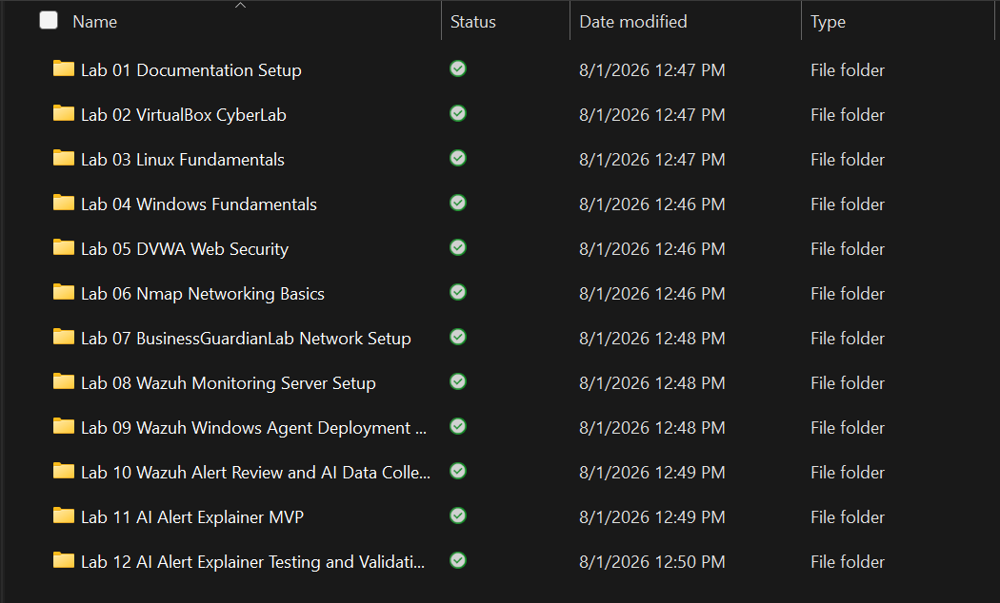

### Testing Workspace Created

A separate testing workspace was created so the published Lab 11 baseline remained unchanged.

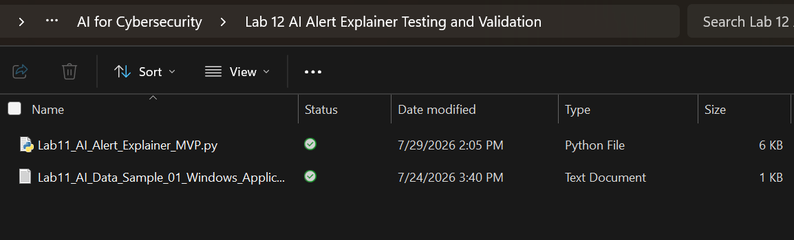

### Baseline Script Success

The copied Lab 11 script completed successfully before test conditions were introduced.

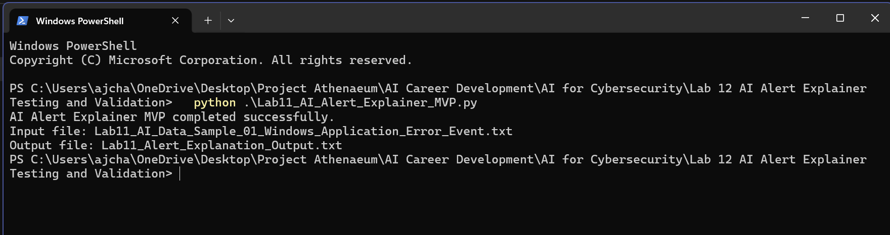

### Baseline Output Created

The baseline execution generated the expected explanation-output file.

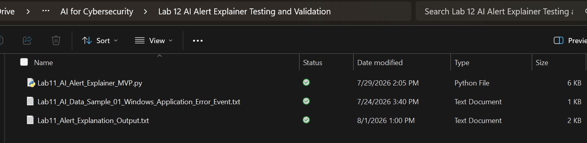

### Input File Renamed

The expected input file was renamed to simulate a missing-file condition.

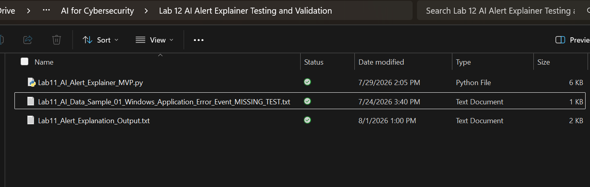

### Missing Input Error Handled

The script displayed a readable error when the expected input file could not be found.

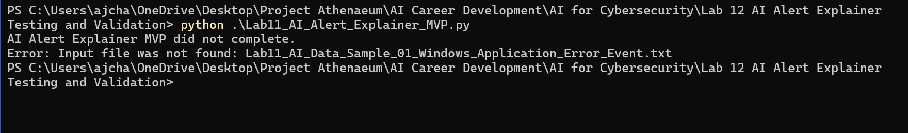

### Empty Input File Created

An empty input file was created using the filename expected by the script.

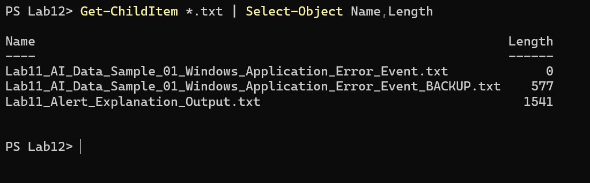

### Empty Input Error Handled

The script identified the empty input file and displayed a readable error message.

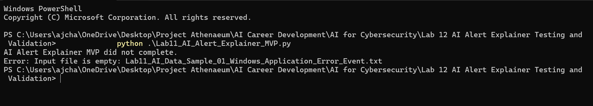

### Original Input Restored

The original sanitized alert data was restored from the temporary backup.

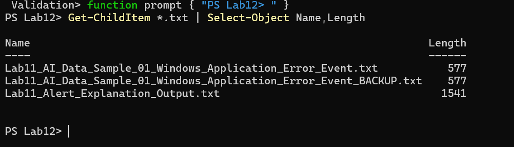

### Missing Rule-Level Test Prepared

The `rule.level` field was removed from the copied input sample.

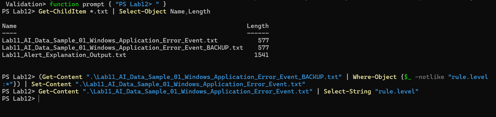

### Missing Field Test Completed

The script completed successfully even though the rule-level field was unavailable.

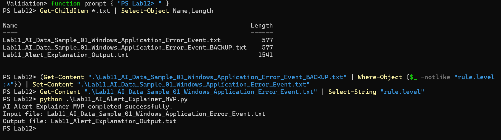

### Missing Field Output Reviewed

The generated report displayed `Unknown rule level` and required manual severity review.

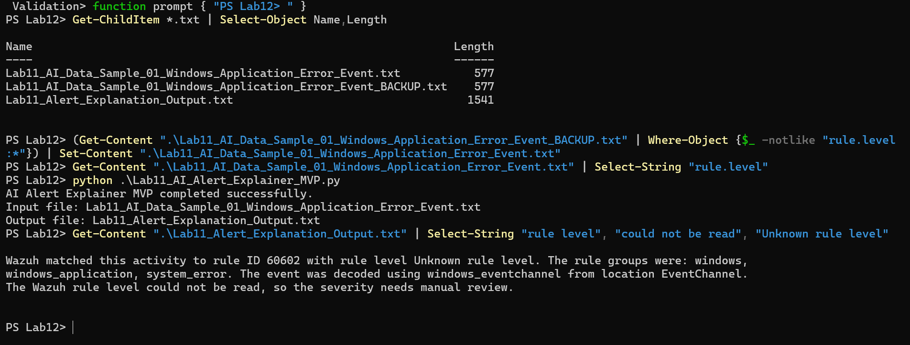

### Severity Test Prepared

The copied input sample was changed from rule level `9` to rule level `3`.

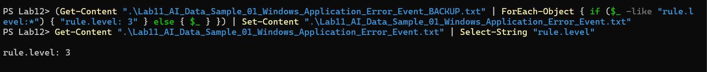

### Severity Test Executed

The script completed successfully using the modified rule-level value.

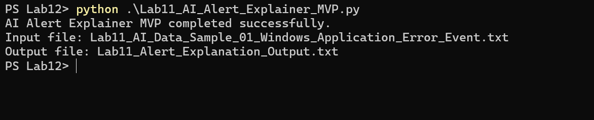

### Severity Output Reviewed

The generated explanation changed to low-level-alert language after the rule level was changed to `3`.

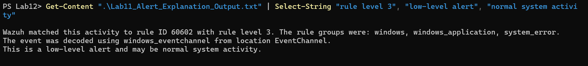

### Original Rule Level Restored

The original rule-level value of `9` was restored after testing.

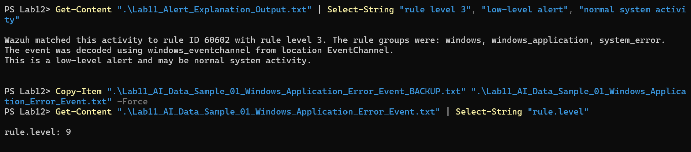

### Final Baseline Confirmed

The restored baseline completed successfully after all validation tests.

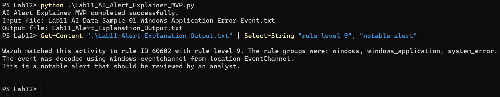

## Change-Control Approach

Lab 12 followed the Project Athenaeum rule that completed work should not be unnecessarily rebuilt or overwritten.

The published Lab 11 MVP remained the stable reference version.

Testing was performed using copied files because this approach:

- Protected the working published version
- Prevented test data from replacing baseline data
- Preserved the original demonstration
- Allowed failure conditions to be created safely
- Made test results easier to compare
- Created evidence before future improvements are introduced

Future code changes should be implemented as documented improvements after validation results are reviewed.

## Security and Privacy

This lab followed these rules:

- Only copied and sanitized Lab 11 files were tested
- The published Lab 11 code was not modified
- No Wazuh credentials or passwords were included
- No API keys or access tokens were used
- No external AI service received the alert data
- No real customer, financial, City, employer, school, or production data was used
- Test conditions were created only inside the authorized local workspace
- The temporary backup file was deleted before publication
- Screenshots were reviewed before GitHub upload
- Human review remained required
- No automatic security action was performed

## Limitations

This validation lab has intentional limitations:

- Only one sanitized alert sample was tested
- The tool still processes structured text rather than a complete JSON record
- Multiple alerts were not processed
- Alert correlation was not tested
- Only selected failure conditions were evaluated
- Automated unit tests were not created
- Severity logic uses simple predefined ranges
- The tool does not independently determine malicious intent
- No dashboard or graphical interface was tested
- No external or local AI model was used
- Human review remains necessary

These limitations identify areas for future development rather than failures of the current MVP.

## Importance

Building a working tool is only one part of software development.

A useful security tool must also be tested under normal and abnormal conditions.

Lab 12 demonstrated that the AI Alert Explainer MVP could:

- Complete its intended baseline workflow
- Detect a missing input file
- Detect an empty input file
- Continue when one expected field was missing
- Change severity language based on the supplied rule level
- Return to its original working state after testing

This validation provides evidence that future improvements should be based on documented behavior rather than added without testing.

## Lessons Learned

This lab reinforced the importance of preserving a known-good baseline before testing changes.

Using a separate workspace made it possible to create missing files, empty files, incomplete data, and altered severity values without damaging the published Lab 11 project.

The testing also showed that readable error messages improve troubleshooting. A program that explains why it stopped is easier to support than one that fails without context.

The missing-field test demonstrated that software can continue producing useful output even when some alert data is unavailable, as long as the missing information is clearly identified.

The severity test confirmed that predefined logic must be validated with more than one value. Changing the rule level from `9` to `3` produced the expected change in the explanation.

Most importantly, this lab established a more realistic development process:

```text
Build
→ Preserve baseline
→ Test
→ Document results
→ Restore baseline
→ Plan improvements
```

## Documentation Created

The following Lab 12 documentation was completed and retained locally:

- `AJ_Chapa_Lab_12_AI_Alert_Explainer_Testing_and_Validation_Screenshot_Log_v1.0.docx`
- `AJ_Chapa_Lab_12_AI_Alert_Explainer_Testing_and_Validation_Notes_v1.0.docx`
- `AJ_Chapa_Lab_12_AI_Alert_Explainer_Testing_and_Validation_Portfolio_Writeup_v1.0.docx`
- Copied Python baseline script
- Sanitized alert-data sample
- Final restored explanation output
- Seventeen sanitized screenshots
- Test results and restoration evidence

## Future Development

The documented Lab 12 results can support future work involving:

- Additional sanitized alert samples
- Automated test cases
- Complete JSON parsing
- Multiple-alert processing
- Improved missing-field handling
- Reusable severity mappings
- Structured output formats
- Alert correlation
- Analyst feedback controls
- Accuracy and consistency measurement
- A graphical interface
- Dashboard integration
- Approved local or external AI-model integration
- Human-approved response recommendations

Future changes should be implemented as new improvements rather than silently replacing the validated Lab 11 baseline.

## Status

**Completed and portfolio ready**
