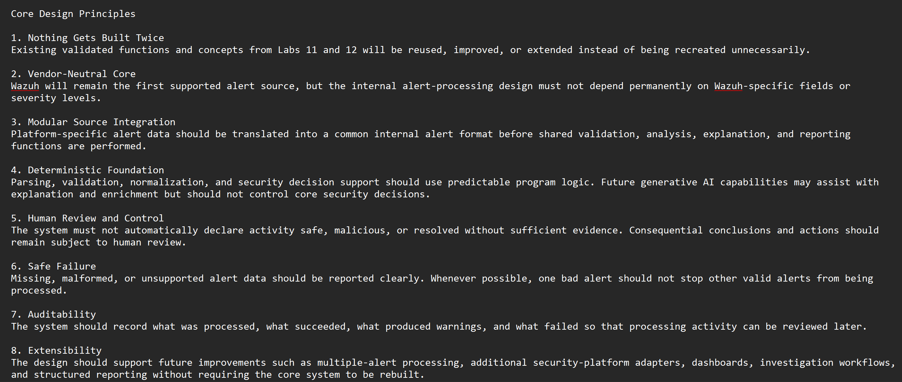
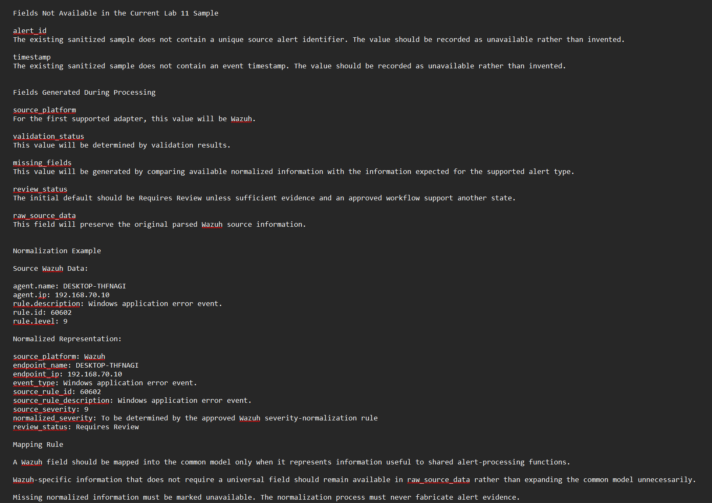
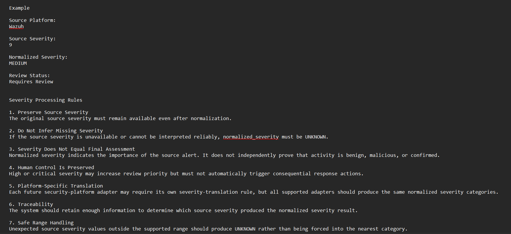
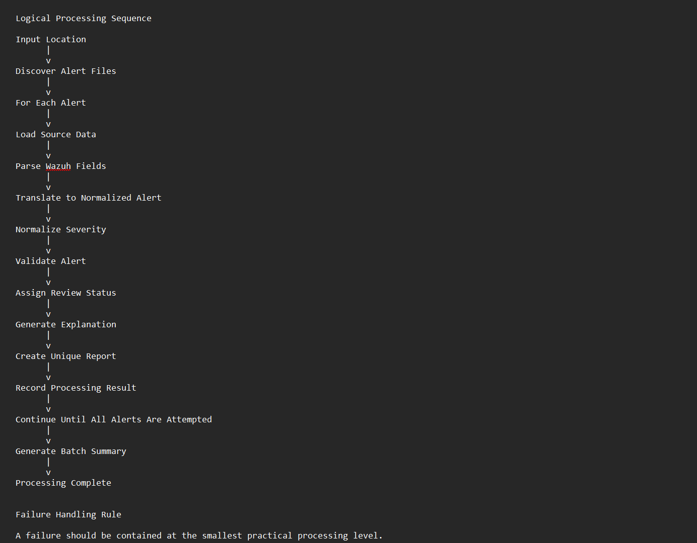
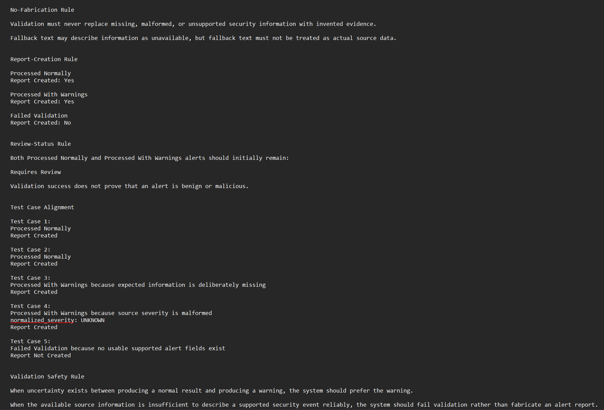
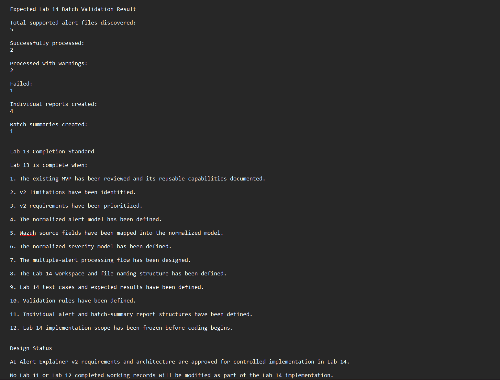

# Lab 13: AI Alert Explainer v2 Requirements and Design

## Overview

Lab 13 defines the requirements and technical design for the next version of the Project Athenaeum AI Alert Explainer.

Lab 11 created the first functional Python-based alert explanation MVP. Lab 12 then tested and validated that MVP under normal and abnormal input conditions while preserving the published version as a stable baseline.

Lab 13 used those validation results to design the next version before additional code was written.

The goal was to create a clear, testable, and implementation-ready design while keeping Labs 11 and 12 unchanged.

## Objective

Design AI Alert Explainer v2 around the lessons learned from the validated MVP.

The design focuses on:

* Multiple-alert processing
* Cleaner input and output organization
* A normalized alert-data model
* Vendor-neutral core processing
* Consistent severity handling
* Improved validation
* Safe missing-field behavior
* Unique output reports
* Batch-level reporting
* Deterministic test cases
* Human review before security decisions

No v2 implementation code was created during this lab.

## Project Progression

```text
Lab 11
AI Alert Explainer MVP
        |
        v
Lab 12
Testing and Validation
        |
        v
Lab 13
Requirements and Design
        |
        v
Lab 14
Controlled v2 Implementation
```

## Why Design Before Coding

Lab 12 confirmed that the original MVP worked and also identified areas that could be improved.

Rather than modifying the stable baseline immediately, Lab 13 documented the next version first.

This approach helps:

* Preserve validated work
* Prevent unnecessary rewrites
* Define testable requirements
* Separate design decisions from implementation
* Reduce accidental scope expansion
* Make later testing easier to compare with the original MVP

## Design Principles

The v2 design follows several principles:

* Preserve the validated Lab 11 and Lab 12 baseline
* Use testing results to justify changes
* Keep the first v2 implementation manageable
* Allow individual alerts to be processed independently
* Separate source-specific data handling from explanation logic
* Identify incomplete data instead of inventing values
* Preserve the original alert evidence
* Prevent generated reports from being silently overwritten
* Keep analyst review visible throughout the workflow

### Design Evidence

The design principles were documented before implementation planning continued.



## Vendor-Neutral Alert Model

Wazuh remains the first alert source used by Project Athenaeum because it is already deployed in the lab environment.

However, the v2 core design is not intended to depend permanently on Wazuh-specific field names.

Instead, source data is translated into a common internal alert structure before explanation logic is applied.

At a high level, the normalized model can represent information such as:

* Source platform
* Timestamp
* Endpoint
* Event
* Detection rule
* Original severity
* Normalized severity
* Validation state
* Review state

This allows the explanation workflow to operate on consistent alert information while preserving the original source data for analyst verification.

### Wazuh Mapping Design

The Wazuh mapping design documents how selected source fields can be translated into the normalized model without changing the underlying evidence.



## Severity Design

Lab 12 demonstrated that the original MVP correctly changed its explanation when the Wazuh rule level changed.

Version 2 expands this concept by separating the source platform's original severity from a consistent analyst-facing severity category.

Planned normalized categories include:

```text
Informational
Low
Medium
High
Critical
Unknown
```

The original Wazuh rule level remains available for review.

Severity normalization is intended to improve consistency across reports. It does not replace source evidence or determine whether activity is malicious.

### Severity Design Evidence

The severity design defines how source severity information can be preserved while also creating a consistent normalized value.



## Multiple-Alert Processing

The Lab 11 MVP processes one prepared alert sample at a time.

Version 2 is designed to support multiple alert samples during one processing run.

The planned workflow will:

1. Discover available input files
2. Process each alert independently
3. Normalize supported alert data
4. Validate available fields
5. Generate an explanation
6. Create a unique report
7. Record the processing result
8. Continue to the next alert
9. Produce a final batch summary

One invalid alert should not automatically prevent other valid alerts from being processed.

### Processing Flow

The processing-flow design defines the sequence that will guide Lab 14 implementation.



## Validation Design

Lab 12 tested several abnormal input conditions, including missing files, empty files, missing fields, and changed severity values.

Version 2 incorporates validation as a defined processing stage rather than treating validation only as an error condition.

The design requires the tool to distinguish between:

* Valid input
* Incomplete input
* Missing optional information
* Unsupported input
* Processing errors

Missing values should be clearly identified.

The tool must not invent alert information when evidence is unavailable.

### Validation Evidence

The validation design defines how incomplete or unsupported alert data should be handled before explanation output is generated.



## Output Design

Version 2 is designed to generate an individual report for each processed alert.

Reports should preserve important analyst information while remaining easy to review.

Planned report content includes:

* Alert identification
* Endpoint context
* Event context
* Source rule information
* Original severity
* Normalized severity
* Missing-field warnings
* Plain-language explanation
* Recommended review steps
* Human-review status

Output files will use unique names so one processing run does not silently replace previous evidence.

## Batch Summary Design

After all available alert samples have been attempted, the tool should produce a batch-level summary.

The summary may include:

* Files discovered
* Alerts successfully processed
* Alerts containing incomplete data
* Alerts that failed validation
* Reports generated
* Processing errors
* Items requiring human review

This provides an analyst with a quick overview of the run without requiring every report to be opened first.

## Planned Lab 14 Test Cases

Lab 13 defines five deterministic test scenarios for the first v2 implementation:

1. Normal baseline alert
2. Lower-severity alert
3. Higher-severity alert
4. Alert with missing information
5. Invalid or unsupported input

These test cases are intended to verify predictable behavior before additional features are introduced.

## Lab 14 Implementation Scope

Lab 13 concludes with a frozen implementation scope for Lab 14.

The first implementation phase will focus on the core processing workflow rather than dashboard or commercial features.

Planned Lab 14 priorities include:

* Creating the v2 workspace
* Supporting multiple sanitized alert samples
* Separating input and output handling
* Building the normalized alert structure
* Creating the first Wazuh mapping process
* Applying validation rules
* Adding severity normalization
* Generating unique individual reports
* Isolating individual alert failures
* Creating a batch summary
* Running the five planned deterministic tests

### Final Baseline

The final design review confirms that Labs 11 and 12 remain preserved and that Lab 14 will begin from the approved Lab 13 design rather than modifying the validated baseline.



## Public Repository Boundary

This public lab documents the portfolio-safe design progression of the AI Alert Explainer.

The public repository includes:

* High-level requirements
* Sanitized architectural concepts
* Portfolio-safe design evidence
* Testing strategy
* Implementation scope
* Lessons learned

The full internal requirements document and complete 42-screenshot evidence record are intentionally not published.

Proprietary Business Guardian product implementation, private connector logic, policy and approval workflows, tenant architecture, sensitive logging, commercial material, and other non-public product details remain outside the public Project Athenaeum repository.

## Work Completed

During this lab, I:

* Reviewed the validated Lab 11 MVP
* Reviewed the Lab 12 testing results
* Preserved Labs 11 and 12 as the stable baseline
* Defined v2 design principles
* Designed a normalized alert model
* Designed the initial Wazuh-to-normalized mapping
* Designed normalized severity handling
* Defined multiple-alert processing requirements
* Defined validation behavior
* Defined missing-field behavior
* Planned isolated failure handling
* Designed individual alert-report requirements
* Designed batch-summary requirements
* Defined the Lab 14 workspace structure
* Created five deterministic validation scenarios
* Defined the initial Lab 14 implementation scope
* Completed the technical design documentation
* Completed the Lab Notes
* Completed the Screenshot Log
* Completed the one-page Portfolio Writeup
* Selected six sanitized screenshots for public publication

## Design Outcome

Lab 13 produced an implementation-ready v2 design without changing the validated MVP.

The project progression is now:

```text
Build
→ Test
→ Validate
→ Design
→ Implement
→ Test again
```

This provides a controlled foundation for Lab 14.

## Lessons Learned

Lab 13 reinforced that successful development is not only about writing more code.

Testing from Lab 12 identified behavior that needed to be preserved or improved. Lab 13 converted those observations into explicit requirements before implementation began.

The design process also reinforced the value of separating source-platform data from core analysis logic. This provides a cleaner path toward supporting additional security platforms later without rebuilding the explanation workflow around every vendor.

Most importantly, the lab kept the next development phase intentionally limited. The goal of Lab 14 is to implement and validate the approved core v2 workflow—not to build the entire Business Guardian platform at once.

## Future Development

Lab 14 will begin controlled implementation of AI Alert Explainer v2.

The first implementation will focus on:

* Multiple-alert processing
* Normalized alert data
* Improved validation
* Severity normalization
* Unique reports
* Failure isolation
* Batch reporting
* Deterministic testing

Dashboard development, advanced AI integration, automated response, and commercial product functionality remain outside the immediate Lab 14 scope.

## Status

**Requirements and technical design completed; approved for controlled Lab 14 implementation**
