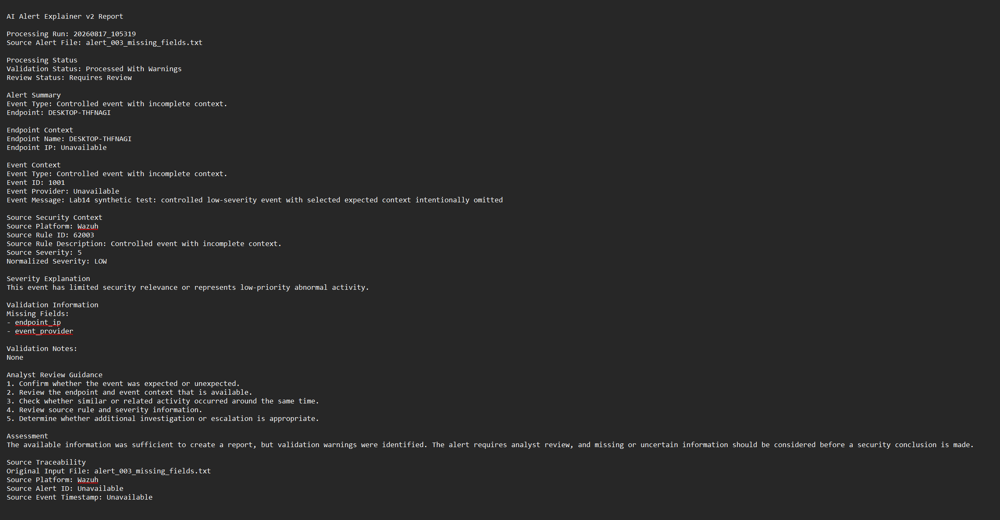
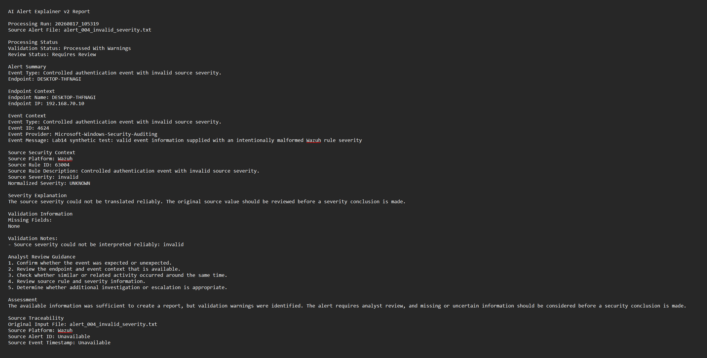
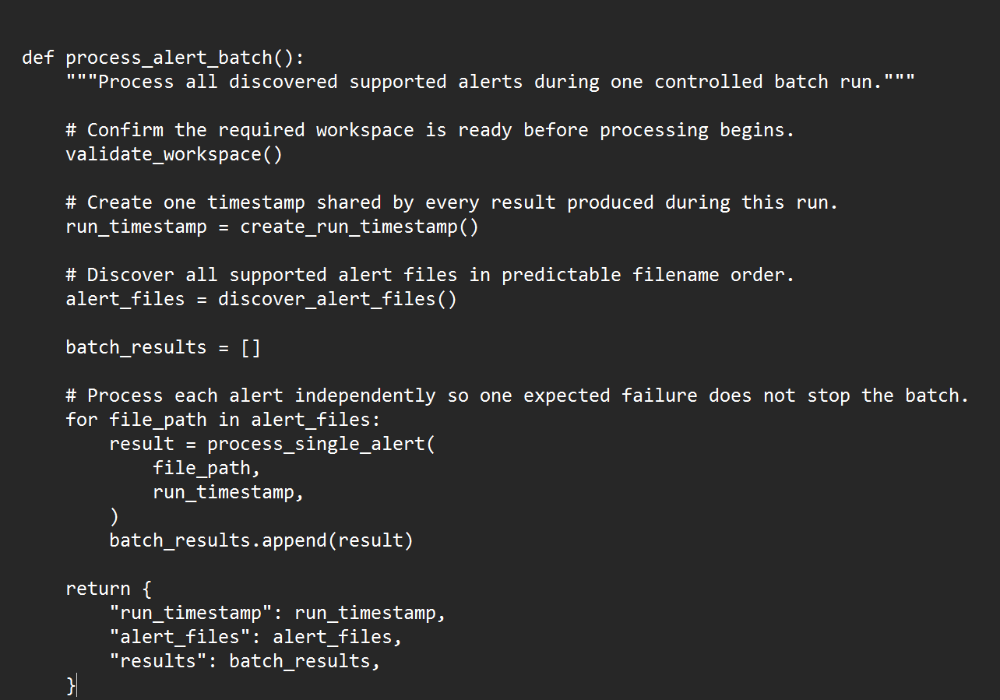
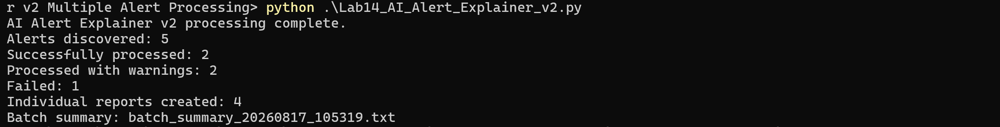
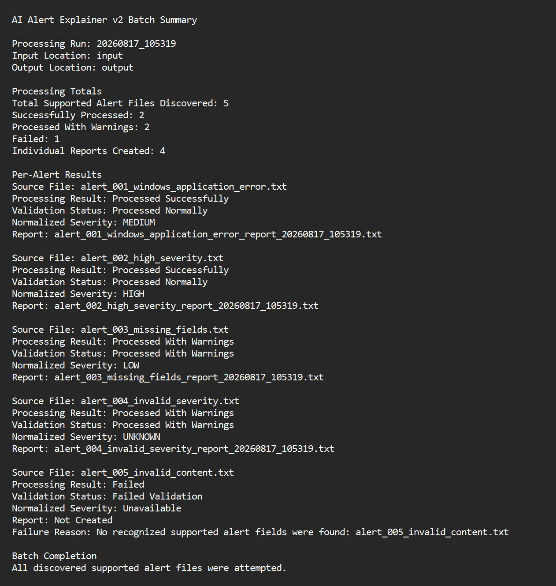
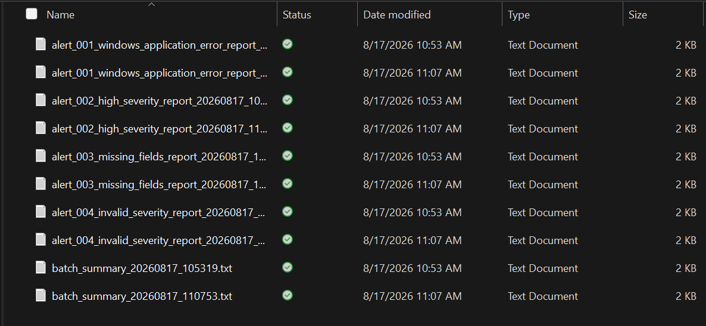

# Lab 14 — AI Alert Explainer v2: Multiple Alert Processing

## What Happens When Five Alerts Arrive at Once?

The original AI Alert Explainer could process one sanitized Wazuh alert at a time.

That worked.

But a real security workflow cannot depend on someone manually feeding it one perfect alert after another.

Some alerts will be complete.

Some will be missing information.

Some will contain malformed values.

Some may not even contain enough recognizable security data to process safely.

Lab 14 asks:

**Can the system process all of them during one controlled run without one bad alert breaking everything else?**

This lab implements the architecture designed in [Lab 13 — AI Alert Explainer v2 Requirements and Design](../lab-13-ai-alert-explainer-v2-requirements-design/README.md).

The workflow moves from:

```text
One Alert
   ↓
One Report
```

to:

```text
Multiple Alerts
      ↓
Discover
      ↓
Parse
      ↓
Normalize
      ↓
Validate Independently
      ↓
Generate Reports
      ↓
Create Batch Summary
```

Labs 11 and 12 remain preserved as the validated single-alert MVP baseline.

Lab 14 extends that foundation instead of replacing it.

**Nothing gets built twice.**

---

# What Lab 14 Adds

The v2 processor can discover several supported alert files during one execution and handle each one independently.

The implementation adds:

- Multiple-alert discovery
- Predictable processing order
- Vendor-neutral normalized alert data
- Initial Wazuh source translation
- Platform-neutral severity
- Missing-field detection
- Malformed-value handling
- Explicit validation outcomes
- Per-alert failure isolation
- Individual analyst reports
- Batch-level summaries
- Source-to-report traceability
- Unique output filenames
- Overwrite protection
- Repeatable validation

The result is no longer just a script that explains one alert.

It is the beginning of a reusable security-data processing pipeline.

---

# From Wazuh Data to a Common Alert Model

Wazuh is the first supported source in Project Athenaeum, but Lab 14 does not allow Wazuh-specific field names to become the permanent architecture.

Instead:

```text
Wazuh Alert
     ↓
Source Translation
     ↓
Normalized Alert
     ↓
Shared Processing Logic
```

Supported information is translated into a common internal structure containing data such as:

- Alert source
- Endpoint identity
- Endpoint IP
- Event identifiers
- Event provider
- Event message
- Source rule information
- Original source severity
- Normalized severity
- Missing fields
- Validation notes
- Processing outcome
- Review status
- Source traceability

The original source information remains available where needed for traceability.

The point is not to remove Wazuh.

The point is to avoid designing the entire system so that it can only understand Wazuh.

---

# Severity Without Guessing

Wazuh rule levels are translated into platform-neutral categories:

```text
INFORMATIONAL
LOW
MEDIUM
HIGH
CRITICAL
UNKNOWN
```

A malformed or unsupported source severity is not guessed.

For example:

```text
rule.level: invalid
```

does not become an arbitrary numeric value.

Instead:

```text
Original source value: invalid
Normalized severity: UNKNOWN
```

The malformed source value remains preserved, and a validation note explains why translation could not be completed safely.

This keeps two important ideas separate:

```text
What the source actually said
            ≠
What the system can safely normalize
```

---

# Three Possible Processing Outcomes

Every discovered alert is evaluated independently.

Lab 14 uses three outcomes.

## `Processed Normally`

The alert contains enough supported information for normal processing and an individual analyst report can be generated.

## `Processed With Warnings`

The alert is still usable, but missing, malformed, or uncertain information requires additional attention.

A report is still created, and the problem is documented.

## `Failed Validation`

The input does not contain enough recognized information to safely produce an analyst report.

The failure is recorded.

The rest of the batch continues.

That last part is important:

> **One bad alert should not stop four good ones from being processed.**

---

# Human Review Remains the Default

Every processable alert begins with:

```text
Requires Review
```

The processor does not automatically declare an alert:

- Benign
- Malicious
- Confirmed
- Resolved

Lab 14 organizes and validates the available evidence.

It does not pretend that formatting an alert into a report is the same thing as completing an investigation.

---

# Missing Data Stays Missing

One controlled alert intentionally omits:

```text
endpoint_ip
event_provider
```

The system does not invent replacements.

Instead, those values are recorded as unavailable and the alert receives:

```text
Processed With Warnings
```

because enough other supported information remains to continue safely.

<p align="center">
  
</p>

<p align="center">
  <em>Missing endpoint and provider information is reported explicitly rather than filled with fabricated values.</em>
</p>

---

# Malformed Data Is Different From Missing Data

Lab 14 also tests data that exists but cannot be interpreted safely.

The malformed-severity test contains:

```text
rule.level: invalid
```

The processor preserves that original value while setting the normalized severity to:

```text
UNKNOWN
```

and recording the problem in validation notes.

That distinction matters:

```text
Missing
   ≠
Malformed
```

A reliable security workflow should know the difference.

<p align="center">
  
</p>

<p align="center">
  <em>The malformed source severity remains preserved while normalization safely falls back to UNKNOWN.</em>
</p>

---

# Processing the Whole Batch

Lab 14 discovers supported `.txt` alert files from the designated input folder and processes them in predictable filename order.

Conceptually:

```text
Find Alert Files
      ↓
Alert 001 → Process
Alert 002 → Process
Alert 003 → Process With Warnings
Alert 004 → Process With Warnings
Alert 005 → Fail Safely
      ↓
Build Batch Summary
```

Each alert is isolated from the others.

A failure in one record does not stop the batch.

<p align="center">
  
</p>

<p align="center">
  <em>The v2 workflow moves Project Athenaeum from single-alert processing into controlled batch processing.</em>
</p>

---

# Controlled Validation Set

Five sanitized or synthetic alerts were prepared before implementation was considered complete.

## Test 1 — Baseline Windows Application Error

File:

[`input/alert_001_windows_application_error.txt`](input/alert_001_windows_application_error.txt)

Purpose:

- Reuse the validated Lab 11 sample
- Confirm compatibility with the new v2 architecture

Expected:

```text
Source severity: 9
Normalized severity: MEDIUM
Outcome: Processed Normally
```

---

## Test 2 — Higher-Severity Alert

File:

[`input/alert_002_high_severity.txt`](input/alert_002_high_severity.txt)

Purpose:

- Exercise a synthetic higher-severity authentication condition
- Validate higher-severity translation

Expected:

```text
Source severity: 11
Normalized severity: HIGH
Outcome: Processed Normally
```

---

## Test 3 — Missing Fields

File:

[`input/alert_003_missing_fields.txt`](input/alert_003_missing_fields.txt)

Intentionally missing:

```text
endpoint_ip
event_provider
```

Expected:

```text
Source severity: 5
Normalized severity: LOW
Outcome: Processed With Warnings
```

The alert should still produce a report because enough supported information remains available.

---

## Test 4 — Malformed Severity

File:

[`input/alert_004_invalid_severity.txt`](input/alert_004_invalid_severity.txt)

Source value:

```text
rule.level: invalid
```

Expected:

```text
Normalized severity: UNKNOWN
Outcome: Processed With Warnings
```

The original malformed value must remain preserved.

---

## Test 5 — Unsupported Content

File:

[`input/alert_005_invalid_content.txt`](input/alert_005_invalid_content.txt)

Purpose:

- Provide input containing no recognized supported Wazuh alert fields
- Confirm safe validation failure
- Confirm that the remaining alerts continue processing

Expected:

```text
Outcome: Failed Validation
Individual report: None
```

---

# The Target Was Frozen Before Coding

Lab 13 defined the acceptance criteria before Lab 14 implementation began.

The expected result was:

```text
Total Supported Alert Files Discovered: 5
Successfully Processed: 2
Processed With Warnings: 2
Failed: 1
Individual Reports Created: 4
Batch Summaries Created: 1
```

That matters because the result was not chosen after seeing what the program happened to produce.

The code had to meet the target.

---

# First Controlled Execution

The first validated processing run was:

```text
20260817_105319
```

Observed:

```text
Total Supported Alert Files Discovered: 5
Successfully Processed: 2
Processed With Warnings: 2
Failed: 1
Individual Reports Created: 4
Batch Summaries Created: 1
```

The observed result matched the frozen Lab 13 acceptance criteria exactly.

**Expected vs. observed: Exact match — PASS**

<p align="center">
  
</p>

<p align="center">
  <em>The first complete five-alert execution matched the predetermined 5 / 2 / 2 / 1 / 4 target.</em>
</p>

---

# Batch-Level Reporting

Every complete execution creates one batch summary.

The batch summary records information such as:

- Processing run identifier
- Input and output locations
- Total supported files discovered
- Normally processed alerts
- Warning conditions
- Failed alerts
- Reports created
- Per-alert processing results
- Validation status
- Normalized severity
- Report creation status
- Failure reason when applicable
- Batch completion status

The totals are calculated from the actual collected results.

They are not hard-coded to match the expected test case.

<p align="center">
  
</p>

<p align="center">
  <em>The batch summary records the outcome of every alert and derives its totals from the actual processing run.</em>
</p>

---

# Individual Analyst Reports

Each processable alert receives its own report.

A report can include:

- Processing-run information
- Original source filename
- Validation status
- Review status
- Alert summary
- Endpoint context
- Event context
- Source security context
- Original source severity
- Normalized severity
- Severity explanation
- Missing-field information
- Validation notes
- Analyst review guidance
- Safe assessment language
- Source traceability

Inputs that fail validation do not receive analyst reports.

That prevents unsupported content from being turned into something that looks authoritative simply because the program was able to open the file.

---

# Published Inputs and Outputs

The public lab contains enough material to inspect the complete workflow.

## Application

- [`Lab14_AI_Alert_Explainer_v2.py`](Lab14_AI_Alert_Explainer_v2.py)
- [`Lab14_AI_Alert_Explainer_v2_Validation_Results.txt`](Lab14_AI_Alert_Explainer_v2_Validation_Results.txt)

## Input

The [`input/`](input/) folder contains the complete five-alert controlled validation set.

- [`alert_001_windows_application_error.txt`](input/alert_001_windows_application_error.txt)
- [`alert_002_high_severity.txt`](input/alert_002_high_severity.txt)
- [`alert_003_missing_fields.txt`](input/alert_003_missing_fields.txt)
- [`alert_004_invalid_severity.txt`](input/alert_004_invalid_severity.txt)
- [`alert_005_invalid_content.txt`](input/alert_005_invalid_content.txt)

## Representative Output

The [`output/`](output/) folder contains selected validated output:

- [`batch_summary_20260817_105319.txt`](output/batch_summary_20260817_105319.txt)
- [`alert_003_missing_fields_report_20260817_124241.txt`](output/alert_003_missing_fields_report_20260817_124241.txt)
- [`alert_004_invalid_severity_report_20260817_124241.txt`](output/alert_004_invalid_severity_report_20260817_124241.txt)

The complete local output set is intentionally not published.

These representative files are enough to demonstrate the behavior without filling the public repository with redundant generated reports.

---

# Repeatability and Overwrite Protection

A second complete validation run was performed:

```text
20260817_110753
```

It produced the same result:

```text
5 alerts discovered
2 processed normally
2 processed with warnings
1 failed validation
4 individual reports
1 batch summary
```

The first-run output remained intact.

Lab 14 uses processing-run timestamps in generated filenames.

If a collision still occurs, a numeric suffix is added instead of overwriting an existing file.

<p align="center">
  
</p>

<p align="center">
  <em>The repeat run reproduced the expected result while preserving the first run's reports and batch summary.</em>
</p>

---

# Why Failure Isolation Matters

The fifth controlled alert was deliberately unsupported.

It failed.

The batch did not.

That difference is one of the most important improvements introduced in Lab 14.

A fragile workflow might behave like this:

```text
Alert 1 → Good
Alert 2 → Good
Alert 3 → Warning
Alert 4 → Warning
Alert 5 → Error
             ↓
        Entire Job Stops
```

Lab 14 instead behaves like:

```text
Alert 1 → Process
Alert 2 → Process
Alert 3 → Process With Warnings
Alert 4 → Process With Warnings
Alert 5 → Fail Safely
             ↓
      Batch Still Completes
```

That makes the processing layer much more useful as a foundation for later security workflows.

---

# Final Validation

Lab 14 validated that:

- Five supported alert files were discovered
- Two alerts processed normally
- Two alerts processed with warnings
- One alert failed validation
- Four individual reports were created
- One batch summary was created per run
- One failed alert did not stop the rest of the batch
- Missing information was reported instead of fabricated
- Malformed severity remained preserved
- Malformed severity normalized to `UNKNOWN`
- Missing and malformed data were handled differently
- Failed validation produced no individual analyst report
- Source files remained unchanged
- Source traceability remained preserved
- Batch totals came from actual results
- Repeat execution created separate output
- Previous output remained intact
- The Lab 11 sample remained compatible with v2
- All processable alerts remained `Requires Review`

## Validation Status

| Validation Area | Result |
| --- | --- |
| Technical implementation | **COMPLETE** |
| Controlled validation | **PASS** |
| Expected result | **MATCHED** |
| Repeatability validation | **PASS** |
| Overwrite protection | **PASS** |
| Multiple-alert processing baseline | **ESTABLISHED** |
| Public portfolio publication | **COMPLETE** |

---

# What Lab 14 Proves

Lab 14 demonstrates that reliable batch processing requires much more than putting a loop around the original single-alert program.

A safe multi-alert workflow needs:

- Clear source boundaries
- Predictable file discovery
- Normalized internal data
- Independent validation
- Warning conditions
- Failure isolation
- Preserved source evidence
- Traceability
- Unique output
- Repeatable testing

Most importantly:

> **A bad alert can fail without taking the rest of the batch down with it.**

And when data is incomplete or malformed, the system reports the problem instead of hiding it.

---

# Public / Private Boundary

Lab 14 is published as a sanitized Project Athenaeum portfolio project.

Public material demonstrates:

- Python programming
- Multiple-file processing
- Vendor-neutral normalization
- Initial Wazuh source translation
- Validation logic
- Missing-data handling
- Malformed-data handling
- Failure isolation
- Analyst report generation
- Batch summaries
- Traceability
- Repeatability
- Overwrite protection
- Human-review requirements

Business Guardian product-level functionality remains private.

That includes areas such as:

- Production connectors
- Evidence orchestration
- Investigation workflows
- Production triage logic
- Policy engines
- Approval mechanisms
- Defensive-action logic
- Verification systems
- Advanced backend architecture
- Customer and tenant logic
- Sensitive security data
- Secrets-related configuration
- Commercial workflows
- Production infrastructure

The public lab demonstrates the engineering foundation without exposing proprietary product implementation.

---

# Skills Demonstrated

- Python
- Multiple-file processing
- Security-data normalization
- Vendor-neutral architecture
- Wazuh data handling
- Severity normalization
- Missing-data validation
- Malformed-data handling
- Error handling
- Failure isolation
- Batch processing
- Report generation
- Source traceability
- Non-destructive processing
- Overwrite protection
- Deterministic testing
- Repeatability testing
- Defensive programming
- Technical documentation

---

# Where the Project Goes From Here

Lab 13 answered:

**What should the next alert-processing architecture look like before I write it?**

Lab 14 answered:

**Can that architecture reliably process multiple imperfect alerts during one run?**

The answer was yes.

But processing an alert still does not give it a durable identity.

That becomes the next problem.

[Lab 15 — Alert Records, Validation, and Traceability](../lab-15-alert-records-validation-traceability/README.md) extends the Lab 14 baseline by turning processable alerts into structured security records with persistent `AR-...` identities, timestamps, validation history, and source traceability.

The progression becomes:

```text
Single Alert MVP
      ↓
Validated MVP
      ↓
Designed v2 Architecture
      ↓
Multiple-Alert Processing
      ↓
Persistent Alert Records
      ↓
Traceability
```

Lab 14 is the point where Project Athenaeum stops thinking in terms of **one alert at a time** and starts behaving like a real processing pipeline.
