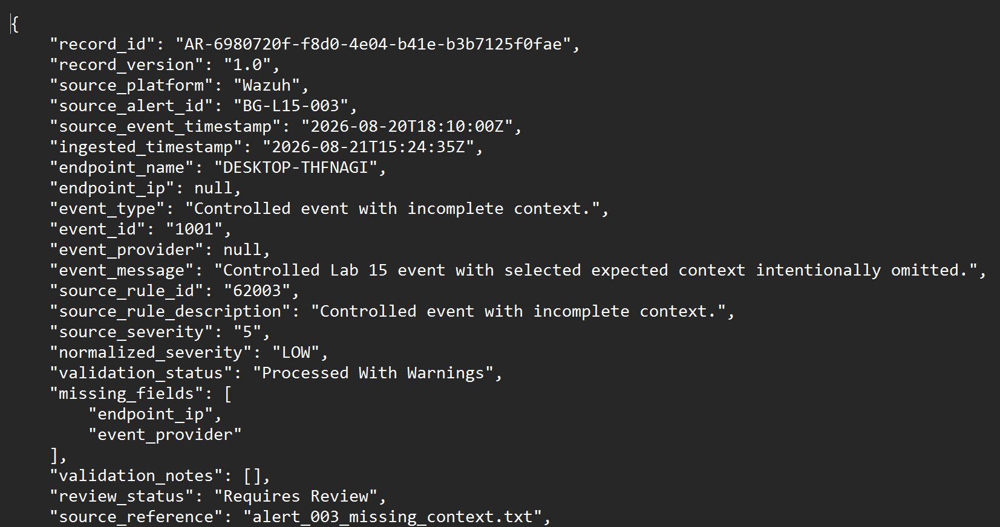
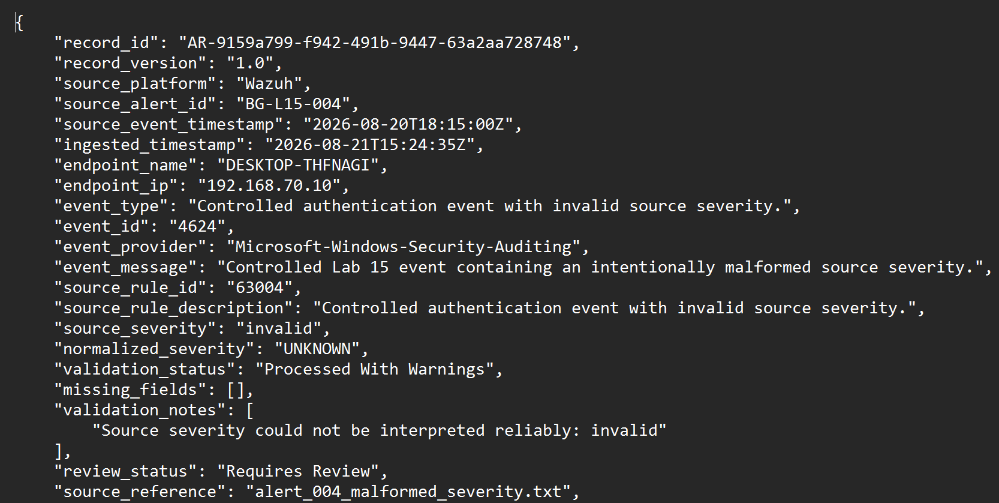
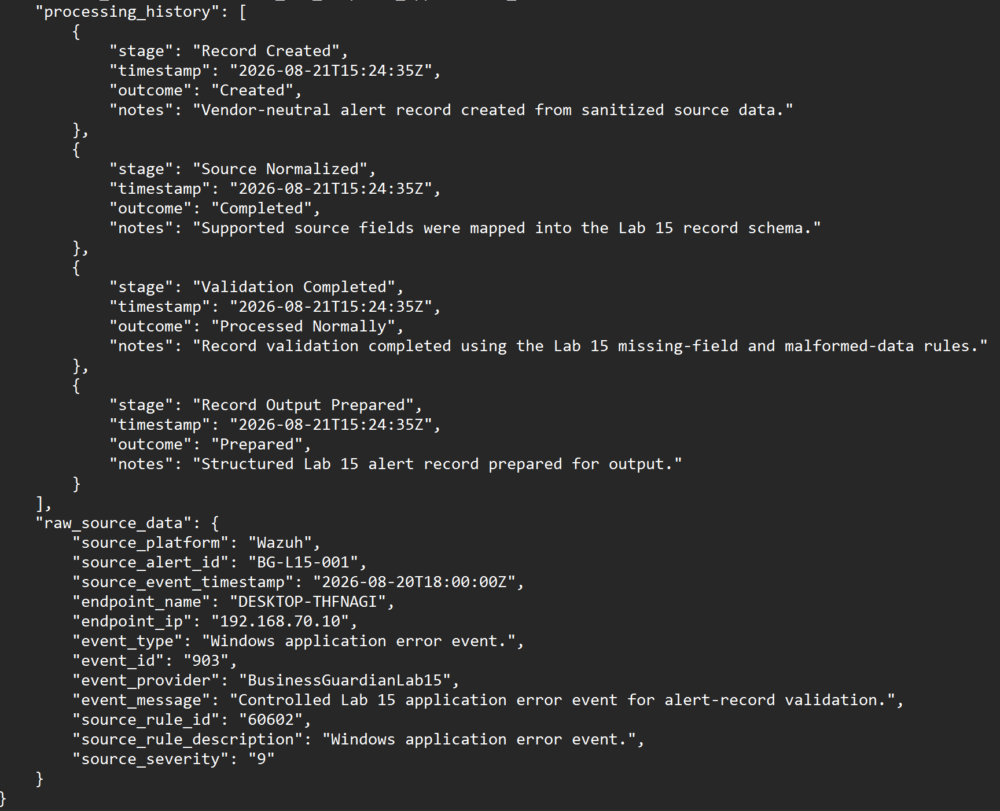
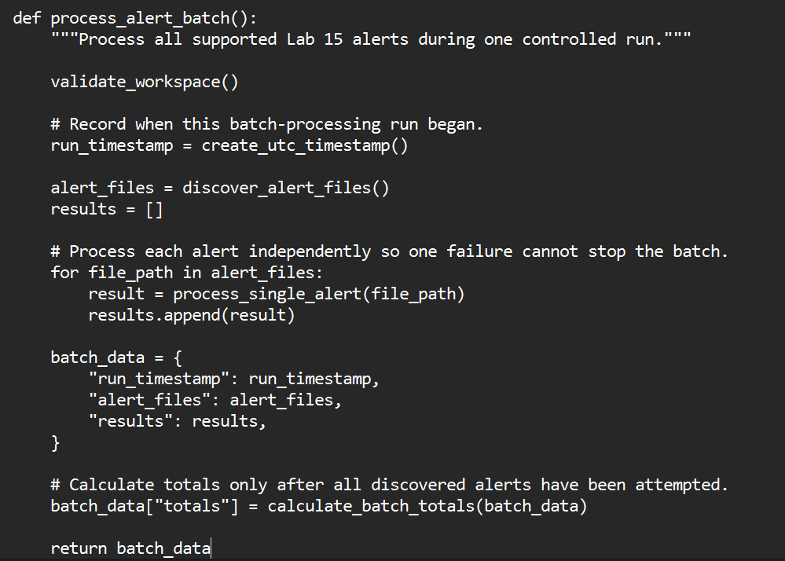
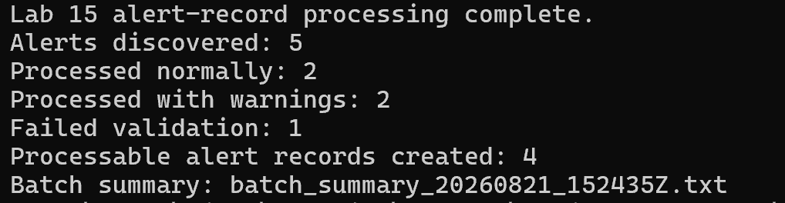
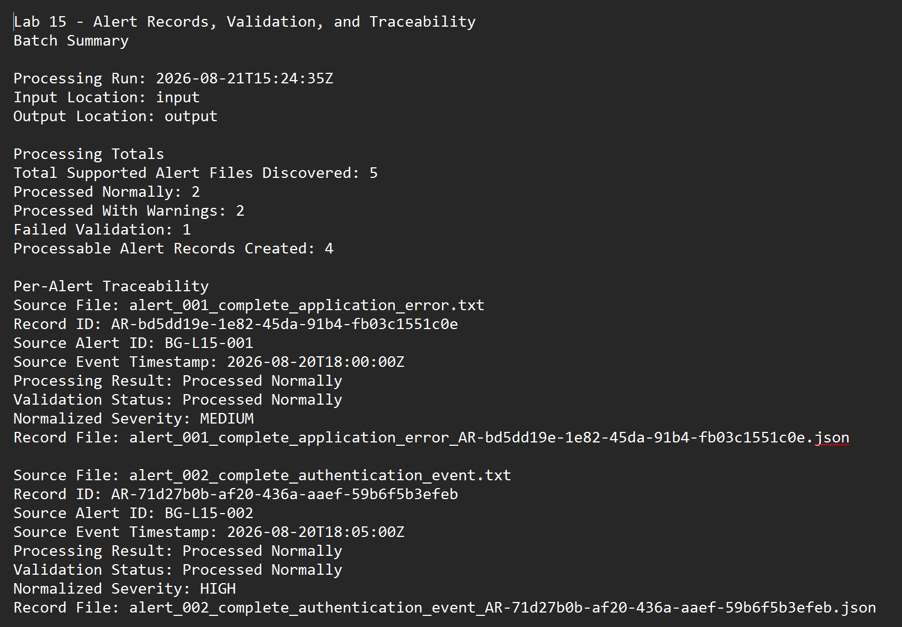
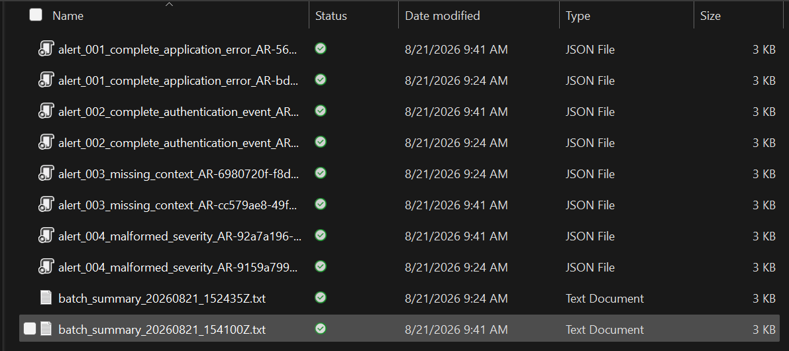
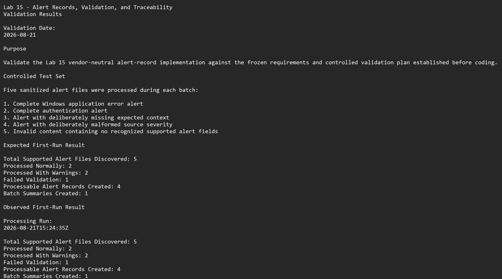

# Lab 15 — Alert Records, Validation, and Traceability

## What Happens to an Alert After It Is Processed?

Lab 14 proved that Project Athenaeum could process multiple security alerts during one controlled run—even when some inputs were incomplete, malformed, or unsupported.

But that created the next problem:

**How do you preserve an alert as it moves through an increasingly complex security workflow?**

A security system needs more than temporary input and a generated report.

It needs a durable record that can answer questions later:

- Which source alert did this come from?
- When did the original event occur?
- When did the system ingest it?
- Was any information missing?
- Was any source data malformed?
- What happened during processing?
- Can a later triage or investigation decision trace back to this exact alert?

Lab 15 builds that foundation.

It introduces structured, vendor-neutral **Alert Records** that preserve identity, validation results, timestamps, processing history, and source traceability without tying the core record format to Wazuh or another specific security platform.

The workflow becomes:

```text
Source Alert
     ↓
Validate and Normalize
     ↓
Create Persistent Alert Record
     ↓
Preserve Traceability
```

Lab 15 extends the validated Lab 14 architecture rather than rebuilding it.

**Nothing gets built twice.**

---

# What Lab 15 Adds

Each processable security alert receives a structured JSON record.

That record preserves information needed by future stages while keeping the internal format vendor-neutral.

A Lab 15 Alert Record can contain:

- Schema version
- `AR-...` alert-record identity
- Original source alert ID
- Source platform
- Source filename
- Original event timestamp
- Separate ingestion timestamp
- Endpoint information
- Normalized severity
- Original source severity
- Validation outcome
- Missing fields
- Validation notes
- Ordered processing history
- Preserved supported source information

The goal is simple:

> **The alert should be able to move forward without losing where it came from or what happened to it.**

---

# Giving Each Alert Its Own Identity

Every processable alert receives a UUID-based identifier beginning with:

```text
AR-...
```

The identifier is intentionally non-sensitive.

It does not contain:

- Endpoint names
- IP addresses
- Usernames
- Source filenames
- Other identifying source values

This creates a stable internal identity without embedding potentially sensitive information into the record ID.

Conceptually:

```text
Source Alert
     ↓
AR-... Alert Record
```

The original source alert ID is not discarded.

Instead, the new `AR-...` record keeps a reference to it so later processing can trace the record back to the original evidence.

This becomes especially important once additional decisions are attached to the same security event.

Lab 16 later builds directly on this design by preserving the `AR-...` identity while creating a separate `TR-...` triage-decision identity.

---

# Source Time and Processing Time Are Different

Lab 15 deliberately keeps two timestamps separate.

```text
Source Event Timestamp
        ≠
Ingestion Timestamp
```

The source timestamp tells us when the original event occurred.

The ingestion timestamp tells us when Project Athenaeum processed it.

Keeping both prevents later stages from accidentally treating processing time as event time.

That distinction becomes increasingly important for investigation, timeline reconstruction, and auditing.

---

# Missing Data Stays Missing

One of the most important rules in Lab 15 is:

> **If the source does not provide a value, the system does not invent one.**

Lab 15 uses three explicit processing outcomes:

```text
Processed Normally
Processed With Warnings
Failed Validation
```

An alert can remain usable even when some non-critical information is missing.

For example, the controlled missing-data record does not provide:

```text
endpoint_ip
event_provider
```

Those values remain explicitly unavailable.

The system does not generate replacements simply to make the record look complete.

<p align="center">
  
</p>

<p align="center">
  <em>Missing endpoint IP and event-provider information remain unavailable instead of being fabricated.</em>
</p>

---

# Malformed Data Is Preserved, Not Hidden

Missing data is one problem.

Malformed data is another.

The controlled validation set includes an alert with an invalid source severity value.

Lab 15 preserves the original malformed value for traceability while safely normalizing the internal severity to:

```text
UNKNOWN
```

A validation note records what happened.

That means the system does not silently replace bad source data with a value that looks more convenient.

<p align="center">
  
</p>

<p align="center">
  <em>The original malformed severity remains preserved while the normalized value safely becomes UNKNOWN.</em>
</p>

---

# Processing History

An alert record should show more than its final state.

Lab 15 also preserves an ordered processing history.

Entries can record:

- Processing stage
- Timestamp
- Outcome
- Notes

Conceptually:

```text
Source Discovered
      ↓
Parsed
      ↓
Normalized
      ↓
Validated
      ↓
Alert Record Created
```

This creates an audit-oriented history of what happened to the alert before later stages begin making decisions about it.

<p align="center">
  
</p>

<p align="center">
  <em>Ordered history entries preserve stage, timestamp, outcome, and processing notes.</em>
</p>

---

# Multiple Alerts Still Process Independently

Lab 15 preserves the failure-isolation behavior established in Lab 14.

One bad alert should not prevent unrelated alerts from being processed.

The batch workflow:

```text
Discover Alert Files
        ↓
Process Each Independently
        ↓
Create Records Where Valid
        ↓
Isolate Failures
        ↓
Calculate Final Batch Totals
```

<p align="center">
  
</p>

<p align="center">
  <em>Each discovered alert is attempted independently before final batch totals are calculated.</em>
</p>

---

# Controlled Validation

Five sanitized alert files were prepared to exercise different conditions:

1. Complete Windows application error
2. Complete authentication event
3. Alert missing endpoint IP and event provider
4. Alert containing malformed source severity
5. Unsupported content containing no recognized alert fields

Before execution, the expected result was frozen.

## Expected Result

```text
Total Supported Alert Files Discovered: 5
Processed Normally: 2
Processed With Warnings: 2
Failed Validation: 1
Processable Alert Records Created: 4
Batch Summaries Created: 1
```

The processor was then executed against the complete controlled set.

## Observed Result

```text
5 discovered
2 processed normally
2 processed with warnings
1 failed validation
4 processable records created
1 batch summary created
```

**Expected vs. observed: Exact match — PASS**

<p align="center">
  
</p>

<p align="center">
  <em>The first controlled execution exactly matched the frozen expected result.</em>
</p>

---

# What Happened to Each Test Case?

The batch totals were important, but individual behavior mattered just as much.

## Complete Records

Two complete supported alerts processed normally and received unique `AR-...` identifiers.

Each preserved:

- Original source identity
- Original event timestamp
- Ingestion timestamp
- Supported source data
- Normalized values
- Processing history

## Missing-Data Record

The third alert remained processable but received warnings because important fields were unavailable.

The missing values remained explicitly missing.

## Malformed-Severity Record

The fourth alert preserved the malformed source severity while normalizing the internal severity to:

```text
UNKNOWN
```

The issue was documented rather than hidden.

## Unsupported Record

The fifth input contained no recognized alert structure.

It:

- Failed validation safely
- Did not receive a processable `AR-...` record
- Did not stop the other four records from processing

That is the behavior the lab was designed to demonstrate.

---

# Batch Summary and Traceability

Once all five discovered inputs were attempted, Lab 15 created a batch summary from the actual processing results.

The summary does not rely on assumed totals.

It reflects what really happened during execution.

<p align="center">
  
</p>

<p align="center">
  <em>The batch summary records actual processing totals while preserving source-to-record relationships.</em>
</p>

---

# Published Inputs and Outputs

The public lab includes sanitized files that allow the workflow to be inspected without exposing sensitive security information.

## Input

The [`input/`](input/) folder contains the controlled alert set used for validation.

These files represent:

```text
Complete supported alert
Complete supported alert
Missing-data alert
Malformed-data alert
Unsupported input
```

## Output

The [`output/`](output/) folder contains representative Lab 15 processing results, including structured Alert Records and batch-processing evidence.

Together, the published files show the workflow:

```text
Sanitized Input
      ↓
Lab 15 Processor
      ↓
Structured AR-... Record
      +
Batch Summary
```

The original input files remain unchanged.

---

# Repeat Processing

A second complete run was performed using the same controlled five-alert set.

It reproduced the same result:

```text
5 discovered
2 normal
2 warnings
1 failed
4 records
```

But repeatability was only part of the test.

The second execution also had to prove that earlier output would remain intact.

It did.

- First-run output remained preserved
- Second-run records received separate identities
- Existing output was not overwritten
- Input remained unchanged

<p align="center">
  
</p>

<p align="center">
  <em>A second controlled execution reproduced the expected totals without overwriting the first run.</em>
</p>

---

# Why Traceability Matters

Lab 15 establishes the record foundation for later security-processing stages.

The larger lifecycle looks like this:

```text
Source Alert
    ↓
Validation
    ↓
Alert Record
    ↓
Triage
    ↓
Investigation
    ↓
Policy / Approval
    ↓
Defensive Action
    ↓
Verification
    ↓
Audit
```

Lab 15 itself stops at the Alert Record layer.

It does not perform triage, investigation, authorization, remediation, verification, or closure.

The important accomplishment is that those future stages can reference the same persistent alert identity instead of recreating the original context.

That design is used immediately in Lab 16, where an `AR-...` Alert Record receives a separate `TR-...` triage-decision identity.

---

# Security and Reliability Rules

Lab 15 follows several rules that continue into later Project Athenaeum work:

- Treat security data as untrusted input
- Never fabricate missing information
- Preserve malformed source values when safe
- Report validation problems explicitly
- Keep original source evidence intact
- Do not allow one failed alert to stop unrelated processing
- Keep platform-specific data separate from reusable record structure
- Preserve processing history
- Protect previous output
- Make validation deterministic and repeatable

These rules matter more as the system begins making increasingly consequential decisions.

---

# Final Validation

The final validation record captures the controlled results and confirms that the complete Lab 15 implementation met its acceptance criteria.

<p align="center">
  
</p>

<p align="center">
  <em>Final controlled validation confirms the expected processing, preservation, failure-isolation, and traceability behavior.</em>
</p>

## Validation Status

| Validation Area | Result |
| --- | --- |
| Technical implementation | Complete |
| Controlled validation | **PASS** |
| Repeat-processing validation | **PASS** |
| Source preservation | **PASS** |
| Failure isolation | **PASS** |
| Traceability validation | **PASS** |
| Alerts discovered | 5 |
| Processed normally | 2 |
| Processed with warnings | 2 |
| Failed validation | 1 |
| Alert records created | 4 |

---

# What Lab 15 Proves

Lab 15 demonstrates that security alerts can move from temporary input into durable, traceable records without destroying the original context.

The lab successfully showed that:

- Alerts can receive non-sensitive persistent identities
- Source alert IDs can remain preserved
- Source event time and ingestion time can remain separate
- Missing information can remain honestly missing
- Malformed source data can remain preserved
- Normalization can fail safely
- Unsupported inputs can be isolated
- One failed record does not stop the batch
- Processing history can remain ordered and auditable
- Source files can remain unchanged
- Repeat runs can preserve previous output
- Batch summaries can reflect actual processing results

Most importantly:

> **Later security decisions can now point back to the same alert instead of losing the history that created them.**

---

# Public / Private Boundary

Project Athenaeum contains the sanitized, portfolio-safe implementation of the Alert Record concept.

Public Lab 15 demonstrates:

- Vendor-neutral record architecture
- Non-sensitive `AR-...` identities
- Structured JSON records
- Validation outcomes
- Missing and malformed-data handling
- Ordered processing history
- Source traceability
- Failure isolation
- Repeat-processing protection
- Controlled inputs
- Representative outputs
- Sanitized validation evidence

More advanced Business Guardian product functionality remains private.

That includes areas such as:

- Production security-platform connectors
- Evidence orchestration
- Investigation workflows
- Production triage logic
- Business-risk scoring
- Policy and approval systems
- Defensive-action selection and execution
- Verification mechanisms
- Audit systems
- Customer or tenant-specific logic
- Sensitive configuration and data

The public project demonstrates the engineering progression without publishing proprietary product implementation.

**Nothing gets built twice.**

---

# Skills Demonstrated

- Python
- JSON record design
- Security-data normalization
- Input validation
- Missing-data handling
- Malformed-data handling
- Error handling
- Batch processing
- Failure isolation
- Persistent record identities
- Source traceability
- Processing-history design
- Audit-oriented architecture
- Non-destructive processing
- Output protection
- Deterministic validation
- Repeatability testing
- Defensive programming
- Technical documentation

---

# Where the Project Goes From Here

Lab 14 answered:

**Can the system process multiple alerts reliably when the inputs are not all perfect?**

Lab 15 answered:

**How do I preserve each processable alert as a durable security record?**

That creates the foundation for the next question:

**What should happen to that record next?**

[Lab 16 — Alert Triage and Decision Logic](../lab-16-alert-triage-decision-logic/README.md) builds directly on this foundation.

It preserves the original `AR-...` identity, creates a separate triage-decision identity, evaluates the available evidence, and routes the alert toward the next security-processing stage.

The progression becomes:

```text
Alert
  ↓
Normalize / Validate
  ↓
Record / Trace
  ↓
Triage
  ↓
Next-Stage Routing
```

Lab 15 makes that progression possible by giving every processable alert something it did not have before:

**A durable identity and a history that can follow it forward.**
