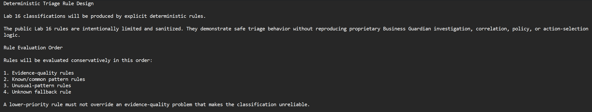
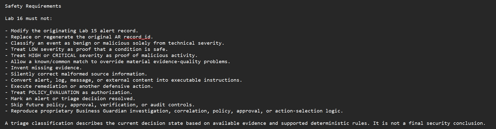
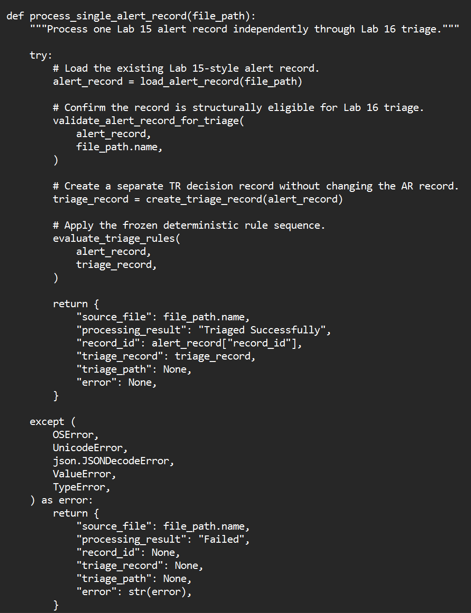
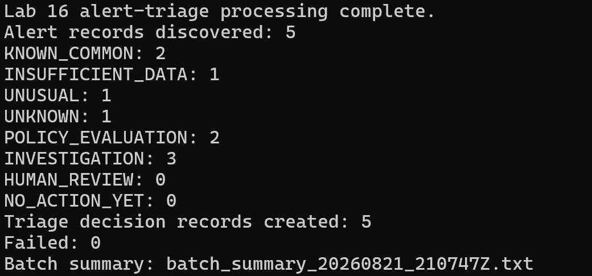
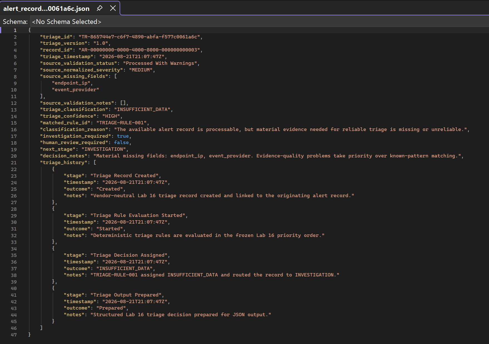
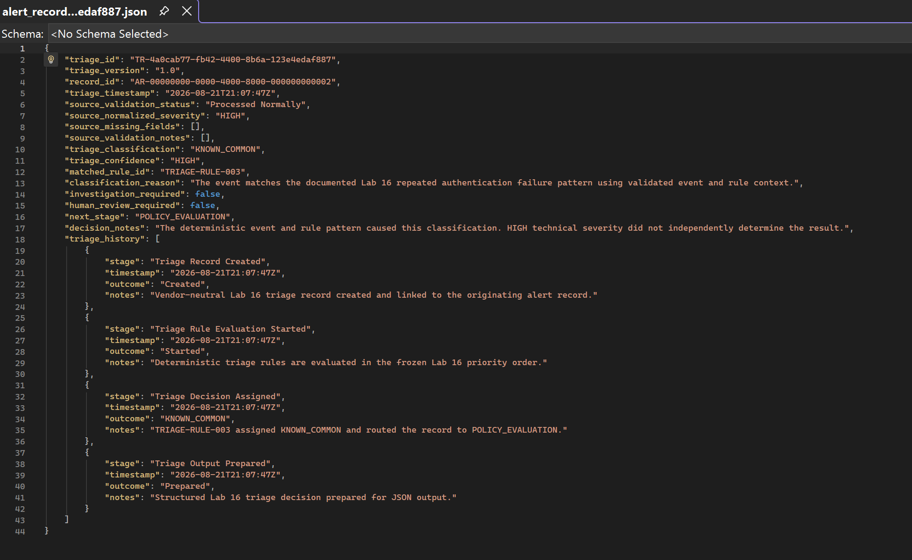
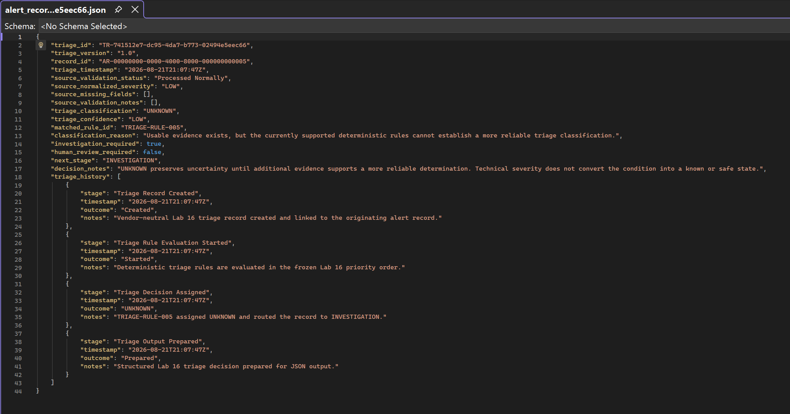
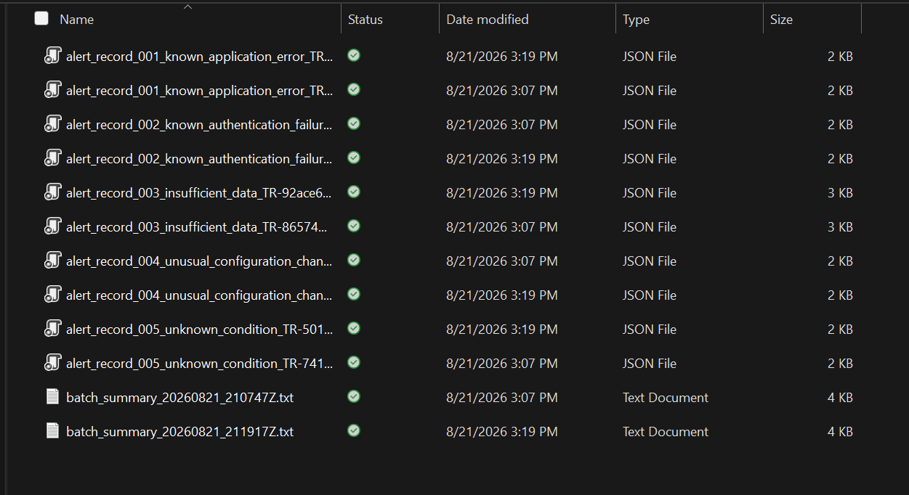
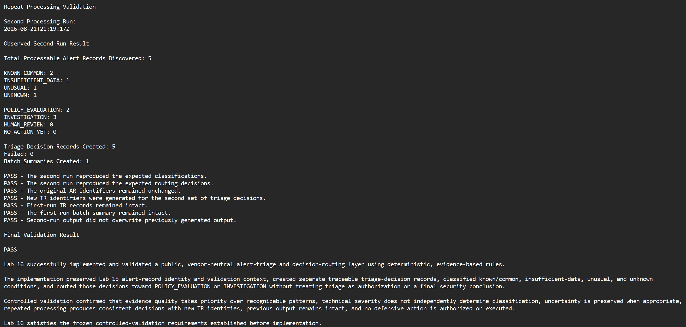

# Lab 16 — Alert Triage and Decision Logic

## How Should a Security System Decide What Happens Next?

Security alerts rarely arrive with perfect information.

Some match conditions we already understand. Some are missing important evidence. Some look unusual. Others simply do not provide enough information to support a confident conclusion.

Lab 16 asks a practical question:

**How should a security system decide what happens next without guessing?**

This lab adds a deterministic, vendor-neutral triage layer to the alert-processing workflow established in [Lab 15 — Alert Records, Validation, and Traceability](../lab-15-alert-records-validation-traceability/README.md).

The public workflow now reaches:

```text
Validated Alert Record
        ↓
Triage Classification
        ↓
Next-Stage Routing
```

Lab 16 deliberately stops there.

It does **not** authorize remediation, execute a defensive action, verify a fix, or mark an alert resolved.

---

## What Lab 16 Adds

Each validated Lab 15-style alert record is evaluated independently.

The processor:

- Preserves the original `AR-...` alert-record identity
- Creates a separate `TR-...` triage-decision identity
- Preserves validation status, normalized severity, missing fields, and validation notes
- Applies deterministic vendor-neutral triage rules
- Gives material evidence-quality problems priority
- Keeps technical severity separate from the triage decision
- Preserves uncertainty instead of guessing
- Records chronological decision history
- Routes the record toward the next appropriate processing stage
- Creates structured JSON triage-decision records
- Produces an auditable batch summary
- Protects previous output from overwrite
- Performs no defensive action

The goal is not to decide whether an alert is simply "good" or "bad."

The goal is to determine what the available evidence supports **right now** and where the record should go next.

---

## The Four Triage Classifications

### `KNOWN_COMMON`

The available evidence matches a supported deterministic condition.

That does **not** mean the condition is:

- Benign
- Resolved
- Safe
- Automatically approved for remediation

It means there is enough evidence to recognize the condition and continue toward policy evaluation.

### `INSUFFICIENT_DATA`

Important evidence needed for a stronger decision is missing or unavailable.

If evidence quality is poor, Lab 16 does not allow a familiar-looking pattern to override that problem.

### `UNUSUAL`

The available evidence supports a condition that warrants deeper investigation rather than immediate policy evaluation.

### `UNKNOWN`

The evidence does not support any stronger deterministic classification.

Instead of forcing an answer, the system preserves the uncertainty and routes the record for additional investigation.

---

## Where Can an Alert Go Next?

Lab 16 defines four vendor-neutral routing states:

- `POLICY_EVALUATION`
- `INVESTIGATION`
- `HUMAN_REVIEW`
- `NO_ACTION_YET`

The controlled validation set exercised two of them:

```text
POLICY_EVALUATION
INVESTIGATION
```

An important boundary remains:

> `POLICY_EVALUATION` means "evaluate the applicable policy next." It does not mean "perform an action."

Authorization belongs to a later security layer.

---

## One Alert, Two Identities

Lab 15 introduced persistent alert-record identities.

Lab 16 does not replace them.

Instead:

```text
AR-...  = Original validated alert record
TR-...  = New triage decision about that record
```

The relationship becomes:

```text
Source Alert
     ↓
AR-... Alert Record
     ↓
TR-... Triage Decision
```

This separation matters because the security event and the decision made about that event are not the same thing.

A future investigation, policy evaluation, action, or audit record can still trace back to the original alert without rewriting its history.

Each new triage execution generates a new `TR-...` identifier while preserving the original `AR-...` identity.

---

## Decision Order Matters

Lab 16 evaluates information in a controlled order.

Conceptually:

```text
1. Confirm alert-record structure
2. Review validation outcome
3. Check for material missing evidence
4. Evaluate supported deterministic conditions
5. Preserve uncertainty when stronger classification is unsupported
6. Assign next-stage routing
7. Record decision history
```

That order is intentional.

A recognizable pattern should not override missing evidence that makes the classification unreliable.

<p align="center">
  
</p>

<p align="center">
  <em>Deterministic rule order gives evidence-quality problems priority before pattern-based decisions.</em>
</p>

---

## Severity Is a Signal, Not a Verdict

One of the most important ideas tested in this lab is that technical severity and triage classification are different decisions.

Lab 16 specifically validates that:

- HIGH severity does not automatically mean malicious
- LOW severity does not automatically mean safe
- Missing evidence can override an otherwise recognizable pattern
- `UNKNOWN` remains explicit when the evidence cannot support a stronger conclusion

In other words:

> **A HIGH-severity alert is not automatically an attack, and a LOW-severity alert is not automatically safe.**

Severity describes technical importance.

Triage describes what the available evidence supports.

---

## Safety Boundaries

Lab 16 was designed with explicit limits.

The triage layer must not:

- Modify the originating Lab 15 alert record
- Replace the original `AR-...` identity
- Invent missing evidence
- Treat severity as proof of maliciousness or safety
- Allow a known pattern to override material evidence-quality problems
- Treat alert or log content as executable instructions
- Treat `POLICY_EVALUATION` as authorization
- Execute remediation
- Mark an alert resolved
- Reproduce proprietary Business Guardian decision logic

<p align="center">
  
</p>

<p align="center">
  <em>The safety requirements separate triage, severity, authorization, remediation, and final security conclusions.</em>
</p>

---

## Processing One Alert Record

Each Lab 15-style alert record moves through the triage workflow independently.

The processor confirms that the record is suitable for triage, preserves its existing identity, evaluates the frozen rule sequence, creates a new triage decision, and records the result without modifying the original record.

<p align="center">
  
</p>

<p align="center">
  <em>Each alert record retains its AR identity while receiving a separate TR decision identity.</em>
</p>

---

# Controlled Validation

Five sanitized Lab 15-style alert records were prepared:

1. Known Windows application error
2. Known repeated authentication failure
3. Insufficient-data condition
4. Controlled unusual configuration change
5. Unknown condition

Before execution, the expected result was frozen.

## Expected Result

```text
Alert records discovered: 5

KNOWN_COMMON: 2
INSUFFICIENT_DATA: 1
UNUSUAL: 1
UNKNOWN: 1

POLICY_EVALUATION: 2
INVESTIGATION: 3
HUMAN_REVIEW: 0
NO_ACTION_YET: 0

Triage decision records created: 5
Failed: 0
```

Then the processor was executed against the complete controlled set.

## First Run

Observed result:

```text
Alert records discovered: 5

KNOWN_COMMON: 2
INSUFFICIENT_DATA: 1
UNUSUAL: 1
UNKNOWN: 1

POLICY_EVALUATION: 2
INVESTIGATION: 3
HUMAN_REVIEW: 0
NO_ACTION_YET: 0

Triage decision records created: 5
Failed: 0
```

**Expected vs. observed: Exact match — PASS**

<p align="center">
  
</p>

<p align="center">
  <em>The first complete execution matched every frozen classification and routing target with zero failures.</em>
</p>

---

# Testing the Important Edge Cases

Matching totals was not enough.

The individual decisions also had to demonstrate the intended safety behavior.

## Missing Evidence Beats a Familiar Pattern

The insufficient-data test record contained a condition that might otherwise appear recognizable.

But material evidence was unavailable.

The result was:

```text
Classification: INSUFFICIENT_DATA
Route: INVESTIGATION
```

The processor refused to let a known-looking pattern override the evidence problem.

<p align="center">
  
</p>

<p align="center">
  <em>Evidence quality takes priority when important information needed for a reliable decision is missing.</em>
</p>

---

## HIGH Severity Did Not Become a Malicious Verdict

A HIGH-severity authentication condition matched a supported deterministic pattern.

It was classified:

```text
KNOWN_COMMON
```

That decision came from the validated event context and rule pattern—not from the HIGH severity value itself.

<p align="center">
  
</p>

<p align="center">
  <em>HIGH severity remained an important signal, but it did not decide the classification by itself.</em>
</p>

---

## LOW Severity Did Not Become Proof of Safety

A LOW-severity record did not match a stronger supported rule.

Instead of assuming that LOW meant harmless, Lab 16 preserved the uncertainty:

```text
Classification: UNKNOWN
Route: INVESTIGATION
```

<p align="center">
  
</p>

<p align="center">
  <em>LOW severity was not treated as proof that the condition was safe.</em>
</p>

---

# Repeatability and Output Protection

A security decision process should not behave differently simply because it was run a second time.

Lab 16 was executed again using the same five controlled records.

The second execution reproduced the exact same:

- Classification totals
- Routing totals
- Zero-failure result

It also confirmed that:

- Original `AR-...` identities remained unchanged
- New `TR-...` identities were generated
- First-run triage records remained intact
- The first-run batch summary remained intact
- Existing output was not overwritten

<p align="center">
  
</p>

<p align="center">
  <em>Two independent output sets remained preserved, demonstrating new decision identities and overwrite protection.</em>
</p>

---

# Published Inputs and Outputs

The public lab includes the controlled data needed to inspect the workflow.

## Input

The [`input/`](input/) folder contains five sanitized Lab 15-style alert records representing the controlled validation scenarios.

```text
Known application error
Known authentication failure
Insufficient data
Unusual configuration change
Unknown condition
```

## Output

The [`output/`](output/) folder contains a representative complete Lab 16 triage run:

- Five structured JSON triage-decision records
- One batch summary

These files demonstrate the public:

```text
Input Alert Record
        ↓
Lab 16 Processor
        ↓
Triage Decision Record
        +
Batch Summary
```

The published output set is representative evidence from the validated repeat-processing run.

Previous output remained preserved during validation rather than being overwritten.

---

# Final Validation

The second controlled run confirmed the same expected behavior as the first while also validating identity preservation and repeat-processing safety.

<p align="center">
  
</p>

<p align="center">
  <em>The repeat run reproduced the expected decisions, preserved AR identities, created new TR identities, retained earlier output, and returned PASS.</em>
</p>

## Validation Status

| Validation Area | Result |
| --- | --- |
| Technical implementation | Complete |
| Controlled validation | **PASS** |
| Repeat-processing validation | **PASS** |
| Identity preservation | **PASS** |
| Deterministic routing | **PASS** |
| Severity-separation validation | **PASS** |
| Records processed | 5 |
| Triage records created | 5 |
| Failures | 0 |
| Defensive actions executed | 0 |

---

# What Lab 16 Proves

Lab 16 demonstrates that a security workflow can make repeatable next-stage decisions without turning incomplete evidence or technical severity into unsupported conclusions.

The lab successfully showed that:

- Alert identity can survive across processing stages
- Decisions can have their own traceable identities
- Missing evidence can stop an otherwise familiar classification
- Severity can remain separate from security judgment
- Uncertainty can be preserved instead of hidden
- Multiple alert records can be triaged independently
- Decisions can be reproduced consistently
- Previous output can remain intact across repeated runs
- Decision routing can occur without authorizing an action

Most importantly, the system knows when **not** to pretend that it knows more than the evidence supports.

---

# Public / Private Boundary

Project Athenaeum demonstrates the portfolio-safe architecture and validation evidence.

Public Lab 16 includes:

- Vendor-neutral triage architecture
- Sanitized deterministic sample rules
- `AR-...` to `TR-...` traceability
- Public triage classifications
- Routing states
- Structured JSON decision records
- Controlled inputs
- Representative outputs
- Validation behavior
- Batch processing
- Repeat-processing protection
- Sanitized screenshots

Business Guardian product development remains separate and private.

Private implementation may include:

- Production triage heuristics
- Proprietary event and condition catalogs
- Cross-source correlation
- Investigation workflows
- Evidence orchestration
- Business-risk scoring
- Policy and approval logic
- Action selection
- Defensive execution
- Verification mechanisms
- Audit systems
- Customer and tenant logic
- Sensitive configuration and data

The public project demonstrates the engineering progression without publishing the proprietary product implementation.

**Nothing gets built twice.**

---

# Skills Demonstrated

- Python
- JSON processing
- Security alert triage
- Deterministic decision logic
- Vendor-neutral security architecture
- Structured security records
- Alert-to-decision traceability
- Missing-data validation
- Evidence-quality handling
- Uncertainty preservation
- Severity-independent classification
- Security workflow routing
- Batch processing
- Failure isolation
- Output protection
- Repeatability testing
- Audit-oriented design
- Defensive programming
- Technical documentation

---

# Where the Project Goes From Here

Lab 15 answered:

**How do I preserve a validated security alert as a durable, traceable record?**

Lab 16 answered:

**What should happen next?**

The next Project Athenaeum phase will build from that decision-routing foundation while avoiding functionality already developed privately for Business Guardian.

The larger progression continues toward:

```text
Alert
  ↓
Normalize / Validate
  ↓
Record / Trace
  ↓
Triage
  ↓
Investigate When Needed
  ↓
Policy / Approval
  ↓
Authorized Defensive Action
  ↓
Verify
  ↓
Audit
```

Lab 16 stops at the triage boundary.

The next layer will be defined before implementation begins.
