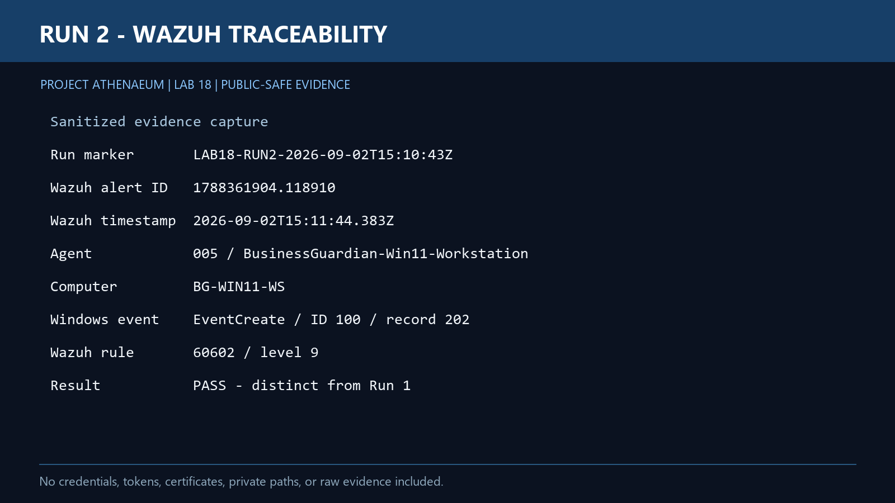
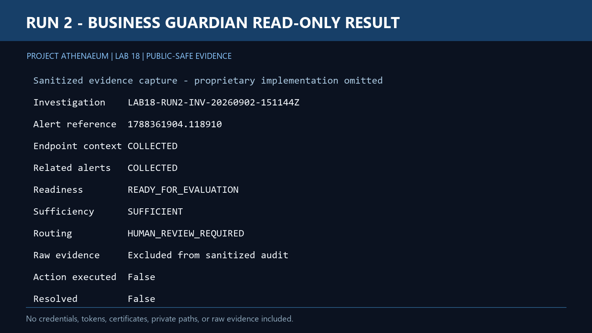
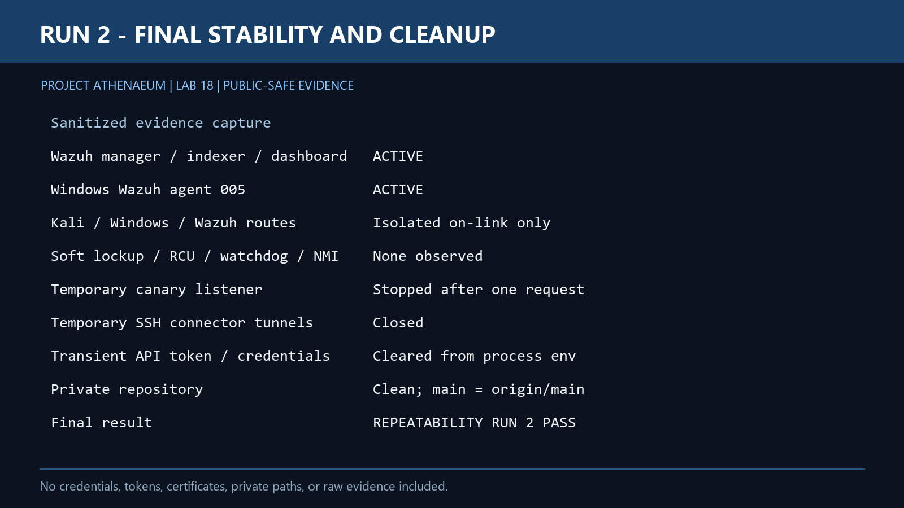

# Lab 18 — Controlled Adversary Simulation and End-to-End Detection Validation

Lab 18 produced a repeatable end-to-end validation of the Project Athenaeum detection and investigation path. Two independent, bounded test runs moved sanitized evidence from an authorized Kali source through a Windows endpoint and Wazuh into the private Business Guardian read-only investigation workflow. Both runs preserved traceability, stopped at human review, and executed no remediation.

## The Question

Labs 15–17 established structured alert records, deterministic triage, and policy/approval boundaries. Lab 18 asked the next practical question:

> Can a real event generated inside the isolated lab travel through the full evidence path without losing source identity, bypassing review, or crossing into action execution?

## Why This Matters

A pipeline can pass unit and integration tests while still failing when it meets live telemetry. Lab 18 therefore tested the already-built components together. It did not create another connector, triage engine, or policy layer.

The public result focuses on validation behavior. The proprietary Business Guardian connector, investigation implementation, credentials, certificates, raw evidence, and internal schemas remain private.

## Validated Architecture

```text
Controlled Kali source
        ↓
Windows 11 endpoint evidence
        ↓
Wazuh detection and traceability
        ↓
Business Guardian read-only evidence collection
        ↓
Investigation workflow
        ↓
HUMAN_REVIEW_REQUIRED
```

All activity was confined to owned and authorized virtual machines on the isolated `BusinessGuardianLab` network. The Wazuh manager, Windows workstation, and Kali workstation ran concurrently in Hyper-V after the environment passed an extended stability checkpoint.

## Controlled Test Design

The test used the smallest practical activity that could create an unambiguous evidence trail:

- Kali served one benign, timestamped canary file inside the isolated lab.
- The Windows workstation retrieved that canary and created a controlled Windows Application event.
- Wazuh ingested the event through the existing Windows agent.
- Business Guardian retrieved the associated Wazuh evidence through its existing read-only path.
- The investigation workflow preserved the source relationship and routed the result to human review.

Initial TCP/445 and TCP/3389 connection paths were intentionally stopped when existing Windows controls blocked them and they did not produce useful detection evidence. The Windows firewall was not weakened merely to make the lab succeed, and the test was not broadened into scanning, exploitation, or authentication attacks.

## Wazuh Traceability

The second run produced a distinct event with its own timestamp and alert reference. Wazuh preserved the Windows agent identity, workstation identity, event provider, event identifier, rule context, and run marker needed to associate the alert with the controlled source activity.

<p align="center">
  
</p>

## Read-Only Investigation Result

Business Guardian collected endpoint context and related alert evidence without modifying Wazuh, Windows, Kali, or the lab network. The evidence was sufficient for investigation routing, but it was not treated as a verdict or authorization to act.

The second run reached:

- endpoint context: `COLLECTED`
- related alerts: `COLLECTED`
- investigation state: `READY_FOR_EVALUATION`
- evidence sufficiency: `SUFFICIENT`
- routing result: `HUMAN_REVIEW_REQUIRED`
- action executed: `false`
- resolved: `false`

<p align="center">
  
</p>

`COLLECTED` means that evidence was retrieved. It does not mean the evidence was interpreted, benign, malicious, remediated, or resolved. Severity also does not grant authority to execute an action.

## Repeatability

The same bounded canary technique was run twice with new timestamps and run-specific evidence. Both runs produced materially consistent outcomes while preserving distinct records. The existing private Business Guardian validation baseline also remained at **264/264 tests passed**.

Repeatability in this lab means that equivalent controlled activity produced the same traceable workflow behavior. It does not require byte-identical identifiers, timestamps, or record ordering.

## Final Safety and Stability Checkpoint

After Run 2:

- Wazuh manager, indexer, and dashboard remained active.
- The Windows Wazuh agent remained active.
- No soft lockup, RCU stall, watchdog timeout, NMI timeout, or severe clock-starvation evidence was observed.
- The one-request Kali listener was stopped.
- Temporary SSH tunnels and transient tokens were cleared.
- TLS verification remained enabled throughout the read-only evidence path.
- No remediation or action execution occurred.
- No condition was marked resolved.

<p align="center">
  
</p>

## Validation Outcome

| Checkpoint | Result |
| :--- | :--- |
| Authorized isolated scope | PASS |
| Windows event generation | PASS |
| Wazuh ingestion and source traceability | PASS |
| Business Guardian read-only collection | PASS |
| Investigation routing | PASS — `HUMAN_REVIEW_REQUIRED` |
| Two-run repeatability | PASS |
| No action execution | PASS |
| No resolved state | PASS |
| Three-VM post-test stability | PASS |
| Overall technical validation | **PASS** |

## Public Artifacts

- [Requirements and Validation Plan](Lab18_Controlled_Adversary_Simulation_and_End-to-End_Detection_Validation_Requirements_and_Validation_Plan_v1.0.txt)
- [Sanitized Validation Results](Lab18_Controlled_Adversary_Simulation_and_End-to-End_Detection_Validation_Results.txt)

No public implementation artifact is included for Lab 18. The lab validated the existing private read-only investigation vertical slice; recreating or publishing that implementation would duplicate prior work and cross the public/private boundary.

## What This Proves—and What It Does Not

Lab 18 proves that the documented workflow behaved consistently for two authorized test events in this isolated lab. It demonstrates live evidence ingestion, read-only collection, traceability, conservative investigation routing, and clean shutdown of transient access.

It does not prove universal detection coverage, production readiness, malicious intent, benign status, remediation success, or authorization for defensive action.

## Next Boundary

Project Athenaeum will pause for a public/private roadmap review before defining another lab. Any future action-execution or remediation work remains a separate controlled boundary and requires its own requirements, authorization, verification, and audit design.
