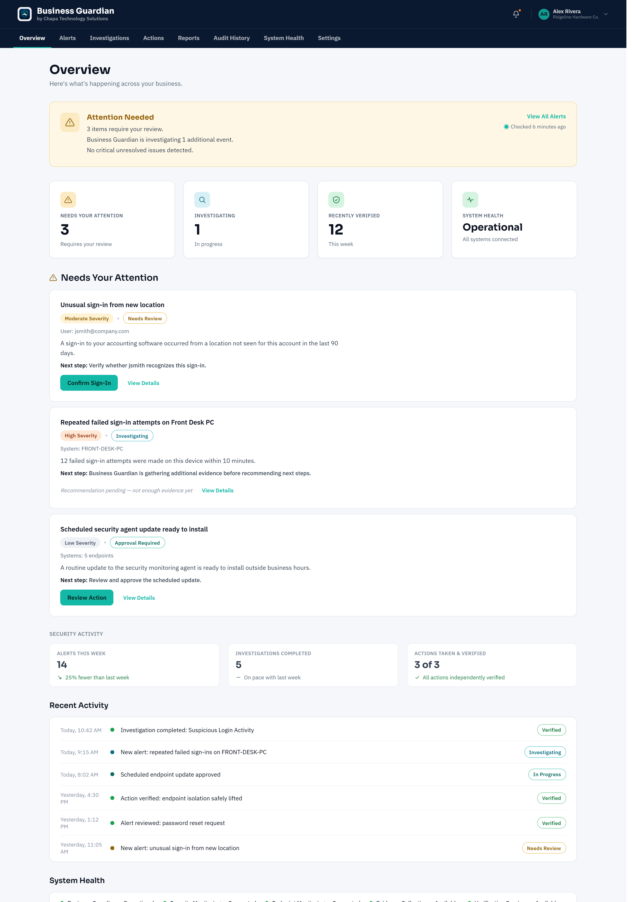
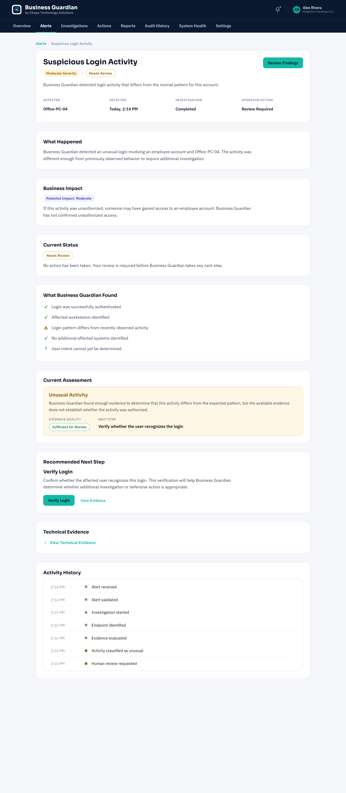
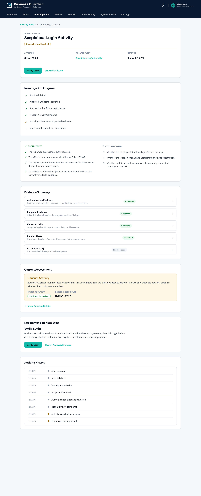
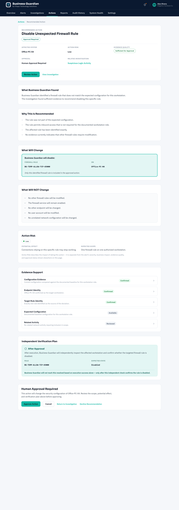
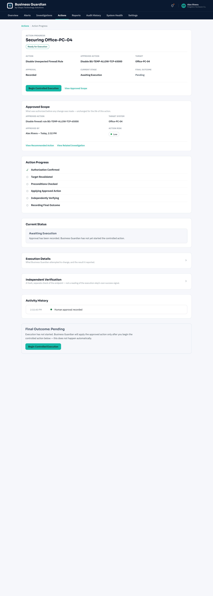
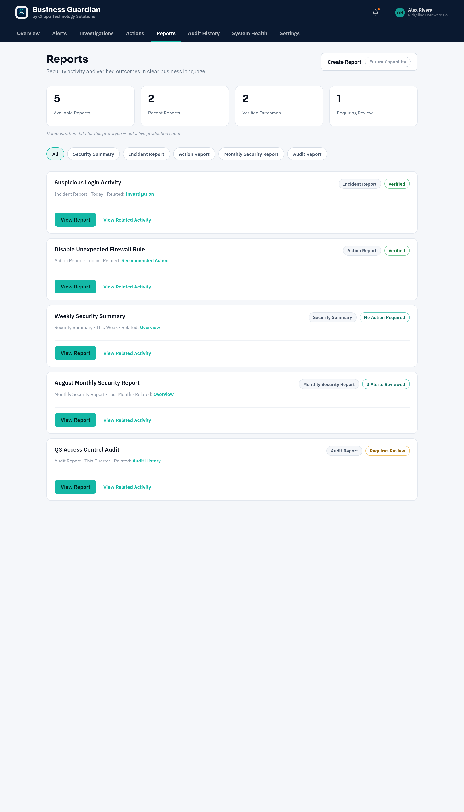

# Lab 23 — Business Guardian Operator Dashboard Requirements and UX Design

Lab 23 moved Business Guardian from backend security workflows toward a real operator-facing product experience.

Instead of building another SIEM-style dashboard filled with raw events and technical telemetry, this lab designed an interface for the people Business Guardian is intended to help: small-business operators who need to understand what is happening, what needs their attention, what Business Guardian recommends, and whether a defensive action produced the expected result.

The completed design establishes nine primary product areas across desktop and tablet or narrow-laptop layouts, including alert investigation, human approval, controlled action progress, independent verification, reporting, audit history, system health, and settings.

## Problem / Question

**How should a small-business operator safely understand, investigate, approve, monitor, and verify Business Guardian security workflows through a clear graphical interface?**

## Importance

Small businesses may not have dedicated cybersecurity staff. Their operators need plain-English answers before they need raw telemetry:

- Am I okay?
- What needs my attention?
- What did Business Guardian find?
- What requires my approval?
- What action occurred?
- Did an independent check confirm the expected result?

The design keeps technical evidence available through progressive disclosure without making the primary experience behave like a dense security console.

## What Was Designed

Lab 23 produced a complete branded UX baseline containing 18 desktop and tablet or narrow-laptop artboards across nine product areas:

1. Overview
2. Alert Detail
3. Investigation
4. Recommended Action / Human Approval
5. Action Progress / Independent Verification
6. Reports
7. Audit History
8. System Health
9. Settings

The baseline defines information architecture, visual hierarchy, representative interactions, responsive layouts, workflow states, evidence presentation, approval scope, verification visibility, and Chapa Technology Solutions branding integration.

## Operator Workflow

The interface preserves the established Business Guardian sequence:

```text
Alert
  ↓
Investigation
  ↓
Recommendation
  ↓
Human Approval
  ↓
Controlled Execution
  ↓
Independent Verification
  ↓
Final Outcome
```

These stages remain deliberately separate:

- Recommendation does not equal authorization.
- Authorization does not equal execution.
- Execution success does not equal verification.
- Verification does not automatically equal formal resolution.

## Safety and Trust Model

The UX makes consequential actions reviewable rather than effortless. It keeps the exact approved target and scope visible, explains **What Will Change** and **What Will NOT Change**, and avoids a generic **Fix Now** control.

Additional design safeguards include:

- explicit human approval for consequential actions,
- no arbitrary endpoint shell or general-purpose command interface,
- action risk separated from alert severity,
- evidence quality separated from workflow status,
- business impact separated from technical severity,
- blocked execution separated from failed execution,
- verification failure kept visible and not treated as resolution,
- insufficient evidence routed to review rather than a guessed answer, and
- system-health degradation not treated as proof of malicious activity.

Automatic remediation and automatic rollback are not represented as implemented capabilities.

## UX Architecture

The operator sees plain-English conclusions and the clearest next step first. Technical and vendor-specific evidence remains available at deeper levels when needed.

The architecture emphasizes:

- one obvious primary action where appropriate,
- progressive disclosure of technical evidence,
- persistent visibility of approved scope,
- distinct security, workflow, evidence, risk, authorization, execution, and verification states,
- responsive desktop and narrow-layout concepts, and
- recorded workflow history without unsupported immutability claims.

The tablet artboards demonstrate responsive design direction. They do not claim a fully interactive production tablet application.

## Validation and Review

The final baseline passed a dedicated consistency and safety review covering screen architecture, desktop and tablet behavior, terminology, workflow boundaries, button hierarchy, badges and states, progressive disclosure, accessibility consistency, capability overclaims, security controls, commercial coherence, and branding.

Public-safe corrections included:

- changing **Recently Resolved** to **Recently Verified**,
- normalizing approval and evidence-review terminology,
- clarifying that automatic rollback is not implemented,
- separating evidence-quality styling from workflow status, and
- keeping brand colors distinct from semantic security-state colors.

## Evidence

The six selected images below are sanitized prototype artboards. Names, organizations, endpoints, and events shown in them are fictional demonstration data. The public package intentionally excludes the interactive prototype archive and complete 18-artboard PDF.

### Overview



### Alert Detail



### Investigation



### Recommended Action and Human Approval



### Action Progress and Independent Verification



### Reports



See [Lab23_Validation_Results_v1.0.txt](Lab23_Validation_Results_v1.0.txt) for the public-safe qualitative validation summary.

## Capability Boundary

Lab 23 is a requirements and UX design lab. It did **not** implement a production dashboard.

### Designed

- operator-facing information architecture and visual hierarchy,
- representative workflows and interaction states,
- desktop and tablet or narrow-laptop layouts,
- alert review, investigation, approval, action-progress, and verification experiences,
- reports, audit-history, system-health, and settings concepts, and
- Chapa Technology Solutions branding integration.

### Not implemented

- production dashboard or backend integration,
- production authentication or role-based access control,
- persistent settings,
- production report or PDF generation,
- external sharing,
- automatic remediation or rollback,
- arbitrary endpoint shell access,
- production action or verification orchestration, and
- customer or tenant administration.

Prototype interactions demonstrate intended operator behavior; they are not evidence of implemented product capability.

## What This Proves

Lab 23 proves that the validated Business Guardian safety model can be translated into a coherent operator experience without flattening important distinctions or overwhelming a small-business user with technical detail.

It also establishes a reviewed design baseline that future implementation can follow instead of redesigning the product from scratch.

## Final Lab Result

**PASS — COMPLETE BUSINESS GUARDIAN OPERATOR UX BASELINE DESIGNED, REVIEWED FOR SAFETY AND CONSISTENCY, BRANDED, AND PRESERVED FOR IMPLEMENTATION**

## What Comes Next

**Lab 24 — Business Guardian Dashboard MVP** is the next planned lab.

Lab 24 should begin a browser-based implementation from this frozen UX baseline, reuse already validated Business Guardian concepts, preserve the distinction between approval, execution, verification, and outcome, and avoid inventing backend capabilities merely to make prototype controls appear functional.
